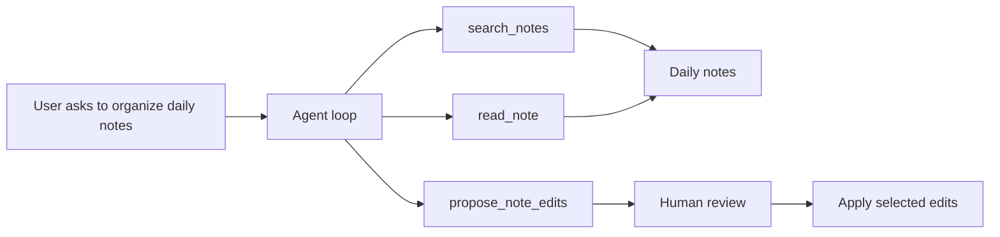

# Agentic Notes Assistant

## Direction

This is not quite a complete rewrite, but it is a new chat architecture. The current retrieval and storage pieces remain useful, especially [src/core/workflows/SearchWorkflow.ts](src/core/workflows/SearchWorkflow.ts), [src/sidecar/adapters/SqliteDocumentStore.ts](src/sidecar/adapters/SqliteDocumentStore.ts), and the transport/runtime wiring in [src/sidecar/runtime/SidecarRuntime.ts](src/sidecar/runtime/SidecarRuntime.ts). The main replacement is [src/core/workflows/ChatWorkflow.ts](src/core/workflows/ChatWorkflow.ts): instead of `search once -> stuff context -> complete once`, chat becomes `reason -> call tools -> inspect results -> answer or propose edits`.

## T-Shirt Epics

- **Epic 1: Deterministic retrieval baseline — S/M**
  Stabilize current search behavior before adding an agent: temperature defaults, deterministic tie-breaking, better logging, and less brittle insufficient-evidence handling. This gives us a known-good substrate for tools.

- **Epic 2: Agent tool contract — M**
  Define internal tools such as `search_notes`, `read_note`, `list_notes`, `get_daily_notes`, and `find_unresolved_actions`. This likely adds a new port/interface beside [src/core/ports/IChatPort.ts](src/core/ports/IChatPort.ts), because the current chat port only supports streaming text completions.

- **Epic 3: Tool-calling chat adapter — M/L**
  Extend OpenAI and selected Ollama model support so the model can request tools and receive tool results. OpenAI is straightforward; Ollama depends on chosen models and API compatibility. The existing factories in [src/sidecar/adapters/createChatPort.ts](src/sidecar/adapters/createChatPort.ts) stay, but the adapter surface changes.

- **Epic 4: Agent loop workflow — L**
  Replace the single-shot chat flow in [src/core/workflows/ChatWorkflow.ts](src/core/workflows/ChatWorkflow.ts) with a bounded loop: max steps, max tokens, tool budget, trace events, and final answer generation. This is the architectural center of the change.

- **Epic 5: Note organization workflows — L/XL**
  Add higher-level workflows for your actual use case: extract people from daily notes, identify meetings, summarize meetings, collect action items, infer or normalize tags, and produce linked person/meeting notes. This is where the plugin becomes more than chat.

- **Epic 6: Safe write/edit mode — L**
  Let the agent propose note creations/edits first, then apply them only after confirmation. This needs diff previews, conflict handling, vault path rules, frontmatter conventions, and safeguards against overwriting human-written notes.

- **Epic 7: UX for agent runs — M/L**
  The chat UI needs to show what the agent is doing: searches performed, notes read, draft files proposed, and why it reached a conclusion. This keeps the system trustworthy when it starts editing knowledge.

- **Epic 8: Evaluation harness — M**
  Add repeatable fixtures and tests for scenarios like “extract people from this week’s daily notes” and “create meeting note draft with action items.” This is the guardrail against another iteration that feels clever but unreliable.

## Practical First Iteration

The best next slice is probably not “generic agent that can do anything.” It is a constrained assistant for one high-value workflow:

A strong first target would be: “Review daily notes in a date range, identify people, meetings, and tags, then draft person notes and meeting notes with links, tags, and action items.” That hits your actual need while forcing the architecture to support search, reading, synthesis, and safe writes.