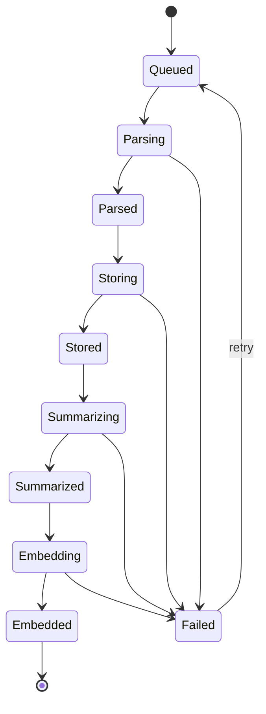

# Obsidian AI Plugin -- Iteration 2 Architecture Plan

## What Worked (Carry Forward)

These decisions are validated and remain as-is:

- **ADR-002: Hierarchical document model** -- tree-structured index (note -> topic -> subtopic -> paragraph/bullet_group -> bullet) with bottom-up LLM summaries
- **ADR-003: Three-phase retrieval** -- summary search -> drill-down -> context assembly with per-tier token budgets
- **ADR-004: Per-vault index database outside the vault** -- `~/.obsidian-ai/` with per-vault files, lazy open, no bulk data in `data.json`
- **ADR-005: Provider abstraction** -- `EmbeddingProvider` / `ChatProvider` interfaces with `ProviderRegistry`
- **SQLite schema** for hierarchical nodes, summaries, embeddings, tags, cross-refs (the schema itself is sound)
- **UI requirements** for search pane (cards with title/path/snippet/score) and chat pane (bubble alignment, bottom input, source pills, copy button, conversation history)
- **Logging/observability** -- structured logger with scopes, operation IDs, log-level filtering, sensitive data redaction

## What Failed (Root Cause and Fix)

### The WASM/Electron Problem

The `force-wasm` branch attempted to ship wa-SQLite + sqlite-vec as bundled WASM assets loaded in Electron's renderer. This required:

- Custom WASM asset copying scripts (`prepare-obsidian-plugin-artifacts.mjs`)
- Workarounds for sqlite3 WASM bind quirks (`Float32Array` -> `Uint8Array` blobs)
- Fighting Electron's restrictions on dynamic module loading
- The esbuild config had to externalize `crypto`, `fs`, `os`, `path`, `url` -- but WASM loading patterns conflicted with Obsidian's plugin loader

**Root cause:** Obsidian's plugin model loads a single `main.js` in the renderer. It does not support dynamic imports, web workers with full filesystem access, or native addons cleanly. Trying to force a full SQLite+vector engine into this constrained runtime creates fragile packaging that breaks across Electron versions.

### The Fix: Sidecar Architecture

Given the new requirements (queue abstraction, service deployment flexibility, idempotent indexing with step tracking), the natural resolution is a **sidecar process**:

```mermaid
graph LR
    subgraph obsidianRenderer [Obsidian Renderer]
        Plugin[Plugin main.js]
        SearchUI[Search Pane]
        ChatUI[Chat Pane]
        ProgressUI[Progress Slideout]
    end

    subgraph sidecar [Sidecar Process]
        API[HTTP/IPC API]
        QueueMgr[Queue Manager]
        IndexSvc[Indexing Service]
        SummarySvc[Summary Service]
        EmbedSvc[Embedding Service]
        SearchSvc[Search Service]
        ChatSvc[Chat Service]
        SQLite[SQLite + sqlite-vec]
    end

    Plugin -->|"HTTP/IPC"| API
    SearchUI --> Plugin
    ChatUI --> Plugin
    ProgressUI --> Plugin
    API --> QueueMgr
    QueueMgr --> IndexSvc
    IndexSvc --> SummarySvc
    IndexSvc --> EmbedSvc
    API --> SearchSvc
    API --> ChatSvc
    IndexSvc --> SQLite
    SearchSvc --> SQLite
    EmbedSvc --> SQLite
end
```


**Assumptions** (confirm or override before implementation):

1. The sidecar runs as a **local Node.js process** spawned by the plugin on load and terminated on unload. This lets us use native `better-sqlite3` + `sqlite-vec` (no WASM hacking), run proper queues, and do heavy compute off the renderer thread.
2. The plugin `main.js` remains a **thin client** -- UI rendering, Obsidian API interactions (vault file reading, settings, secrets), and HTTP/IPC calls to the sidecar.
3. For users who want zero setup, the sidecar binary could eventually be a single compiled executable (e.g. via `pkg` or `sea`), but iteration 2 starts with Node.js as a prerequisite.

## Identified Requirement Conflicts

### Conflict 1: "Self-contained plugin" vs. Sidecar

[REQUIREMENTS.md](docs/requirements/REQUIREMENTS.md) section 12 says the vector store must be "wa-SQLite (or equivalent WASM SQLite)" and [ADR-001](docs/decisions/ADR-001-wasm-sqlite-vec-shipped-plugin.md) forbids native addons. But the lessons learned say the WASM approach "didn't seem right" and the new queuing/service-abstraction requirements push beyond what the renderer can cleanly host.

**Resolution assumed:** Retire ADR-001. The sidecar uses native SQLite. The plugin itself ships no native addons (it's still just `main.js` + CSS). The "native module" lives in the sidecar, not the plugin bundle. REQUIREMENTS.md section 12 technology constraint for wa-SQLite is updated to "SQLite with sqlite-vec, hosted in the sidecar process."

### Conflict 2: "All data local" vs. Cloud Queue/Functions

The requirements say indexed data stays local. But the queue and service abstractions are designed to eventually support RabbitMQ and cloud functions. These are not in conflict if the **interfaces** support both but the **iteration 2 implementation** is local-only.

**Resolution assumed:** Build the port/adapter interfaces. Iteration 2 ships only the in-process queue adapter and local service implementations. The abstractions exist for future cloud adapters.

### Conflict 3: Privacy with Sidecar

If the sidecar is a separate process, raw note content crosses a process boundary. This is still local (localhost HTTP/IPC), but the privacy model must document that clearly.

**Resolution assumed:** Sidecar binds only to `127.0.0.1` with a random port. An auth token (generated per session) is required on all requests. Document in privacy section.

---

## Architecture: Ports and Adapters (Hexagonal)

The core domain logic has no knowledge of whether it runs in-process, in a sidecar, or in a cloud function. All infrastructure is behind ports (interfaces).

### Port Definitions

```
Ports (interfaces):
  IDocumentStore        -- CRUD for hierarchical nodes, summaries, embeddings
  IQueuePort            -- enqueue/dequeue/ack work items
  IEmbeddingPort        -- embed text -> vectors
  IChatPort             -- chat completion (streaming)
  IVaultAccessPort      -- read vault files (abstracts Obsidian API)
  IProgressPort         -- emit progress events to UI
  ISecretPort           -- retrieve API keys
```

### Adapter Implementations (Iteration 2)

```
Adapters:
  IDocumentStore    -> SqliteDocumentStore (better-sqlite3 + sqlite-vec, sidecar)
  IQueuePort        -> InProcessQueue (async queue with persistence)
  IEmbeddingPort    -> OpenAIEmbeddingAdapter, OllamaEmbeddingAdapter
  IChatPort         -> OpenAIChatAdapter, OllamaChatAdapter
  IVaultAccessPort  -> ObsidianVaultAdapter (plugin side, proxied to sidecar)
  IProgressPort     -> WebSocketProgressAdapter (sidecar -> plugin)
  ISecretPort       -> ObsidianSecretAdapter (plugin side, proxied to sidecar)
```

### Future Adapters (Not in Iteration 2)

```
  IDocumentStore    -> PostgresDocumentStore (cloud)
  IQueuePort        -> RabbitMQAdapter, SQSAdapter
  IEmbeddingPort    -> AzureOpenAIAdapter, AnthropicAdapter
  IChatPort         -> AnthropicChatAdapter
```

---

## Idempotent Indexing Workflow

Each note progresses through a state machine tracked in a `job_steps` table:




### Key Properties

- **Idempotent:** Each step checks if already completed (via content hash + step status). Re-running skips completed steps.
- **Restartable:** On crash/restart, the queue reloads incomplete jobs from the `job_steps` table and resumes from the last completed step.
- **Observable:** Each state transition emits a progress event via `IProgressPort`, giving the UI per-note, per-step visibility.
- **Queue-decoupled:** The state machine operates on `NoteJobItem` objects. Whether those come from an in-process queue or RabbitMQ is transparent.

### Queue Abstraction

```typescript
interface IQueuePort<T> {
  enqueue(items: T[]): Promise<void>;
  dequeue(batchSize: number): Promise<QueueItem<T>[]>;
  ack(itemId: string): Promise<void>;
  nack(itemId: string, reason: string): Promise<void>;
  peek(): Promise<number>;  // pending count
}
```

The `InProcessQueue` adapter for iteration 2:

- Backed by an in-memory array with SQLite persistence for crash recovery
- Configurable concurrency (default: 1 for summarize/embed to respect rate limits)
- Dead-letter tracking after N retries (configurable, default 3)

---

## Project Structure (Iteration 2)

```
obsidian-ai-plugin/
  src/
    plugin/                          # Obsidian plugin (thin client)
      main.ts                        # Plugin entry: lifecycle, views, commands
      settings.ts                    # Settings tab
      ui/
        SearchView.ts
        ChatView.ts
        ProgressSlideout.ts
      client/
        SidecarClient.ts             # HTTP/IPC client to sidecar
        SidecarLifecycle.ts           # Spawn/kill sidecar process
    core/                            # Domain logic (portable, no framework deps)
      ports/
        IDocumentStore.ts
        IQueuePort.ts
        IEmbeddingPort.ts
        IChatPort.ts
        IVaultAccessPort.ts
        IProgressPort.ts
      domain/
        types.ts                     # DocumentNode, NodeType, etc.
        chunker.ts                   # Hierarchical tree builder
        sentenceSplitter.ts
        wikilinkParser.ts
        tokenEstimator.ts
      workflows/
        IndexWorkflow.ts             # State machine orchestrator
        SearchWorkflow.ts            # Three-phase retrieval
        ChatWorkflow.ts              # RAG orchestration
        SummaryWorkflow.ts           # Bottom-up summary generation
    sidecar/                         # Sidecar process entry
      server.ts                      # HTTP/IPC server
      routes/                        # API routes
      adapters/
        SqliteDocumentStore.ts       # better-sqlite3 + sqlite-vec
        InProcessQueue.ts
        OpenAIEmbeddingAdapter.ts
        OllamaEmbeddingAdapter.ts
        OpenAIChatAdapter.ts
        OllamaChatAdapter.ts
        FileSystemVaultAdapter.ts    # Reads vault files directly
        WebSocketProgressAdapter.ts
  scripts/
    query-store.mjs
  docs/
    decisions/                       # ADRs
    requirements/
```

---

## Sidecar Communication Protocol

### REST API (sidecar)

- `POST /index/full` -- start full reindex
- `POST /index/incremental` -- start incremental index
- `GET /index/status` -- get job queue status and per-note progress
- `POST /search` -- semantic search query
- `POST /chat` -- chat completion (SSE streaming response)
- `POST /chat/clear` -- clear conversation
- `GET /health` -- sidecar health check

### WebSocket (sidecar -> plugin)

- Progress events streamed in real-time for UI updates
- Connection established on plugin load, reconnects on drop

### Security

- Sidecar binds `127.0.0.1` only
- Random auth token generated at spawn, passed to plugin
- Token required in `Authorization` header on all requests

---

## Implementation Phases

### Phase 0: Foundation (ADRs + Project Skeleton)

- Update/retire ADR-001, add ADR-006 (sidecar architecture), ADR-007 (queue abstraction), ADR-008 (idempotent indexing)
- Scaffold project structure with `plugin/`, `core/`, `sidecar/` directories
- Set up build pipeline: esbuild for plugin, tsc/esbuild for sidecar
- Define all port interfaces in `core/ports/`
- Define domain types in `core/domain/types.ts`

### Phase 1: Core Domain (No Infrastructure)

- Port `chunker.ts`, `sentenceSplitter.ts`, `wikilinkParser.ts`, `tokenEstimator.ts` into `core/domain/`
- Implement `IndexWorkflow` state machine (pure logic, port-driven)
- Implement `SearchWorkflow` three-phase retrieval (port-driven)
- Implement `SummaryWorkflow` bottom-up generation (port-driven)
- Unit tests for all domain logic (these run without any infrastructure)

### Phase 2: Sidecar Infrastructure

- Implement `SqliteDocumentStore` adapter (better-sqlite3 + sqlite-vec, native)
- Implement `InProcessQueue` adapter with SQLite-backed persistence
- Implement embedding adapters (OpenAI, Ollama)
- Implement chat adapters (OpenAI, Ollama)
- Implement sidecar HTTP server with routes
- Implement WebSocket progress streaming
- Integration tests: index workflow end-to-end through real SQLite

### Phase 3: Plugin Client

- Implement `SidecarLifecycle` (spawn Node process, health check, shutdown)
- Implement `SidecarClient` (HTTP client with auth, SSE streaming, WebSocket)
- Port `SearchView`, `ChatView`, `ProgressSlideout` from prior iteration (UI requirements unchanged)
- Wire commands to sidecar client calls
- Settings tab (provider config, folders, token budgets)

### Phase 4: Integration and Polish

- End-to-end testing: plugin -> sidecar -> SQLite -> search/chat
- Scale validation (hundreds to thousands of notes)
- Vault access: sidecar reads files via `IVaultAccessPort` (filesystem adapter using vault path from plugin settings)
- Secrets: plugin reads from Obsidian SecretStorage, passes to sidecar on each request (not stored by sidecar)
- Authoring guide documentation

---

## Key Differences from Force-WASM Iteration


| Concern            | Force-WASM                                 | Iteration 2                         |
| ------------------ | ------------------------------------------ | ----------------------------------- |
| SQLite runtime     | wa-SQLite WASM in renderer                 | Native better-sqlite3 in sidecar    |
| Plugin bundle      | Large (WASM assets, SQLite, vector engine) | Small (UI + HTTP client)            |
| Dynamic loading    | Required WASM hacking                      | Not needed                          |
| Queue/workflow     | Monolithic IndexingService                 | State machine + queue abstraction   |
| Service boundaries | Tight coupling in renderer                 | Ports/adapters, deployable anywhere |
| Progress tracking  | Per-phase callbacks                        | Per-note, per-step via WebSocket    |
| Testability        | Required Obsidian mocks for everything     | Domain logic testable in isolation  |
| Crash recovery     | Start from scratch                         | Resume from last completed step     |


