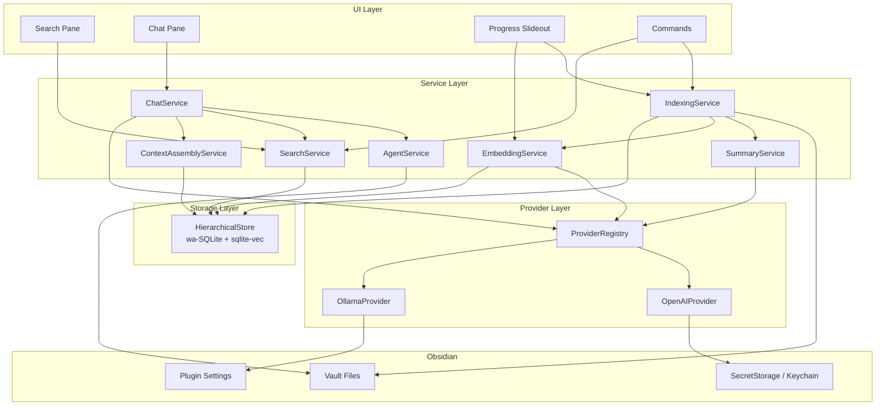
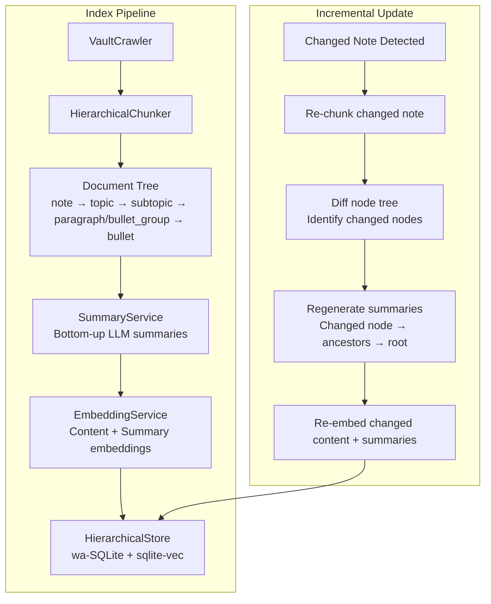
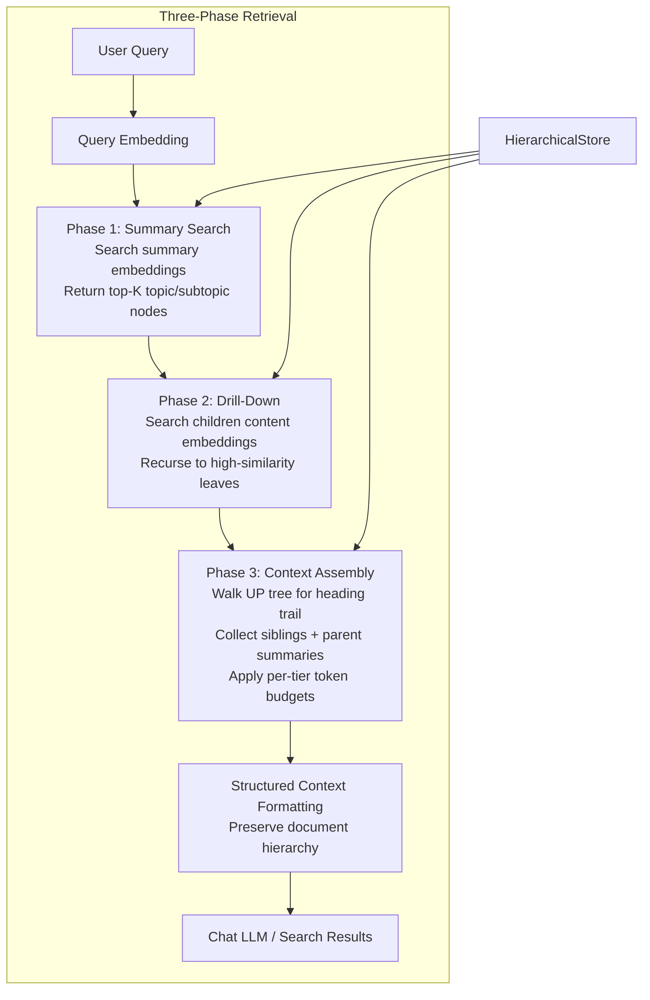

# Obsidian AI Plugin

## Preface
This project represents 2 things for me.  The first is that I've always wanted AI capabilities in Obsidian.  This isn't even the first time I've built it.  It's become my "Hello World" project where I experiment with various ways of building software.  The second is to practice using Cursor's agentic abilities.  It was built using the following agents:
- Architect
  - Build the high-level design document.  It doesn't write the code, only makes sure the project is properly spec'd to be built correctly and cleanly.  A template is used to assure completeness.
  - Create user stories.  Uses a template to spec everything out sufficiently so that the code meets the requirements.  The critical piece is the acceptance criteria.
- Implementer -  Writes the actual code.  It must follow the spec EXACTLY and generate evidence that the code meets the criteria.  If any ambiguities are found, it is instructed to stop and ask how to proceed.  
- QA - Runs all tests to verify acceptance criteria are met and no regressions are added
- Documenter - Updates the documentation with any changes precipitated by the latest work.

Commands were used to execute the various steps and templates were used to maintain consistency. 

The code on this branch was generated using the `GPT-5.3 Codex High` model.

## Purpose
An Obsidian plugin that adds AI-powered **semantic search** and **chat completions** over your vault. Notes are indexed locally with embeddings stored in wa-SQLite/sqlite-vec. Chat uses only vault content as context and can create or update notes on request. Supports OpenAI and Ollama providers (abstracted for future additions).

**Hierarchical Indexing (v2):** The indexing pipeline produces a hierarchical document tree (note → topic → subtopic → paragraph/bullet_group → bullet) with LLM-generated summaries at every non-leaf level. Retrieval uses a three-phase strategy (summary search → drill-down → context assembly) that preserves document structure and delivers coherent, contextualized results to the chat LLM.

Requirements: 
- [docs/prompts/01-initial.md](docs/prompts/01-initial.md)
- [docs/prompts/02-second.md](docs/prompts/02-second.md)
- [docs/prompts/03-search-chat-ux.md](docs/prompts/03-search-chat-ux.md)
- [docs/prompts/04-hierarchical-indexing.md](docs/prompts/04-hierarchical-indexing.md)

## Table of Contents

- [High-Level Architecture](#high-level-architecture)
- [Technical Stack](#technical-stack)
- [Key Design Decisions](#key-design-decisions)
- [Prerequisites](#prerequisites)
- [Getting Started](#getting-started)
- [Available Scripts](#available-scripts)
- [UI Components](#ui-components)
- [API Contract (Internal Service Interfaces)](#api-contract-internal-service-interfaces)
- [Plugin Settings](#plugin-settings)
- [Backlog Items](#backlog-items)
- [License](#license)

## High-Level Architecture

The plugin is a single TypeScript codebase running inside Obsidian's renderer process. It has four layers: **UI**, **Services**, **Providers**, and **Storage**.

The v2 hierarchical indexing redesign replaces the flat chunk pipeline with a tree-structured document model. The indexing pipeline now produces a tree of nodes per note, generates bottom-up LLM summaries, and embeds both content and summaries into a shared vector space. Retrieval navigates the tree in three phases: coarse summary search, fine-grained drill-down, and structured context assembly.



### Data Flow

1. **Indexing (Hierarchical):** `IndexingService` reads vault files via `VaultCrawler`. The `HierarchicalChunker` parses each note into a tree of typed nodes (note → topic → subtopic → paragraph/bullet_group → bullet). `SummaryService` generates bottom-up LLM summaries for non-leaf nodes using the user's configured chat model. `EmbeddingService` generates vectors for both raw content (leaf nodes) and summaries (non-leaf nodes) using the same embedding model. All nodes, summaries, embeddings, tags, and cross-references are stored in the `HierarchicalStore` (wa-SQLite + sqlite-vec).

2. **Hierarchical Retrieval (Three-Phase):**
   - **Phase 1 — Summary Search:** User query is embedded → search against summary embeddings only (note/topic/subtopic levels) → return top-K candidate nodes.
   - **Phase 2 — Drill-Down:** For each Phase 1 candidate, search its children's content embeddings recursively until high-similarity leaf nodes are found.
   - **Phase 3 — Context Assembly:** For each matched leaf, walk up the tree to collect heading trails, sibling nodes, and parent summaries. Apply per-tier token budgets (matched: ~2000, sibling: ~1000, parent summaries: ~1000). Assemble structured context blocks preserving document hierarchy.

3. **Chat:** User sends a message → `SearchService` performs hierarchical retrieval → `ContextAssemblyService` formats results preserving document structure → `ChatService` sends message + structured context to the chat provider → response streamed back.

4. **Semantic Search:** Same three-phase retrieval as chat, but results are displayed in the search pane with hierarchical context (heading trail, parent summary, surrounding content).

5. **Agent Operations:** When the user asks the chat to create/update files, `AgentService` writes to allowed folders with configurable max file size (default 5k chars).

### Index Pipeline Detail



### Retrieval Pipeline Detail



## Technical Stack

| Layer | Technology | Rationale |
|-------|-----------|-----------|
| Language | TypeScript | Required by Obsidian plugin API; confirmed in requirements |
| Plugin Framework | Obsidian Plugin API (>= 1.11.4) | Minimum version that includes SecretStorage API for secure key management |
| Vector Store | wa-SQLite + sqlite-vec | Bundled as plugin dependency (R5). Runs entirely in-browser via WASM, keeps all data local. Supports relational queries for tree traversal, joins across node/summary/embedding tables, and ANN vector search. |
| Build Tool | esbuild | Standard Obsidian plugin build tool; fast, zero-config for TS |
| Embedding Providers | OpenAI API, Ollama | Two providers for MVP; abstracted behind a common interface for future additions |
| Chat Providers | OpenAI API, Ollama | Same providers as embedding; may use different models per task. Chat model also used for summary generation (R2). |
| Testing | Vitest | Fast TS-native test runner; works well with esbuild projects |
| Linting | ESLint | Standard for TypeScript projects |

## Key Design Decisions

### 1. Hierarchical Document Model (R1)

The chunker produces a **tree** of typed nodes per note, replacing the flat chunk list. Each Markdown note becomes:

```
NoteNode (root, one per file)
  TopicNode (# heading)
    ParagraphNode (contiguous text block)
    BulletGroupNode (consecutive bullets, no blank line separating)
      BulletNode (single bullet)
        BulletNode (sub-bullet, indented)
    SubTopicNode (## through ###### heading)
      ParagraphNode
      BulletGroupNode
        ...
```

**Node types:** `note`, `topic`, `subtopic`, `paragraph`, `bullet_group`, `bullet`.

Each node tracks: `nodeId` (stable hash), `parentId`, `childIds` (ordered), `notePath`, `noteTitle`, `headingTrail` (full trail), `depth`, `nodeType`, `content` (raw text, NOT truncated), `sequenceIndex` (sibling ordering for reassembly), `tags` (inherited + inline).

The `nodeId` is computed as a stable FNV-1a hash of `notePath|headingTrail|nodeType|sequenceIndex|contentPrefix` to remain deterministic across re-indexes while being sensitive to structural changes.

### 2. Bottom-Up LLM Summary Generation (R2)

After chunking, `SummaryService` generates summaries bottom-up:

1. **Leaf nodes** (paragraphs, individual bullets): Content IS the summary — no LLM call for short content (below ~200 tokens). Long leaf content gets a summary LLM call.
2. **Bullet groups**: LLM generates a 1-2 sentence summary of grouped bullets.
3. **Subtopics**: LLM summary encompassing all child summaries.
4. **Topics**: LLM summary encompassing all subtopic/child summaries.
5. **Note root**: LLM summary encompassing all topic summaries.

Summary generation uses the user's configured **chat model** with `max_tokens` capped at ~100 tokens per summary call. The prompt instructs the LLM to faithfully represent content without editorializing, preserving key terms, entities, and relationships.

Summaries are stored in a separate `node_summaries` table (not inline with nodes) because they are derived artifacts that may need independent regeneration (prompt changes, model upgrades). Staleness is detectable via `node_summaries.generatedAt < nodes.updatedAt`.

Each summary is embedded as its own vector in `node_embeddings` with `embeddingType = "summary"`. Both content and summary embeddings use the **same embedding model** (hard requirement — they share a vector space).

### 3. Sentence-Boundary Paragraph Splitting (R3)

When a paragraph exceeds the chunk size limit, it is split at **sentence boundaries** (not arbitrary word boundaries). Each split chunk:

- Retains the same `parentId` as the original paragraph node
- Carries a `sequenceIndex` (0, 1, 2, ...) for reassembly via `SELECT * FROM nodes WHERE parentId = ? ORDER BY sequenceIndex`
- Preserves the full `headingTrail`

No overlap window is used. The hierarchical model supports reassembly via `parentId` + `sequenceIndex`, making overlap unnecessary. Overlap would waste embedding tokens, degrade embedding quality, and complicate deduplication.

The sentence splitter (`src/utils/sentenceSplitter.ts`) uses a regex-based approach that handles common abbreviations (Mr., Dr., e.g., i.e., etc.) and avoids splitting on decimal numbers or URLs.

### 4. Bullet List Semantic Grouping (R4)

- Consecutive bullets with no blank line form a `bullet_group` node.
- Sub-bullets (indented) become children of their parent `bullet` node, forming a tree.
- The `bullet_group` gets its own summary embedding (for coarse retrieval).
- Individual bullets also get their own content embeddings (for precise retrieval).
- Blank lines between bullets create separate `bullet_group` nodes.

### 5. SQLite Schema for Hierarchical Model (R5)

The existing JSON-backed `LocalVectorStoreRepository` is replaced by `SqliteVecRepository` backed by wa-SQLite + sqlite-vec, bundled as a plugin dependency.

```sql
-- Document tree nodes
CREATE TABLE nodes (
  node_id       TEXT PRIMARY KEY,
  parent_id     TEXT,
  note_path     TEXT NOT NULL,
  note_title    TEXT NOT NULL,
  heading_trail TEXT NOT NULL,       -- JSON array
  depth         INTEGER NOT NULL,
  node_type     TEXT NOT NULL,       -- 'note'|'topic'|'subtopic'|'paragraph'|'bullet_group'|'bullet'
  content       TEXT NOT NULL,
  sequence_index INTEGER NOT NULL DEFAULT 0,
  content_hash  TEXT NOT NULL,
  updated_at    INTEGER NOT NULL,
  FOREIGN KEY (parent_id) REFERENCES nodes(node_id) ON DELETE CASCADE
);

-- Ordered child relationships (denormalized for efficient tree traversal)
CREATE TABLE node_children (
  parent_id  TEXT NOT NULL,
  child_id   TEXT NOT NULL,
  sort_order INTEGER NOT NULL,
  PRIMARY KEY (parent_id, child_id),
  FOREIGN KEY (parent_id) REFERENCES nodes(node_id) ON DELETE CASCADE,
  FOREIGN KEY (child_id) REFERENCES nodes(node_id) ON DELETE CASCADE
);

-- LLM-generated summaries (separate from source-of-truth nodes)
CREATE TABLE node_summaries (
  node_id        TEXT PRIMARY KEY,
  summary        TEXT NOT NULL,
  model_used     TEXT NOT NULL,
  prompt_version TEXT NOT NULL,
  generated_at   INTEGER NOT NULL,
  FOREIGN KEY (node_id) REFERENCES nodes(node_id) ON DELETE CASCADE
);

-- Vector embeddings via sqlite-vec
CREATE VIRTUAL TABLE node_embeddings USING vec0(
  node_id        TEXT PRIMARY KEY,
  embedding_type TEXT NOT NULL,     -- 'content' | 'summary'
  embedding      FLOAT[{dimensions}]
);

-- Normalized tag index
CREATE TABLE node_tags (
  node_id TEXT NOT NULL,
  tag     TEXT NOT NULL,
  PRIMARY KEY (node_id, tag),
  FOREIGN KEY (node_id) REFERENCES nodes(node_id) ON DELETE CASCADE
);

-- Cross-references (wikilinks between notes/topics)
CREATE TABLE node_cross_refs (
  source_node_id TEXT NOT NULL,
  target_path    TEXT NOT NULL,      -- vault-relative path of the linked note
  target_display TEXT,               -- display text of the wikilink
  FOREIGN KEY (source_node_id) REFERENCES nodes(node_id) ON DELETE CASCADE
);

-- Schema metadata
CREATE TABLE metadata (
  key   TEXT PRIMARY KEY,
  value TEXT
);

-- Indexes
CREATE INDEX idx_nodes_parent_id ON nodes(parent_id);
CREATE INDEX idx_nodes_note_path ON nodes(note_path);
CREATE INDEX idx_nodes_node_type ON nodes(node_type);
CREATE INDEX idx_nodes_content_hash ON nodes(content_hash);
CREATE INDEX idx_node_children_parent ON node_children(parent_id, sort_order);
CREATE INDEX idx_node_tags_tag ON node_tags(tag);
CREATE INDEX idx_node_tags_node ON node_tags(node_id);
CREATE INDEX idx_node_cross_refs_source ON node_cross_refs(source_node_id);
CREATE INDEX idx_node_cross_refs_target ON node_cross_refs(target_path);
CREATE INDEX idx_node_summaries_generated ON node_summaries(generated_at);
```

**Migration strategy:** A new migration (`003_hierarchical_model`) creates all new tables. The old `chunks`/`chunk_embeddings` tables are dropped. A full reindex is required after migration — the migration itself does not attempt data conversion because the structural model is fundamentally different.

### 6. Three-Phase Hierarchical Retrieval (R6)

Replaces flat top-K search:

**Phase 1 — Summary Search (coarse):**
- Embed the user's query.
- Search against **summary embeddings only** (note-level and topic-level first, then subtopic).
- Return top-K candidate topic/subtopic nodes (default K=10).

**Phase 2 — Drill-Down (fine):**
- For each Phase 1 candidate, search its children's **content embeddings**.
- Recurse into subtopics until leaf nodes with high similarity are found.
- Collect matching leaf nodes and their ancestor chains.
- Deduplicate leaves that appear via multiple ancestor paths.

**Phase 3 — Context Assembly:**
- For each matched leaf node, walk UP the tree to collect:
  - Full heading trail (structural context)
  - Sibling nodes (surrounding context within the same bullet group or section)
  - Parent summaries (broader context)
- Apply separate configurable token budgets per tier:
  - **Matched content:** ~2000 tokens (the actual leaf nodes that matched)
  - **Sibling context:** ~1000 tokens (surrounding bullets/paragraphs in the same group/section)
  - **Parent summaries:** ~1000 tokens (ancestor topic/subtopic summaries)
- Track actual token usage per tier for future tuning.
- Assemble coherent context blocks preserving original document structure.

### 7. Structured Context Formatting (R7)

Context sent to the LLM preserves document structure:

```
Source: notePath
# Topic Heading
Summary: <topic summary>

## Subtopic Heading
<full paragraph text>

- Bullet 1
  - Sub-bullet 1a
  - Sub-bullet 1b
- Bullet 2
```

Both `OpenAIChatProvider` and `OllamaChatProvider` use a shared `formatHierarchicalContext()` utility that replaces the current flat `[N] notePath (heading)\nsnippet` format. The `ChatContextChunk` type is replaced by a richer `HierarchicalContextBlock` type that carries the heading trail, content, sibling content, and parent summaries.

### 8. Scoped Tag Tracking (R8)

Tags are tracked at every level of the hierarchy:
- **Note-level tags:** From frontmatter, applied to the root `note` node and inherited by all descendants.
- **Inline tags:** Extracted within each node's scope and stored in `node_tags` for that specific node.
- Tags are queryable: "find all nodes tagged X under topic Y" via `SELECT n.* FROM nodes n JOIN node_tags t ON n.node_id = t.node_id WHERE t.tag = ? AND n.parent_id = ?`.

### 9. Cross-Reference Tracking (R9)

Wikilinks (`[[target]]` and `[[target|display]]`) within node content are parsed and stored in `node_cross_refs`. During retrieval, cross-references can be followed to expand context with related material from other notes/topics.

### 10. Incremental Summary Updates (Resolved Decision #4)

When a note's content hash changes during incremental indexing:
1. Re-chunk the changed note into a new tree.
2. Diff the new tree against the stored tree to identify changed nodes (by `content_hash`).
3. For changed nodes, regenerate summaries from the changed node up through all ancestors to the note root.
4. Re-embed changed content vectors and regenerated summary vectors.
5. Unchanged nodes retain their existing embeddings and summaries.

This prevents stale parent summaries from misrepresenting updated child content.

### 11. Provider Abstraction

Both embedding and chat operations go through a `Provider` interface so that adding new providers (e.g., Anthropic, local llama.cpp) requires only implementing the interface and registering it — no changes to core services.

```typescript
type ProviderId = "openai" | "ollama" | (string & {});

interface EmbeddingProvider {
  readonly id: ProviderId;
  readonly name: string;
  embed(request: EmbeddingRequest): Promise<EmbeddingResponse>;
}

interface ChatProvider {
  readonly id: ProviderId;
  readonly name: string;
  complete(request: ChatRequest): AsyncIterable<ChatStreamEvent>;
}
```

OpenAI and Ollama each implement both interfaces. A `ProviderRegistry` maps provider IDs to instances and is the single lookup point for services. `SummaryService` uses the chat provider for summary generation.

### 12. Startup Performance (< 2 seconds)

- The wa-SQLite database file is opened lazily on first query or background index, not during `onload()`.
- `onload()` only registers views, commands, and the settings tab.
- No indexing runs at startup; the user triggers it via commands.

### 13. Agent File Operations

The chat agent can create/update notes only in user-configured "allowed output folders." This is enforced in `AgentService` before any write. Max generated file size is configurable (default 5,000 characters). The agent cannot delete files.

### 14. Local Data Constraint

All indexed data (nodes, summaries, embeddings, metadata) lives in the plugin's data directory (`.obsidian/plugins/obsidian-ai/`). Raw note content is never sent to external indexing services. Only the text of individual nodes is sent to the embedding provider, only node content is sent to the chat provider for summary generation, and only query + retrieved context is sent to the chat provider for completions.

### 15. Logging and Observability

The plugin uses a lightweight structured logging system tailored for an Obsidian plugin running in Electron's renderer process.

**Logger:** `createRuntimeLogger(scope)` in `src/logging/runtimeLogger.ts` is a scoped wrapper over the browser console API (`console.debug`, `console.info`, `console.warn`, `console.error`). No external logging library (Pino, Winston, etc.) is needed since all runtime output flows through DevTools.

**Format:** Structured `RuntimeLogPayload` objects emitted via `console.{level}()`. Each payload contains:

| Field | Description |
|-------|-------------|
| `scope` | Module or class name (e.g. `"ChatService"`, `"SummaryService"`) |
| `timestamp` | ISO-8601 timestamp |
| `level` | `debug` / `info` / `warn` / `error` |
| `event` | Dotted hierarchical event name (e.g. `summary.generate.started`, `retrieval.phase1.completed`) |
| `message` | Human-readable description |
| `domain` | Optional `RuntimeErrorDomain` for error events |
| `context` | Optional typed key-value map with operation metadata |
| `error` | Optional `NormalizedRuntimeError` for failure events |

DevTools renders these natively with expandable object views.

**Operation IDs:** Each user-initiated action (chat turn, search query, index command) generates a unique `operationId` via a utility function. The ID flows through service layers as a `context` field, enabling end-to-end correlation of all log entries for a single user action.

**Log Levels:**

| Level | Convention |
|-------|-----------|
| `debug` | Internal state detail: batch progress, vector dimensions, node counts, cache hits, tree traversal steps |
| `info` | Operation lifecycle milestones: search started/completed, chat turn started/completed, indexing phase transitions, summary generation progress |
| `warn` | Non-fatal degradations: timeout retry, partial batch failure, stale summary detected, summary generation skipped |
| `error` | Unrecoverable failures that prevent the operation from completing |

**New logging events for hierarchical pipeline:**
- `indexing.chunk.tree_built` — tree node count per note
- `summary.generate.started`, `summary.generate.completed`, `summary.generate.skipped` — per-node summary lifecycle
- `retrieval.phase1.completed`, `retrieval.phase2.completed`, `retrieval.phase3.completed` — per-phase retrieval metrics
- `context.assembly.budget_usage` — actual token usage per tier

**Sensitive Data Policy:** API keys, bearer tokens, and raw user message content must never appear in logs. Only derived metadata is logged: message character count, provider ID, model name, endpoint hostname (not full URL with credentials), chunk counts, result counts, and timing data. A `redactSensitiveContext` utility strips known sensitive keys from log context before emission.

### Project Structure

```
obsidian-ai-plugin/
├── src/
│   ├── main.ts                     # Plugin entry: onload/onunload, register views/commands
│   ├── constants.ts                # Stable command and view identifiers
│   ├── settings.ts                 # PluginSettingTab + defaults (extended with token budget settings)
│   ├── types.ts                    # Shared type definitions (extended with hierarchical node types)
│   ├── bootstrap/
│   │   └── bootstrapRuntimeServices.ts # Runtime composition root (updated for new services)
│   ├── ui/
│   │   ├── SearchView.ts           # Semantic search pane (updated for hierarchical results)
│   │   ├── ChatView.ts             # Chat completions pane
│   │   └── ProgressSlideout.ts     # Long-running task progress UI (updated for summary phase)
│   ├── services/
│   │   ├── IndexingService.ts      # Vault reading, hierarchical chunking, summary orchestration
│   │   ├── SummaryService.ts       # NEW: Bottom-up LLM summary generation
│   │   ├── EmbeddingService.ts     # Embedding generation via provider
│   │   ├── SearchService.ts        # Three-phase hierarchical retrieval
│   │   ├── ContextAssemblyService.ts # NEW: Phase 3 context assembly + token budgets
│   │   ├── ChatService.ts          # RAG: hierarchical retrieve + chat completion
│   │   ├── AgentService.ts         # File create/update with folder + size guards
│   │   └── indexing/
│   │       ├── IndexJobStateStore.ts
│   │       └── IndexManifestStore.ts
│   ├── providers/
│   │   ├── Provider.ts             # EmbeddingProvider + ChatProvider interfaces
│   │   ├── ProviderRegistry.ts     # Registry mapping IDs → provider instances
│   │   ├── chat/
│   │   │   ├── OpenAIChatProvider.ts  # OpenAI chat (updated context formatting)
│   │   │   ├── OllamaChatProvider.ts  # Ollama chat (updated context formatting)
│   │   │   └── httpChatUtils.ts       # Shared HTTP streaming utilities
│   │   └── embeddings/
│   │       ├── OpenAIEmbeddingProvider.ts
│   │       └── OllamaEmbeddingProvider.ts
│   ├── storage/
│   │   ├── SqliteVecRepository.ts  # NEW: wa-SQLite + sqlite-vec hierarchical store
│   │   ├── HierarchicalStoreContract.ts # NEW: Interface for hierarchical storage operations
│   │   ├── vectorStoreSchema.ts    # Schema migrations (extended with hierarchical tables)
│   │   ├── vectorStorePaths.ts     # Storage path resolution
│   │   └── LocalVectorStoreRepository.ts # DEPRECATED: retained for migration reference only
│   ├── logging/
│   │   └── runtimeLogger.ts        # Structured logging
│   ├── errors/
│   │   └── normalizeRuntimeError.ts
│   ├── secrets/
│   │   └── PluginSecretStore.ts
│   └── utils/
│       ├── chunker.ts              # Flat chunker + hierarchical tree-building chunker (buildDocumentTree)
│       ├── sentenceSplitter.ts     # Sentence-boundary paragraph splitting
│       ├── wikilinkParser.ts       # Extract [[wikilinks]] from content
│       ├── contextFormatter.ts     # NEW: Shared hierarchical context formatting
│       ├── tokenEstimator.ts       # Token counting for budget enforcement
│       ├── hasher.ts               # SHA-256 content hashing
│       └── vaultCrawler.ts         # Vault file discovery
├── styles.css                      # Plugin CSS
├── manifest.json                   # Obsidian plugin manifest
├── versions.json                   # Obsidian version compatibility map
├── package.json
├── tsconfig.json
├── esbuild.config.mjs              # Build configuration
├── .eslintrc.cjs
└── docs/
    ├── prompts/
    │   ├── 01-initial.md
    │   ├── 02-second.md
    │   ├── 03-search-chat-ux.md
    │   └── 04-hierarchical-indexing.md
    ├── authoring-guide/
    │   └── README.md               # NEW: User-facing guide on writing notes for optimal indexing (R10)
    └── features/                   # Story documents (created during planning)
```

## Prerequisites

- **Node.js** >= 18
- **npm** >= 9
- **Obsidian** >= 1.11.4 (required for SecretStorage API)
- For **Ollama** provider: Ollama installed and running locally (see [ollama.com](https://ollama.com))
- For **OpenAI** provider: An OpenAI API key

## Getting Started

### 1. Install dependencies

```bash
npm install
```

### 2. Build the plugin

```bash
npm run build
```

### 3. Install into Obsidian vault for development

Copy or symlink the build output into your test vault:

```bash
# Create plugin directory in your test vault
mkdir -p /path/to/vault/.obsidian/plugins/obsidian-ai-mvp

# Symlink build artifacts
ln -s "$(pwd)/main.js" /path/to/vault/.obsidian/plugins/obsidian-ai-mvp/main.js
ln -s "$(pwd)/manifest.json" /path/to/vault/.obsidian/plugins/obsidian-ai-mvp/manifest.json
ln -s "$(pwd)/versions.json" /path/to/vault/.obsidian/plugins/obsidian-ai-mvp/versions.json
```

### 4. Enable the plugin

1. Open Obsidian Settings → Community Plugins.
2. Enable "Obsidian AI MVP."
3. Configure provider connection details in the plugin settings tab.
4. Add API keys via the Keychain settings (SecretStorage).

### 5. Development with hot reload

```bash
npm run dev
```

This watches `src/` and rebuilds on changes. Reload Obsidian (Cmd+R / Ctrl+R) to pick up changes, or use the [Hot Reload plugin](https://github.com/pjeby/hot-reload).

### 6. Use command palette actions

Open Obsidian's command palette (Cmd+P on macOS, Ctrl+P on Windows/Linux), then run the commands below by display name.
The display names and command IDs in this table match the values registered by the plugin command constants.

| Display Name | Command ID | Purpose / Expected Behavior | Typical Usage |
|--------------|------------|-----------------------------|---------------|
| Reindex vault | `obsidian-ai:reindex-vault` | Runs a full reindex of configured folders, rebuilding the hierarchical node tree, summaries, and embeddings from scratch. | Use after major note refactors, model changes, schema migration, or when index consistency is uncertain. |
| Index changes | `obsidian-ai:index-changes` | Runs incremental indexing for only new, modified, or deleted content. Regenerates summaries bottom-up from changed nodes to root. | Use routinely after normal note edits to keep search/chat context current with minimal cost. |
| Semantic search selection | `obsidian-ai:search-selection` | Uses selected note text as the semantic query, opens the search pane, and executes hierarchical search. | Use while reading a note when you want related context from the vault for highlighted text. |
| Open semantic search pane | `obsidian-ai:open-semantic-search-pane` | Opens or reveals the Semantic Search pane without running a query and reuses an existing pane if present. | Use when you want to prepare/search manually from the pane UI. |
| Open chat pane | `obsidian-ai:open-chat-pane` | Opens or reveals the Chat pane without sending a prompt and reuses an existing pane if present. | Use when you want to start or continue a vault-grounded chat session. |

## Available Scripts

| Command | Description |
|---------|-------------|
| `npm run dev` | Build with esbuild in watch mode |
| `npm run build` | Production build that emits `main.js` |
| `npm run lint` | Run ESLint on TypeScript source and config |
| `npm run test` | Run Vitest test suite |
| `npm run test:scale` | Run REL-2 scale validation integration scenarios only |
| `npm run typecheck` | Run `tsc --noEmit` for type checking |

### Test Suite Layout

| Path | Purpose |
|------|---------|
| `src/__tests__/smoke.test.ts` | Lightweight compile-safe and contract smoke checks |
| `src/__tests__/unit/**/*.test.ts` | Service-level unit tests with typed collaborators |
| `src/__tests__/unit/hierarchicalTypes.test.ts` | Compile-time contract tests for hierarchical node types and store contract |
| `src/__tests__/unit/hierarchicalChunker.test.ts` | Hierarchical tree chunker tests (tree structure, bullets, paragraphs, tags, cross-refs) |
| `src/__tests__/unit/sentenceSplitter.test.ts` | Sentence-boundary splitting with abbreviation/URL/decimal handling |
| `src/__tests__/unit/wikilinkParser.test.ts` | Wikilink extraction with code fence filtering and deduplication |
| `src/__tests__/unit/tokenEstimator.test.ts` | Token estimation, budget checking, and truncation |
| `src/__tests__/unit/hierarchicalSchema.test.ts` | Hierarchical SQLite schema migration structure, table/index coverage, and old table cleanup |
| `src/__tests__/unit/sqliteVecRepository.test.ts` | SqliteVecRepository HierarchicalStoreContract implementation (tree ops, search, summaries, tags) |
| `src/__tests__/unit/summaryService.test.ts` | SummaryService bottom-up generation, leaf skipping, LLM integration, error handling, propagation |
| `src/__tests__/unit/summaryService.incremental.test.ts` | Incremental summary propagation: staleness detection, ancestor deduplication, changed node propagation |
| `src/__tests__/unit/summaryService.progress.test.ts` | Summary generation progress callback invocation, error swallowing, stage label |
| `src/__tests__/unit/hierarchicalSearch.test.ts` | Phase 1 and Phase 2 hierarchical search in SearchService |
| `src/__tests__/unit/contextAssemblyService.test.ts` | Phase 3 context assembly with per-tier token budgets |
| `src/__tests__/unit/contextFormatter.test.ts` | Hierarchical context formatting with heading trails, summaries, and sibling content |
| `src/__tests__/unit/bootstrapHierarchicalStore.test.ts` | Bootstrap wiring of SqliteVecRepository into ServiceContainer |
| `src/__tests__/integration/**/*.test.ts` | Plugin lifecycle/command integration tests with Obsidian-compatible mocks |
| `src/__tests__/integration/scaleValidation.integration.test.ts` | REL-2 scale validation for reindex/search/index-changes latency budgets |
| `src/__tests__/harness/` | Reusable test harness factories for app/plugin runtime setup |
| `src/__tests__/setup/mockObsidianModule.ts` | Test-time `obsidian` compatibility shim used by Vitest |

## UI Components

Obsidian UI views registered by the plugin:

| Component | Type | Description |
|-----------|------|-------------|
| `SearchView` | `ItemView` | Semantic search pane. Query input, top-k and min-score controls, and result list showing matching nodes with note title, heading trail, snippet, relevance score, and parent summary context. Clicking a result opens the note at the matching location (with heading context when available). |
| `ChatView` | `ItemView` | Chat completions pane. Message input, scrollable conversation history, streaming responses. The chat agent can create/update files when asked. Sources (retrieved nodes with hierarchical context) shown alongside responses. |
| `ProgressSlideout` | Custom slideout | Slideout panel showing progress for long-running operations (indexing, summary generation, embedding). Displays current task, progress bar/count, and elapsed time. |

### Commands

| Command | ID | Description |
|---------|----|-------------|
| Reindex vault | `obsidian-ai:reindex-vault` | Full reindex — re-chunks, re-summarizes, and re-embeds all notes in configured folders |
| Index changes | `obsidian-ai:index-changes` | Incremental index — only processes new/modified/deleted notes with bottom-up summary propagation |
| Semantic search selection | `obsidian-ai:search-selection` | Uses selected note text as query, opens the search pane, and runs hierarchical search with active quality controls |
| Open semantic search pane | `obsidian-ai:open-semantic-search-pane` | Opens or reveals the semantic search pane and reuses an existing pane when present |
| Open chat pane | `obsidian-ai:open-chat-pane` | Opens or reveals the chat pane and reuses an existing pane when present |

## API Contract (Internal Service Interfaces)

This is an Obsidian plugin, not a REST API. The table below describes the key internal service methods that form the contract between layers.

| Service | Method | Signature | Description |
|---------|--------|-----------|-------------|
| `IndexingService` | `reindexVault()` | `() → Promise<IndexResult>` | Full reindex: chunk → summarize → embed all configured folders |
| `IndexingService` | `indexChanges()` | `() → Promise<IndexResult>` | Incremental index with bottom-up summary propagation |
| `SummaryService` | `generateSummaries(tree)` | `(DocumentTree) → Promise<SummaryResult[]>` | Generate bottom-up summaries for a document tree |
| `SummaryService` | `regenerateFromNode(nodeId)` | `(string) → Promise<SummaryResult[]>` | Regenerate summaries from a changed node up to root |
| `SearchService` | `search(request)` | `(SearchRequest) → Promise<HierarchicalSearchResult[]>` | Three-phase hierarchical retrieval |
| `ContextAssemblyService` | `assemble(matches)` | `(LeafMatch[]) → Promise<AssembledContext>` | Phase 3: walk tree, collect context, apply token budgets |
| `ChatService` | `chat(request)` | `(ChatRequest) → AsyncIterable<ChatStreamEvent>` | RAG chat: hierarchical retrieve + structured context + stream completion |
| `AgentService` | `createNote(path, content)` | `(string, string) → Promise<void>` | Create a note in an allowed folder |
| `AgentService` | `updateNote(path, content)` | `(string, string) → Promise<void>` | Update an existing note in an allowed folder |
| `EmbeddingService` | `embed(request)` | `(EmbeddingRequest) → Promise<EmbeddingResponse>` | Generate embeddings via configured provider |
| `HierarchicalStore` | `upsertNodeTree(tree)` | `(DocumentTree) → Promise<void>` | Insert or update a full node tree for a note |
| `HierarchicalStore` | `deleteByNotePath(path)` | `(string) → Promise<void>` | Delete all nodes/summaries/embeddings for a note |
| `HierarchicalStore` | `getChildren(nodeId)` | `(string) → Promise<DocumentNode[]>` | Get ordered children of a node |
| `HierarchicalStore` | `getAncestorChain(nodeId)` | `(string) → Promise<DocumentNode[]>` | Walk up to root, returning ancestor nodes |
| `HierarchicalStore` | `getSiblings(nodeId)` | `(string) → Promise<DocumentNode[]>` | Get sibling nodes (same parent, ordered) |
| `HierarchicalStore` | `searchSummaryEmbeddings(vec, k)` | `(number[], number) → Promise<NodeMatch[]>` | ANN search on summary embeddings only |
| `HierarchicalStore` | `searchContentEmbeddings(vec, k, parentId?)` | `(number[], number, string?) → Promise<NodeMatch[]>` | ANN search on content embeddings, optionally scoped to a parent |
| `HierarchicalStore` | `upsertSummary(nodeId, summary)` | `(string, SummaryRecord) → Promise<void>` | Insert or update a node's summary |
| `HierarchicalStore` | `upsertEmbedding(nodeId, type, vec)` | `(string, EmbeddingType, number[]) → Promise<void>` | Insert or update a node's embedding |
| `ProviderRegistry` | `getEmbedding()` | `() → EmbeddingProvider` | Return the active embedding provider |
| `ProviderRegistry` | `getChat()` | `() → ChatProvider` | Return the active chat provider |

### Runtime Error + Logging Contracts

| Contract | Signature | Description |
|----------|-----------|-------------|
| `normalizeRuntimeError` | `(error: unknown, context?: Record<string, unknown>) → NormalizedRuntimeError` | Normalizes unknown thrown values into consistent domain, code, message, retryability, and user-facing guidance |
| `createRuntimeLogger` | `(scope: string) → RuntimeLoggerContract` | Emits structured runtime log events (`debug`/`info`/`warn`/`error`) with scope and timestamp metadata |
| `RuntimeErrorDomain` | `"provider" \| "network" \| "storage" \| "runtime"` | Classifies failure source for consistent handling paths and user notices |

## Plugin Settings

Settings stored via `Plugin.loadData()` / `Plugin.saveData()` in `.obsidian/plugins/obsidian-ai/data.json`. API keys are stored separately in Obsidian's SecretStorage (Keychain).

| Setting | Type | Default | Description |
|---------|------|---------|-------------|
| `embeddingProvider` | `string` | `"openai"` | Active embedding provider ID (`openai` or `ollama`) |
| `chatProvider` | `string` | `"openai"` | Active chat provider ID (`openai` or `ollama`) |
| `embeddingModel` | `string` | `"text-embedding-3-small"` | Model name for embeddings (used for both content and summary embeddings) |
| `chatModel` | `string` | `"gpt-4o-mini"` | Model name for chat completions and summary generation |
| `ollamaEndpoint` | `string` | `"http://localhost:11434"` | Ollama server URL |
| `openaiEndpoint` | `string` | `"https://api.openai.com/v1"` | OpenAI-compatible API base URL |
| `indexedFolders` | `string[]` | `["/"]` | Folders to include in indexing (vault-relative) |
| `excludedFolders` | `string[]` | `[]` | Folders to exclude from indexing |
| `agentOutputFolders` | `string[]` | `[]` | Folders the agent is allowed to create/update files in |
| `maxGeneratedNoteSize` | `number` | `5000` | Max characters for agent-generated notes |
| `chatTimeout` | `number` | `30000` | Chat completion timeout in milliseconds |
| `summaryMaxTokens` | `number` | `100` | Max tokens per LLM summary generation call |
| `matchedContentBudget` | `number` | `2000` | Token budget for matched leaf content in context assembly |
| `siblingContextBudget` | `number` | `1000` | Token budget for sibling context in context assembly |
| `parentSummaryBudget` | `number` | `1000` | Token budget for parent summary context in context assembly |
| `logLevel` | `string` | `"info"` | Minimum log level emitted to console (`debug`, `info`, `warn`, `error`) |

Secrets (stored in SecretStorage, not in `data.json`):

| Secret Key | Description |
|------------|-------------|
| `openai-api-key` | OpenAI API key |

## Backlog Items

### Epic 1: Plugin Foundation and Runtime Shell

Establish the plugin skeleton, lifecycle wiring, and baseline developer workflows.

| ID | Status | Story | Size | Notes |
| ----- | -------- | --------------------------------------------------------------------- | ---- | ------------------------------------------------------------------------------------------- |
| [FND-1](docs/features/FND-1-initialize-obsidian-plugin-scaffold-and-build-pipeline.md) | Done | Initialize Obsidian plugin scaffold and build pipeline | S | Ensure `manifest.json`, `versions.json`, `esbuild`, lint, and test scripts are wired |
| [FND-2](docs/features/FND-2-register-plugin-lifecycle-views-commands-and-settings-tab-shell.md) | Done | Register plugin lifecycle, views, commands, and settings tab shell | M | View/command/settings/progress shells registered with deterministic unload cleanup |
| [FND-3](docs/features/FND-3-define-shared-domain-types-for-chunks-providers-search-chat-and-jobs.md) | Done | Define shared domain types for chunks, providers, search, chat, and jobs | S | Types should support future providers without refactors |
| [FND-4](docs/features/FND-4-implement-service-container-bootstrap-orchestration.md) | Done | Implement service container/bootstrap orchestration | M | Runtime bootstrap and service disposal order are explicit and tested |
| [FND-5](docs/features/FND-5-add-structured-logging-and-error-normalization.md) | Done | Add structured logging and error normalization | S | Provide actionable errors for provider/network/storage failures |
| [FND-6](docs/features/FND-6-set-up-unit-integration-test-harness-with-obsidian-compatible-mocks.md) | Done | Set up unit/integration test harness with Obsidian-compatible mocks | M | Required for service-level and command-level planning in later stories |

### Epic 2: Indexing and Metadata Pipeline

Build full and incremental indexing that preserves note structure and metadata.

| ID | Status | Story | Size | Notes |
| ----- | -------- | --------------------------------------------------------------------- | ---- | ------------------------------------------------------------------------------------------- |
| [IDX-1](docs/features/IDX-1-implement-markdown-chunker-preserving-heading-paragraph-bullet-context-and-tags.md) | Done | Implement markdown chunker preserving heading, paragraph/bullet context, and tags | M | Metadata minimum: note name, heading, paragraph/bullet, tags |
| [IDX-2](docs/features/IDX-2-implement-vault-crawler-with-configurable-include-exclude-folders.md) | Done | Implement vault crawler with configurable include/exclude folders | M | Folder scoping comes from plugin settings |
| [IDX-3](docs/features/IDX-3-build-full-reindex-workflow-and-reindex-vault-command.md) | Done | Build full reindex workflow and `Reindex vault` command | M | Always rebuild chunks/embeddings for configured scope |
| [IDX-4](docs/features/IDX-4-build-incremental-index-workflow-and-index-changes-command.md) | Done | Build incremental index workflow and `Index changes` command | L | Detect new/updated/deleted content via content hash strategy |
| [IDX-5](docs/features/IDX-5-persist-index-job-state-and-progress-events-for-long-running-tasks.md) | Done | Persist index job state and progress events for long-running tasks | M | Drives slideout progress UI and prevents duplicate jobs |
| [IDX-6](docs/features/IDX-6-add-index-consistency-checks-and-recovery-flow.md) | Done | Add index consistency checks and recovery flow | S | Handle partial failures and resume safely |

### Epic 3: Local Vector Storage and Embedding Providers

Provide local embedding storage and provider-backed embedding generation.

| ID | Status | Story | Size | Notes |
| ----- | -------- | --------------------------------------------------------------------- | ---- | ------------------------------------------------------------------------------------------- |
| [STO-1](docs/features/STO-1-implement-wa-sqlite-sqlite-vec-schema-migrations-and-local-storage-paths.md) | Done | Implement wa-SQLite/sqlite-vec schema, migrations, and local storage paths | M | Indexed data must remain local in plugin directory |
| [STO-2](docs/features/STO-2-implement-vector-store-repository-for-upsert-delete-and-nearest-neighbor-query.md) | Done | Implement vector store repository for upsert, delete, and nearest-neighbor query | M | Optimize for vaults with thousands of notes |
| [STO-3](docs/features/STO-3-implement-embedding-provider-abstraction-and-registry.md) | Done | Implement embedding provider abstraction and registry | S | Keep provider interface extensible for post-MVP providers |
| [STO-4](docs/features/STO-4-implement-openai-embedding-provider-integration.md) | Done | Implement OpenAI embedding provider integration | M | Endpoint and API key configurable; key from secret store |
| [STO-5](docs/features/STO-5-implement-ollama-embedding-provider-integration.md) | Done | Implement Ollama embedding provider integration | M | Endpoint/model configurable for local runtime |
| [STO-6](docs/features/STO-6-add-batching-retry-and-timeout-handling-for-embedding-jobs.md) | Done | Add batching, retry, and timeout handling for embedding jobs | M | Use safe defaults and surface per-note failures |

### Epic 4: Semantic Search Experience

Deliver semantic search end to end from query entry to note navigation.

| ID | Status | Story | Size | Notes |
| ----- | -------- | --------------------------------------------------------------------- | ---- | ------------------------------------------------------------------------------------------- |
| [SRCH-1](docs/features/SRCH-1-implement-search-service-using-query-embeddings-and-vector-similarity.md) | Done | Implement search service using query embeddings and vector similarity | M | Return ranked results with metadata and excerpts |
| [SRCH-2](docs/features/SRCH-2-build-semantic-search-pane-ui.md) | Done | Build Semantic Search pane UI | M | Include query input, loading state, result list, empty/error states |
| [SRCH-3](docs/features/SRCH-3-implement-semantic-search-selection-command.md) | Done | Implement `Semantic search selection` command | S | Uses selected note text as query input |
| [SRCH-4](docs/features/SRCH-4-wire-result-actions-to-open-note-at-relevant-location.md) | Done | Wire result actions to open note at relevant location | S | Preserve heading context when navigating |
| [SRCH-5](docs/features/SRCH-5-add-search-quality-controls-and-result-limits.md) | Done | Add search quality controls and result limits | S | Include top-k, relevance threshold, and sane defaults |

### Epic 5: Chat Completions and Agent File Operations

Deliver vault-grounded chat and controlled note creation/update workflows.

| ID | Status | Story | Size | Notes |
| ----- | -------- | --------------------------------------------------------------------- | ---- | ------------------------------------------------------------------------------------------- |
| [CHAT-1](docs/features/CHAT-1-implement-chat-provider-abstraction-with-streaming-completion-support.md) | Done | Implement chat provider abstraction with streaming completion support | M | Shared contract for OpenAI and Ollama |
| [CHAT-2](docs/features/CHAT-2-implement-openai-chat-provider-integration.md) | Done | Implement OpenAI chat provider integration | M | Configurable model, endpoint, timeout |
| [CHAT-3](docs/features/CHAT-3-implement-ollama-chat-provider-integration.md) | Done | Implement Ollama chat provider integration | M | Configurable model, endpoint, timeout |
| [CHAT-4](docs/features/CHAT-4-implement-retrieval-augmented-chat-orchestration.md) | Done | Implement retrieval-augmented chat orchestration | L | Chat context must come only from indexed vault content |
| [CHAT-5](docs/features/CHAT-5-build-chat-pane-ui-with-streaming-responses-and-source-context-display.md) | Done | Build Chat pane UI with streaming responses and source context display | M | Include conversation history and cancellation controls |
| [CHAT-6](docs/features/CHAT-6-implement-agent-create-note-workflow-with-allowed-folder-enforcement.md) | Done | Implement agent create-note workflow with allowed-folder enforcement | M | Allowed output folders configurable and validated |
| [CHAT-7](docs/features/CHAT-7-implement-agent-update-note-workflow-with-max-size-enforcement.md) | Done | Implement agent update-note workflow with max-size enforcement | M | Default max generated note size: 5,000 characters |

### Epic 6: Settings, Secrets, and Configuration Guardrails

Provide secure, configurable runtime settings for indexing, providers, and chat behavior.

| ID | Status | Story | Size | Notes |
| ----- | -------- | --------------------------------------------------------------------- | ---- | ------------------------------------------------------------------------------------------- |
| [CFG-1](docs/features/CFG-1-implement-settings-schema-with-defaults-and-runtime-validation.md) | Done | Implement settings schema with defaults and runtime validation | M | Include folders, providers, models, endpoints, limits, and timeout |
| [CFG-2](docs/features/CFG-2-build-settings-ui-for-indexing-scope-and-agent-output-folder-controls.md) | Done | Build settings UI for indexing scope and agent output folder controls | M | Keep indexing scope and write scope independently configurable |
| [CFG-3](docs/features/CFG-3-integrate-obsidian-secret-store-for-api-key-management.md) | Done | Integrate Obsidian secret store for API key management | S | No secrets in plain config files |
| [CFG-4](docs/features/CFG-4-implement-provider-model-selection-for-embeddings-and-chat.md) | Done | Implement provider/model selection for embeddings and chat | S | Must support OpenAI and Ollama in MVP |
| [CFG-5](docs/features/CFG-5-add-configurable-chat-timeout-with-30s-default.md) | Done | Add configurable chat timeout with 30s default | S | Should support slower local models and remote APIs |
| [CFG-6](docs/features/CFG-6-add-settings-migration-versioning-support.md) | Done | Add settings migration/versioning support | S | Preserve compatibility across plugin updates |

### Epic 7: Performance, Reliability, and MVP Readiness

Validate performance constraints and readiness for MVP release.

| ID | Status | Story | Size | Notes |
| ----- | -------- | --------------------------------------------------------------------- | ---- | ------------------------------------------------------------------------------------------- |
| [REL-1](docs/features/REL-1-implement-lazy-runtime-initialization-for-fast-plugin-startup.md) | Done | Implement lazy initialization strategy to keep plugin startup under 2 seconds | M | Defer DB/provider-heavy work until first use/background task |
| [REL-2](docs/features/REL-2-run-scale-validation-for-indexing-and-search-latency.md) | Done | Run scale validation on vaults with hundreds to thousands of notes | M | Verify indexing/search latency remains practical |
| [REL-3](docs/features/REL-3-add-end-to-end-tests-for-core-user-journeys.md) | Done | Add end-to-end tests for core user journeys | L | Reindex, index changes, semantic search, chat, and agent note writes |
| [REL-4](docs/features/REL-4-harden-provider-outage-and-partial-indexing-failure-recovery.md) | Done | Harden failure handling for provider outages and partial indexing failures | M | Include retries, user-facing errors, and recovery actions |
| [REL-5](docs/features/REL-5-prepare-mvp-release-checklist-and-acceptance-criteria.md) | Done | Prepare MVP release checklist and acceptance criteria | S | Ensure success criteria map to measurable verification steps |

### Epic 8: Command Palette Pane Access and Command UX

Add pane-opening commands and command documentation so users can discover and open core plugin experiences directly from the command palette.

| ID | Status | Story | Size | Notes |
| ----- | -------- | --------------------------------------------------------------------- | ---- | ------------------------------------------------------------------------------------------- |
| [CMD-1](docs/features/CMD-1-add-pane-open-command-constants-and-command-id-type-coverage.md) | Done | Add pane-open command constants and command ID type coverage | S | Centralize IDs/names and include new IDs in command type unions for compile-time safety |
| [CMD-2](docs/features/CMD-2-add-open-semantic-search-pane-command-registration-and-reveal-behavior.md) | Done | Add `Open semantic search pane` command registration and reveal behavior | S | Reuse existing search leaf when present; open one when missing; do not execute search automatically |
| [CMD-3](docs/features/CMD-3-add-open-chat-pane-command-registration-and-reveal-behavior.md) | Done | Add `Open chat pane` command registration and reveal behavior | S | Reuse existing chat leaf when present; open one when missing; do not trigger completion automatically |
| [CMD-4](docs/features/CMD-4-update-getting-started-command-reference-aligned-with-registered-command-names.md) | Done | Update `Getting Started` command reference aligned with registered command names | S | Document display name, behavior, and usage context for all user-facing plugin commands |
| [CMD-5](docs/features/CMD-5-add-integration-tests-for-pane-command-discoverability-and-open-reveal-semantics.md) | Done | Add integration tests for pane command discoverability and open/reveal semantics | M | Verify commands are registered and reliably reveal existing panes or create missing panes |

### Epic 9: Logging and Observability Instrumentation

Instrument all service, provider, storage, and UI layers with structured logging, operation IDs, and log-level controls to make the application maintainable and debuggable.

| ID | Status | Story | Size | Notes |
| ----- | -------- | --------------------------------------------------------------------- | ---- | ------------------------------------------------------------------------------------------- |
| [LOG-1](docs/features/LOG-1-enhance-runtime-logger-with-operation-id-support-and-log-level-filtering.md) | Done | Enhance runtime logger with operation ID support and log-level filtering | S | Add `operationId` generator, `logLevel` threshold check, convenience methods, and `logLevel` setting |
| [LOG-2](docs/features/LOG-2-instrument-searchservice-and-searchpanemodel-with-structured-logging.md) | Done | Instrument SearchService and SearchPaneModel with structured logging | M | Log query lifecycle: start, embedding timing, vector search timing, result count, completion/failure |
| [LOG-3](docs/features/LOG-3-instrument-chatservice-and-chatpanemodel-with-structured-logging.md) | Done | Instrument ChatService and ChatPaneModel with structured logging | M | Log turn lifecycle: start, context retrieval, provider call timing, stream events, completion/failure |
| [LOG-4](docs/features/LOG-4-instrument-embeddingservice-and-provider-http-layer-with-structured-logging.md) | Done | Instrument EmbeddingService and provider HTTP layer with structured logging | M | Log batch processing, HTTP request/response timing, retries; redact Authorization headers |
| [LOG-5](docs/features/LOG-5-instrument-storage-layer-and-agentservice-with-structured-logging.md) | Done | Instrument storage layer and AgentService with structured logging | S | Log VectorStore load/persist/query timing and AgentService create/update lifecycle |
| [LOG-6](docs/features/LOG-6-add-log-level-setting-ui-and-sensitive-data-redaction-tests.md) | Done | Add log-level setting UI and sensitive data redaction tests | S | Add `logLevel` dropdown to settings, `redactSensitiveContext` utility, and unit tests |

### Epic 10: Search and Chat Pane UX Polish

Improve visual formatting, text selectability, and interaction patterns for the Semantic Search and Chat panes.

| ID | Status | Story | Size | Notes |
| ----- | -------- | ----- | ---- | ----- |
| [UX-1](docs/features/UX-1-create-plugin-stylesheet-with-design-tokens-and-shared-styles.md) | Done | Create plugin stylesheet with design tokens and shared styles | S | Create `styles.css` at project root using Obsidian CSS variables for theme compatibility; define tokens for spacing, border-radius, and colors |
| [UX-2](docs/features/UX-2-redesign-semantic-search-result-cards-with-visual-hierarchy-and-text-selectability.md) | Done | Redesign Semantic Search result cards with visual hierarchy and text selectability | M | Style each result as a card with distinct note title (clickable link), file path (muted), selectable snippet, and score badge; ensure all text is selectable |
| [UX-3](docs/features/UX-3-redesign-chat-pane-layout-with-bubble-alignment-and-bottom-input-area.md) | Done | Redesign Chat pane layout with bubble alignment and bottom input area | M | Restructure ChatView: right-aligned user bubbles, left-aligned assistant bubbles, multi-line textarea at bottom, scrollable history area, auto-scroll to newest |
| [UX-4](docs/features/UX-4-add-copy-to-clipboard-button-on-assistant-response-bubbles.md) | Done | Add copy-to-clipboard button on assistant response bubbles | S | Add a copy icon button in the upper-right corner of each assistant bubble; copies full response text via `navigator.clipboard.writeText` |
| [UX-5](docs/features/UX-5-add-source-pill-buttons-to-chat-responses-with-note-navigation.md) | Done | Add source pill buttons to chat responses with note navigation | M | Render sources as clickable pill buttons below assistant bubbles; wire `openSource` callback through ChatPaneModel to open notes using existing search navigation |
| [UX-6](docs/features/UX-6-add-new-conversation-button-and-clear-conversation-support.md) | Done | Add New Conversation button and clear conversation support | S | Add `clearConversation()` to ChatPaneModel; render "New Conversation" button in chat header that resets turns and status |

### Epic 11: Hierarchical Document Model and Tree Chunker

Replace the flat chunker with a tree-building chunker that produces typed hierarchical nodes with full metadata. Covers requirements R1, R3, R4.

| ID | Status | Story | Size | Notes |
| ----- | -------- | --------------------------------------------------------------------- | ---- | ------------------------------------------------------------------------------------------- |
| [HIER-1](docs/features/HIER-1-define-hierarchical-node-types-and-hierarchical-store-contract-interface.md) | Done | Define hierarchical node types and HierarchicalStoreContract interface | M | New types: DocumentNode, NodeType, DocumentTree, HierarchicalStoreContract. Extend types.ts with all node-related interfaces. No dependencies. |
| [HIER-2](docs/features/HIER-2-implement-sentence-boundary-paragraph-splitter.md) | Done | Implement sentence-boundary paragraph splitter | S | New file: `src/utils/sentenceSplitter.ts`. Handles abbreviations, decimals, URLs. Each split carries `sequenceIndex`. Depends on HIER-1 (node types). |
| [HIER-3](docs/features/HIER-3-implement-wikilink-parser-for-cross-reference-extraction.md) | Done | Implement wikilink parser for cross-reference extraction | S | New file: `src/utils/wikilinkParser.ts`. Extract `[[target]]` and `[[target\|display]]` from node content. No dependencies. |
| [HIER-4](docs/features/HIER-4-implement-token-estimator-utility.md) | Done | Implement token estimator utility | S | New file: `src/utils/tokenEstimator.ts`. Approximate token count for budget enforcement. Use character-based heuristic (chars/4) with optional tiktoken integration. No dependencies. |
| [HIER-5](docs/features/HIER-5-rewrite-chunker-to-produce-hierarchical-document-tree.md) | Done | Rewrite chunker to produce hierarchical document tree | L | Complete rewrite of `src/utils/chunker.ts`. Parse markdown into tree of typed nodes (note → topic → subtopic → paragraph/bullet_group → bullet). Sentence splitting for long paragraphs. Bullet grouping by blank-line boundaries. Scoped tag tracking. Cross-reference extraction. Depends on HIER-1, HIER-2, HIER-3, HIER-4. |

### Epic 12: SQLite Hierarchical Storage Migration

Migrate from the flat chunk storage to the hierarchical node/summary/embedding schema in wa-SQLite. Covers requirement R5.

| ID | Status | Story | Size | Notes |
| ----- | -------- | --------------------------------------------------------------------- | ---- | ------------------------------------------------------------------------------------------- |
| [STOR-1](docs/features/STOR-1-define-hierarchical-sqlite-schema-migration.md) | Done | Define hierarchical SQLite schema migration | M | New migration `003_hierarchical_model` creating `nodes`, `node_children`, `node_summaries`, `node_embeddings`, `node_tags`, `node_cross_refs`, and `metadata` tables with all indexes. Drop old `chunks`/`chunk_embeddings` tables. Full reindex required after migration. Depends on HIER-1 (node types define schema shape). |
| [STOR-2](docs/features/STOR-2-implement-sqlitevecrepository-with-hierarchical-store-contract.md) | Done | Implement SqliteVecRepository with HierarchicalStoreContract | L | New file: `src/storage/SqliteVecRepository.ts`. Implements tree traversal queries, summary/content embedding search, upsert/delete operations, tag queries. Include structured logging for all storage operations. Depends on STOR-1, HIER-1. |
| [STOR-3](docs/features/STOR-3-wire-sqlitevecrepository-into-bootstrap-and-deprecate-localvectorstorerepository.md) | Done | Wire SqliteVecRepository into bootstrap and deprecate LocalVectorStoreRepository | M | Update `bootstrapRuntimeServices.ts` to construct `SqliteVecRepository`. Update all service dependencies. Mark `LocalVectorStoreRepository` as deprecated. Depends on STOR-2. |

### Epic 13: LLM Summary Generation Service

Build the bottom-up summary generation pipeline that produces concise summaries at every non-leaf level of the document tree. Covers requirement R2.

| ID | Status | Story | Size | Notes |
| ----- | -------- | --------------------------------------------------------------------- | ---- | ------------------------------------------------------------------------------------------- |
| [SUM-1](docs/features/SUM-1-implement-summaryservice-with-bottom-up-generation.md) | Done | Implement SummaryService with bottom-up generation | L | New file: `src/services/SummaryService.ts`. Traverse tree bottom-up. Skip short leaf nodes (below ~200 tokens). Generate summaries via chat provider with `max_tokens` cap (~100 tokens). Store in `node_summaries`. Include structured logging (summary.generate.started/completed/skipped events). Depends on HIER-1 (node types), STOR-2 (storage), chat provider (existing). |
| [SUM-2](docs/features/SUM-2-implement-incremental-summary-propagation-for-changed-nodes.md) | Done | Implement incremental summary propagation for changed nodes | M | When a node's content changes, regenerate summaries from the changed node up through all ancestors to the note root. Detect staleness via `generatedAt < updatedAt`. Depends on SUM-1, STOR-2. |
| [SUM-3](docs/features/SUM-3-add-summary-generation-progress-events.md) | Done | Add summary generation progress events to IndexingService and ProgressSlideout | S | Emit progress events during summary phase. Update ProgressSlideout UI to display summary generation status (node count, current node, elapsed time). New indexing stage: `summarize`. Depends on SUM-1. |

### Epic 14: Three-Phase Hierarchical Retrieval

Replace flat top-K search with the three-phase hierarchical retrieval strategy. Covers requirements R6, R7.

| ID | Status | Story | Size | Notes |
| ----- | -------- | --------------------------------------------------------------------- | ---- | ------------------------------------------------------------------------------------------- |
| [RET-1](docs/features/RET-1-implement-phase-1-summary-search-in-searchservice.md) | Done | Implement Phase 1 summary search in SearchService | M | Search summary embeddings only. Return top-K candidate topic/subtopic nodes (default K=10). Include structured logging (retrieval.phase1.completed). Depends on STOR-2 (searchSummaryEmbeddings). |
| [RET-2](docs/features/RET-2-implement-phase-2-drill-down-search-in-searchservice.md) | Done | Implement Phase 2 drill-down search in SearchService | M | For each Phase 1 candidate, search children's content embeddings recursively. Collect high-similarity leaf nodes. Deduplicate across ancestor paths. Include structured logging (retrieval.phase2.completed). Depends on RET-1, STOR-2 (searchContentEmbeddings). |
| [RET-3](docs/features/RET-3-implement-contextassemblyservice-phase-3.md) | Done | Implement ContextAssemblyService (Phase 3) | L | New file: `src/services/ContextAssemblyService.ts`. Walk up tree for heading trails, siblings, parent summaries. Apply per-tier token budgets (matched: ~2000, sibling: ~1000, parent summaries: ~1000). Track actual usage per tier. Include structured logging (retrieval.phase3.completed, context.assembly.budget_usage). Depends on RET-2, HIER-4 (token estimator), STOR-2 (getAncestorChain, getSiblings). |
| [RET-4](docs/features/RET-4-implement-shared-hierarchical-context-formatter.md) | Done | Implement shared hierarchical context formatter | M | New file: `src/utils/contextFormatter.ts`. Format assembled context preserving document structure (headings, summaries, bullets, paragraphs). Used by both chat providers. Depends on RET-3, HIER-1 (node types). |
| RET-5 | Not Started | Update ChatService and chat providers for hierarchical context | M | Replace `ChatContextChunk` with `HierarchicalContextBlock`. Update `OpenAIChatProvider` and `OllamaChatProvider` to use `formatHierarchicalContext()`. Depends on RET-4. |

### Epic 15: Hierarchical Indexing Pipeline Integration

Wire the hierarchical chunker, summary service, and new storage into the IndexingService for both full and incremental indexing. Integrates Epics 11-14 into the runtime.

| ID | Status | Story | Size | Notes |
| ----- | -------- | --------------------------------------------------------------------- | ---- | ------------------------------------------------------------------------------------------- |
| INTG-1 | Not Started | Update bootstrap to wire SummaryService, ContextAssemblyService, and SqliteVecRepository | M | Update `bootstrapRuntimeServices.ts` with new service construction order. Add `SummaryService` and `ContextAssemblyService` to `RuntimeServices`. Must be done first — other INTG stories depend on the wired services. Depends on STOR-3, SUM-1, RET-3. |
| INTG-2 | Not Started | Update IndexingService for hierarchical full reindex | L | Replace flat chunk → embed flow with: chunk tree → store nodes → generate summaries → embed content + summaries. Update progress events for new phases. Depends on INTG-1, HIER-5 (chunker), SUM-1, STOR-2. |
| INTG-3 | Not Started | Update IndexingService for hierarchical incremental index | L | Diff node trees for changed notes. Delete stale nodes. Upsert changed nodes. Trigger incremental summary propagation (SUM-2). Re-embed changed content + summaries. Depends on INTG-2, SUM-2. |
| INTG-4 | Not Started | Add token budget settings to plugin settings UI | S | Add `summaryMaxTokens`, `matchedContentBudget`, `siblingContextBudget`, `parentSummaryBudget` to settings schema, defaults, and settings tab UI. Consumed by RET-3 (ContextAssemblyService) and SUM-1. Can be done in parallel with INTG-1. |

### Epic 16: Scoped Tags, Cross-References, and Search UX Updates

Implement scoped tag tracking, cross-reference following, and update the search pane for hierarchical results. Covers requirements R8, R9.

| ID | Status | Story | Size | Notes |
| ----- | -------- | --------------------------------------------------------------------- | ---- | ------------------------------------------------------------------------------------------- |
| META-1 | Not Started | Implement scoped tag tracking in chunker and storage | M | Tags inherited from note frontmatter + inline tags per node scope. Store in `node_tags`. Queryable: "find all nodes tagged X under topic Y". Depends on HIER-5 (chunker), STOR-2 (node_tags table). |
| META-2 | Not Started | Implement cross-reference tracking and retrieval expansion | M | Parse wikilinks during chunking (uses HIER-3), store in `node_cross_refs`. During retrieval, optionally follow cross-references to expand context with related material. Depends on HIER-3, HIER-5, STOR-2 (node_cross_refs table), RET-3. |
| META-3 | Not Started | Update SearchView for hierarchical result display | M | Show heading trail, parent summary context, and surrounding content in search result cards. Update `SearchResult` type to use `HierarchicalSearchResult`. Depends on RET-1, RET-2, RET-3. |

### Epic 17: User-Facing Authoring Guide

Document the hierarchical indexing and retrieval scheme for end users. Covers requirement R10.

| ID | Status | Story | Size | Notes |
| ----- | -------- | --------------------------------------------------------------------- | ---- | ------------------------------------------------------------------------------------------- |
| DOC-1 | Not Started | Write authoring guide for optimal note structure | M | New file: `docs/authoring-guide/README.md`. Cover: heading mapping to topics/subtopics, bullet grouping semantics, paragraph splitting by sentence, tag scoping (frontmatter + inline), wikilink cross-references, and best practices. Can be written once Epics 11-14 are stable. |

### Epic 18: Hierarchical Pipeline Testing and Validation

Validate the hierarchical pipeline end-to-end with unit, integration, and scale tests. Ensures all requirements R1-R10 are verified.

| ID | Status | Story | Size | Notes |
| ----- | -------- | --------------------------------------------------------------------- | ---- | ------------------------------------------------------------------------------------------- |
| TEST-1 | Not Started | Add unit tests for hierarchical chunker | M | Test tree structure for various markdown inputs: headings, nested bullets, long paragraphs, mixed content, edge cases (empty notes, no headings, deeply nested bullets). Also covers sentence splitter and wikilink parser. Depends on HIER-5. |
| TEST-2 | Not Started | Add unit tests for SummaryService | M | Test bottom-up traversal, leaf skipping (below ~200 tokens), incremental propagation, error handling. Mock chat provider. Depends on SUM-1, SUM-2. |
| TEST-3 | Not Started | Add unit tests for three-phase retrieval | M | Test Phase 1 summary search, Phase 2 drill-down, Phase 3 context assembly with token budgets. Verify per-tier budget enforcement and actual usage tracking. Mock HierarchicalStore. Depends on RET-1, RET-2, RET-3. |
| TEST-4 | Not Started | Add integration tests for hierarchical index → search → chat flow | L | End-to-end: index a set of notes → hierarchical search → verify structured context format → chat completion with hierarchical context. Depends on INTG-2, RET-5. |
| TEST-5 | Not Started | Run scale validation for hierarchical pipeline | M | Verify indexing (with summaries) and search latency for vaults with hundreds to thousands of notes. Ensure summary generation cost is bounded. Compare latency budgets against existing REL-2 baselines. Depends on TEST-4. |

## License
MIT © Philip Teitel
