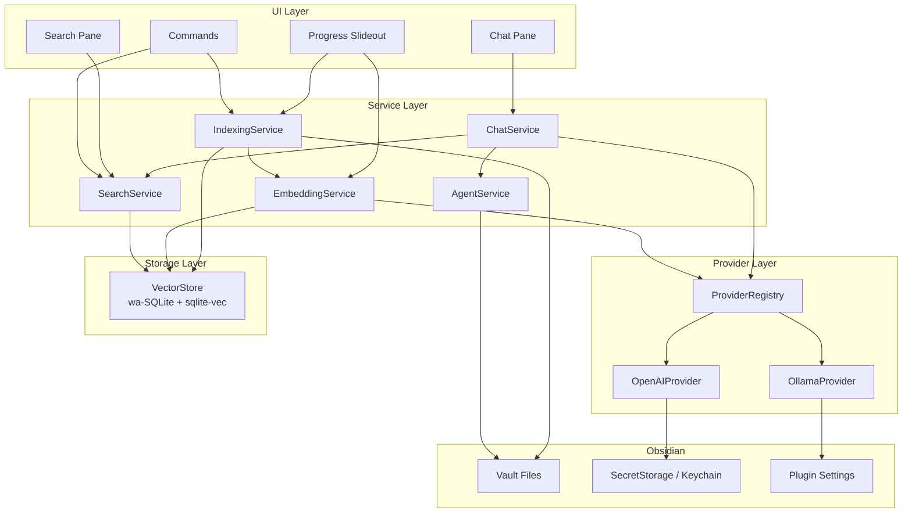

# Obsidian AI Plugin

## Preface
This project represents 2 things for me.  The first is that I've always wanted AI capabilities in Obsidian.  This isn't even the first time I've built it.  It's become my "Hello World" project where I experiment with various ways of building software.  The second is to practice using Cursor's agentic abilities.  It was built using the following agents:
- Architect
  - Build the high-level design document.  It doesn't write the code, only makes sure the project is properly spec'd to be built correctly and cleanly.  A template is used to assure completeness.
  - Create user stories.  Uses a template to spec everything out sufficiently so that the code meets the requirements.  The critical piece is the acceptance criteria.
- Implementer -  Writes the actual code.  It must follow the spec EXACTLY.  Generate evidence that the code meets the criteria.  If any ambiguities are found, it is instructed to stop and ask how to proceed.  
- QA - Runs all tests to verify acceptance criteria are met and no regressions are added
- Documenter - Updates the documentation with any changes precipitated by the latest work.

Commands were used to execute the various steps and templates were used to maintain consistency. 

The code on this branch was generated using the `GPT-5.3 Codex High` model.

## Purpose
An Obsidian plugin that adds AI-powered **semantic search** and **chat completions** over your vault. Notes are indexed locally with embeddings stored in wa-SQLite/sqlite-vec. Chat uses only vault content as context and can create or update notes on request. Supports OpenAI and Ollama providers (abstracted for future additions).

Requirements: [docs/prompts/initial.md](docs/prompts/initial.md)

## Table of Contents

- [High-Level Architecture](#high-level-architecture)
- [Technical Stack](#technical-stack)
- [Key Design Decisions](#key-design-decisions)
- [Prerequisites](#prerequisites)
- [Getting Started](#getting-started)
- [Available Scripts](#available-scripts)
- [UI Components](#ui-components)
- [API Contract (Internal Service Interfaces)](#api-contract-internal-service-interfaces)
- [Plugin Settings](#plugin-settings)
- [Backlog Items](#backlog-items)
- [License](#license)

## High-Level Architecture

The plugin is a single TypeScript codebase running inside Obsidian's renderer process. It has four layers: **UI**, **Services**, **Providers**, and **Storage**.



### Data Flow

1. **Indexing:** `IndexingService` reads vault files, splits them into chunks (by heading/paragraph) with metadata (note name, heading, tags). `EmbeddingService` generates vectors via the configured provider. Chunks + vectors are stored in `VectorStore`.
2. **Semantic Search:** User enters a query → `EmbeddingService` embeds the query → `VectorStore` performs nearest-neighbor search → results returned with source metadata.
3. **Chat:** User sends a message → `SearchService` retrieves relevant chunks as context → `ChatService` sends the message + context to the chat provider → response streamed back. Only vault content is used as context.
4. **Agent Operations:** When the user asks the chat to create/update files, `AgentService` writes to allowed folders with configurable max file size (default 5k chars).

## Technical Stack

| Layer | Technology | Rationale |
|-------|-----------|-----------|
| Language | TypeScript | Required by Obsidian plugin API; confirmed in requirements |
| Plugin Framework | Obsidian Plugin API (>= 1.11.4) | Minimum version that includes SecretStorage API for secure key management |
| Vector Store | wa-SQLite + sqlite-vec | Confirmed in requirements; runs entirely in-browser via WASM, keeps all data local |
| Build Tool | esbuild | Standard Obsidian plugin build tool; fast, zero-config for TS |
| Embedding Providers | OpenAI API, Ollama | Two providers for MVP; abstracted behind a common interface for future additions |
| Chat Providers | OpenAI API, Ollama | Same providers as embedding; may use different models per task |
| Testing | Vitest | Fast TS-native test runner; works well with esbuild projects |
| Linting | ESLint | Standard for TypeScript projects |

## Key Design Decisions

### 1. Provider Abstraction

Both embedding and chat operations go through a `Provider` interface so that adding new providers (e.g., Anthropic, local llama.cpp) requires only implementing the interface and registering it — no changes to core services.

```typescript
type ProviderId = "openai" | "ollama" | (string & {});

interface EmbeddingRequest {
  providerId: ProviderId;
  model: string;
  inputs: string[];
}

interface EmbeddingResponse {
  providerId: ProviderId;
  model: string;
  vectors: EmbeddingVector[];
}

interface EmbeddingProvider {
  readonly id: ProviderId;
  readonly name: string;
  embed(request: EmbeddingRequest): Promise<EmbeddingResponse>;
}

interface ChatRequest {
  providerId: ProviderId;
  model: string;
  messages: ChatMessage[];
  context: ChatContextChunk[];
  timeoutMs: number;
}

type ChatStreamEvent =
  | { type: "token"; text: string }
  | { type: "done"; finishReason: "stop" | "length" | "error" }
  | { type: "error"; message: string; retryable: boolean };

interface ChatProvider {
  readonly id: ProviderId;
  readonly name: string;
  complete(request: ChatRequest): AsyncIterable<ChatStreamEvent>;
}
```

OpenAI and Ollama each implement both interfaces. A `ProviderRegistry` maps provider IDs to instances and is the single lookup point for services.

### 2. Chunking Strategy

Notes are split into **chunks** at heading boundaries. Within a heading section, long content is further split by paragraph/bullet. Each chunk carries metadata:

| Field | Source |
|-------|--------|
| `noteTitle` | File basename |
| `notePath` | Vault-relative path |
| `heading` | Nearest parent heading(s) |
| `tags` | Obsidian tags from frontmatter + inline |
| `content` | Raw text of the chunk |
| `hash` | SHA-256 of `content` for change detection |

This preserves the structural context required by the spec while keeping chunks small enough for effective embedding.

### 3. Incremental Indexing

Each chunk's `hash` is stored alongside its embedding. On "Index changes":
1. Walk configured folders and compute hashes for current chunks.
2. Compare against stored hashes — skip unchanged, embed new/modified, delete removed.
3. This avoids re-embedding the entire vault on every change.

"Reindex vault" bypasses the comparison and re-processes everything.

### 4. Startup Performance (< 2 seconds)

- The wa-SQLite database file is opened lazily on first query or background index, not during `onload()`.
- `onload()` only registers views, commands, and the settings tab.
- No indexing runs at startup; the user triggers it via commands or it can be triggered after a configurable delay post-load.

### 5. Agent File Operations

The chat agent can create/update notes only in user-configured "allowed output folders." This is enforced in `AgentService` before any write. Max generated file size is configurable (default 5,000 characters). The agent cannot delete files.

### 6. Local Data Constraint

All indexed data (chunks, embeddings, metadata) lives in the plugin's data directory (`.obsidian/plugins/obsidian-ai/`). Raw note content is never sent to external indexing services. Only the text of individual chunks is sent to the embedding provider, and only query + retrieved context is sent to the chat provider.

### 7. SQLite Schema

```sql
CREATE TABLE chunks (
  id         INTEGER PRIMARY KEY,
  note_path  TEXT NOT NULL,
  heading    TEXT,
  content    TEXT NOT NULL,
  hash       TEXT NOT NULL,
  tags       TEXT,           -- JSON array
  updated_at INTEGER NOT NULL
);

CREATE VIRTUAL TABLE chunk_embeddings USING vec0(
  chunk_id INTEGER PRIMARY KEY,
  embedding FLOAT[{dimensions}]  -- dimension set by chosen embedding model
);

CREATE TABLE metadata (
  key   TEXT PRIMARY KEY,
  value TEXT
);
```

### Project Structure

```
obsidian-ai-plugin/
├── src/
│   ├── main.ts                     # Plugin entry: onload/onunload, register views/commands
│   ├── constants.ts                # Stable command and view identifiers
│   ├── settings.ts                 # PluginSettingTab + defaults
│   ├── types.ts                    # Shared type definitions
│   ├── bootstrap/
│   │   └── bootstrapRuntimeServices.ts # Runtime composition root + deterministic init order
│   ├── ui/
│   │   ├── SearchView.ts           # Semantic search pane (ItemView)
│   │   ├── ChatView.ts             # Chat completions pane (ItemView)
│   │   └── ProgressSlideout.ts     # Long-running task progress UI
│   ├── services/
│   │   ├── IndexingService.ts      # Vault reading, chunking, orchestrating embedding
│   │   ├── EmbeddingService.ts     # Embedding generation via provider
│   │   ├── SearchService.ts        # Query embedding + vector nearest-neighbor lookup
│   │   ├── ChatService.ts          # RAG: retrieve context + chat completion
│   │   └── AgentService.ts         # File create/update with folder + size guards
│   ├── providers/
│   │   ├── Provider.ts             # EmbeddingProvider + ChatProvider interfaces
│   │   ├── ProviderRegistry.ts     # Registry mapping IDs → provider instances
│   │   ├── OpenAIProvider.ts       # OpenAI implementation (embeddings + chat)
│   │   └── OllamaProvider.ts       # Ollama implementation (embeddings + chat)
│   ├── db/
│   │   ├── VectorStore.ts          # wa-SQLite + sqlite-vec wrapper
│   │   └── migrations.ts           # Schema creation and versioned migrations
│   └── utils/
│       ├── chunker.ts              # Markdown parsing → chunks with metadata
│       └── hasher.ts               # SHA-256 content hashing
├── styles.css                      # Plugin CSS
├── manifest.json                   # Obsidian plugin manifest
├── versions.json                   # Obsidian version compatibility map
├── package.json
├── tsconfig.json
├── esbuild.config.mjs              # Build configuration
├── .eslintrc.cjs
└── docs/
    ├── prompts/
    │   └── initial.md              # Requirements document
    └── features/                   # Story documents (created during planning)
```

## Prerequisites

- **Node.js** >= 18
- **npm** >= 9
- **Obsidian** >= 1.11.4 (required for SecretStorage API)
- For **Ollama** provider: Ollama installed and running locally (see [ollama.com](https://ollama.com))
- For **OpenAI** provider: An OpenAI API key

## Getting Started

### 1. Install dependencies

```bash
npm install
```

### 2. Build the plugin

```bash
npm run build
```

### 3. Install into Obsidian vault for development

Copy or symlink the build output into your test vault:

```bash
# Create plugin directory in your test vault
mkdir -p /path/to/vault/.obsidian/plugins/obsidian-ai-mvp

# Symlink build artifacts
ln -s "$(pwd)/main.js" /path/to/vault/.obsidian/plugins/obsidian-ai-mvp/main.js
ln -s "$(pwd)/manifest.json" /path/to/vault/.obsidian/plugins/obsidian-ai-mvp/manifest.json
ln -s "$(pwd)/versions.json" /path/to/vault/.obsidian/plugins/obsidian-ai-mvp/versions.json
```

### 4. Enable the plugin

1. Open Obsidian Settings → Community Plugins.
2. Enable "Obsidian AI MVP."
3. Configure provider connection details in the plugin settings tab.
4. Add API keys via the Keychain settings (SecretStorage).

### 5. Development with hot reload

```bash
npm run dev
```

This watches `src/` and rebuilds on changes. Reload Obsidian (Cmd+R / Ctrl+R) to pick up changes, or use the [Hot Reload plugin](https://github.com/pjeby/hot-reload).

## Available Scripts

| Command | Description |
|---------|-------------|
| `npm run dev` | Build with esbuild in watch mode |
| `npm run build` | Production build that emits `main.js` |
| `npm run lint` | Run ESLint on TypeScript source and config |
| `npm run test` | Run Vitest test suite |
| `npm run typecheck` | Run `tsc --noEmit` for type checking |

### Test Suite Layout

| Path | Purpose |
|------|---------|
| `src/__tests__/smoke.test.ts` | Lightweight compile-safe and contract smoke checks |
| `src/__tests__/unit/**/*.test.ts` | Service-level unit tests with typed collaborators |
| `src/__tests__/integration/**/*.test.ts` | Plugin lifecycle/command integration tests with Obsidian-compatible mocks |
| `src/__tests__/harness/` | Reusable test harness factories for app/plugin runtime setup |
| `src/__tests__/setup/mockObsidianModule.ts` | Test-time `obsidian` compatibility shim used by Vitest |

## UI Components

Obsidian UI views registered by the plugin:

| Component | Type | Description |
|-----------|------|-------------|
| `SearchView` | `ItemView` | Semantic search pane. Query input, top-k and min-score controls, and result list showing matching chunks with note title, heading, snippet, and relevance score. Clicking a result opens the note at the matching location (with heading context when available). |
| `ChatView` | `ItemView` | Chat completions pane. Message input, scrollable conversation history, streaming responses. The chat agent can create/update files when asked. Sources (retrieved chunks) shown alongside responses. |
| `ProgressSlideout` | Custom slideout | Slideout panel showing progress for long-running operations (indexing, embedding). Displays current task, progress bar/count, and elapsed time. |

### Commands

| Command | ID | Description |
|---------|----|-------------|
| Reindex vault | `obsidian-ai:reindex-vault` | Full reindex — re-chunks and re-embeds all notes in configured folders |
| Index changes | `obsidian-ai:index-changes` | Incremental index — only processes new/modified/deleted notes |
| Semantic search selection | `obsidian-ai:search-selection` | Uses selected note text as query, opens the search pane, and runs semantic search with active quality controls |

## API Contract (Internal Service Interfaces)

This is an Obsidian plugin, not a REST API. The table below describes the key internal service methods that form the contract between layers.

| Service | Method | Signature | Description |
|---------|--------|-----------|-------------|
| `IndexingService` | `reindexVault()` | `() → Promise<IndexResult>` | Full reindex of all configured folders |
| `IndexingService` | `indexChanges()` | `() → Promise<IndexResult>` | Incremental index of changed files |
| `SearchService` | `search(request)` | `(SearchRequest) → Promise<SearchResult[]>` | Embed query and return nearest chunks |
| `ChatService` | `chat(request)` | `(ChatRequest) → AsyncIterable<ChatStreamEvent>` | RAG chat: retrieve context, stream completion |
| `AgentService` | `createNote(path, content)` | `(string, string) → Promise<void>` | Create a note in an allowed folder |
| `AgentService` | `updateNote(path, content)` | `(string, string) → Promise<void>` | Update an existing note in an allowed folder |
| `EmbeddingService` | `embed(request)` | `(EmbeddingRequest) → Promise<EmbeddingResponse>` | Generate embeddings via configured provider |
| `VectorStore` | `upsertChunks(chunks)` | `(ChunkWithEmbedding[]) → Promise<void>` | Insert or update chunks + vectors |
| `VectorStore` | `queryNearest(vec, k)` | `(number[], number) → Promise<ChunkResult[]>` | k-nearest-neighbor search |
| `ProviderRegistry` | `getEmbedding()` | `() → EmbeddingProvider` | Return the active embedding provider |
| `ProviderRegistry` | `getChat()` | `() → ChatProvider` | Return the active chat provider |

### Runtime Error + Logging Contracts

| Contract | Signature | Description |
|----------|-----------|-------------|
| `normalizeRuntimeError` | `(error: unknown, context?: Record<string, unknown>) → NormalizedRuntimeError` | Normalizes unknown thrown values into consistent domain, code, message, retryability, and user-facing guidance |
| `createRuntimeLogger` | `(scope: string) → RuntimeLoggerContract` | Emits structured runtime log events (`debug`/`info`/`warn`/`error`) with scope and timestamp metadata |
| `RuntimeErrorDomain` | `"provider" \| "network" \| "storage" \| "runtime"` | Classifies failure source for consistent handling paths and user notices |

## Plugin Settings

Settings stored via `Plugin.loadData()` / `Plugin.saveData()` in `.obsidian/plugins/obsidian-ai/data.json`. API keys are stored separately in Obsidian's SecretStorage (Keychain).

| Setting | Type | Default | Description |
|---------|------|---------|-------------|
| `embeddingProvider` | `string` | `"openai"` | Active embedding provider ID (`openai` or `ollama`) |
| `chatProvider` | `string` | `"openai"` | Active chat provider ID (`openai` or `ollama`) |
| `embeddingModel` | `string` | `"text-embedding-3-small"` | Model name for embeddings |
| `chatModel` | `string` | `"gpt-4o-mini"` | Model name for chat completions |
| `ollamaEndpoint` | `string` | `"http://localhost:11434"` | Ollama server URL |
| `openaiEndpoint` | `string` | `"https://api.openai.com/v1"` | OpenAI-compatible API base URL |
| `indexedFolders` | `string[]` | `["/"]` | Folders to include in indexing (vault-relative) |
| `excludedFolders` | `string[]` | `[]` | Folders to exclude from indexing |
| `agentOutputFolders` | `string[]` | `[]` | Folders the agent is allowed to create/update files in |
| `maxGeneratedNoteSize` | `number` | `5000` | Max characters for agent-generated notes |
| `chatTimeout` | `number` | `30000` | Chat completion timeout in milliseconds |

Secrets (stored in SecretStorage, not in `data.json`):

| Secret Key | Description |
|------------|-------------|
| `openai-api-key` | OpenAI API key |

## Backlog Items

### Epic 1: Plugin Foundation and Runtime Shell

Establish the plugin skeleton, lifecycle wiring, and baseline developer workflows.

| ID | Status | Story | Size | Notes |
| ----- | -------- | --------------------------------------------------------------------- | ---- | ------------------------------------------------------------------------------------------- |
| [FND-1](docs/features/FND-1-initialize-obsidian-plugin-scaffold-and-build-pipeline.md) | Done | Initialize Obsidian plugin scaffold and build pipeline | S | Ensure `manifest.json`, `versions.json`, `esbuild`, lint, and test scripts are wired |
| [FND-2](docs/features/FND-2-register-plugin-lifecycle-views-commands-and-settings-tab-shell.md) | Done | Register plugin lifecycle, views, commands, and settings tab shell | M | View/command/settings/progress shells registered with deterministic unload cleanup |
| [FND-3](docs/features/FND-3-define-shared-domain-types-for-chunks-providers-search-chat-and-jobs.md) | Done | Define shared domain types for chunks, providers, search, chat, and jobs | S | Types should support future providers without refactors |
| [FND-4](docs/features/FND-4-implement-service-container-bootstrap-orchestration.md) | Done | Implement service container/bootstrap orchestration | M | Runtime bootstrap and service disposal order are explicit and tested |
| [FND-5](docs/features/FND-5-add-structured-logging-and-error-normalization.md) | Done | Add structured logging and error normalization | S | Provide actionable errors for provider/network/storage failures |
| [FND-6](docs/features/FND-6-set-up-unit-integration-test-harness-with-obsidian-compatible-mocks.md) | Done | Set up unit/integration test harness with Obsidian-compatible mocks | M | Required for service-level and command-level planning in later stories |

### Epic 2: Indexing and Metadata Pipeline

Build full and incremental indexing that preserves note structure and metadata.

| ID | Status | Story | Size | Notes |
| ----- | -------- | --------------------------------------------------------------------- | ---- | ------------------------------------------------------------------------------------------- |
| [IDX-1](docs/features/IDX-1-implement-markdown-chunker-preserving-heading-paragraph-bullet-context-and-tags.md) | Done | Implement markdown chunker preserving heading, paragraph/bullet context, and tags | M | Metadata minimum: note name, heading, paragraph/bullet, tags |
| [IDX-2](docs/features/IDX-2-implement-vault-crawler-with-configurable-include-exclude-folders.md) | Done | Implement vault crawler with configurable include/exclude folders | M | Folder scoping comes from plugin settings |
| [IDX-3](docs/features/IDX-3-build-full-reindex-workflow-and-reindex-vault-command.md) | Done | Build full reindex workflow and `Reindex vault` command | M | Always rebuild chunks/embeddings for configured scope |
| [IDX-4](docs/features/IDX-4-build-incremental-index-workflow-and-index-changes-command.md) | Done | Build incremental index workflow and `Index changes` command | L | Detect new/updated/deleted content via content hash strategy |
| [IDX-5](docs/features/IDX-5-persist-index-job-state-and-progress-events-for-long-running-tasks.md) | Done | Persist index job state and progress events for long-running tasks | M | Drives slideout progress UI and prevents duplicate jobs |
| [IDX-6](docs/features/IDX-6-add-index-consistency-checks-and-recovery-flow.md) | Done | Add index consistency checks and recovery flow | S | Handle partial failures and resume safely |

### Epic 3: Local Vector Storage and Embedding Providers

Provide local embedding storage and provider-backed embedding generation.

| ID | Status | Story | Size | Notes |
| ----- | -------- | --------------------------------------------------------------------- | ---- | ------------------------------------------------------------------------------------------- |
| [STO-1](docs/features/STO-1-implement-wa-sqlite-sqlite-vec-schema-migrations-and-local-storage-paths.md) | Done | Implement wa-SQLite/sqlite-vec schema, migrations, and local storage paths | M | Indexed data must remain local in plugin directory |
| [STO-2](docs/features/STO-2-implement-vector-store-repository-for-upsert-delete-and-nearest-neighbor-query.md) | Done | Implement vector store repository for upsert, delete, and nearest-neighbor query | M | Optimize for vaults with thousands of notes |
| [STO-3](docs/features/STO-3-implement-embedding-provider-abstraction-and-registry.md) | Done | Implement embedding provider abstraction and registry | S | Keep provider interface extensible for post-MVP providers |
| [STO-4](docs/features/STO-4-implement-openai-embedding-provider-integration.md) | Done | Implement OpenAI embedding provider integration | M | Endpoint and API key configurable; key from secret store |
| [STO-5](docs/features/STO-5-implement-ollama-embedding-provider-integration.md) | Done | Implement Ollama embedding provider integration | M | Endpoint/model configurable for local runtime |
| [STO-6](docs/features/STO-6-add-batching-retry-and-timeout-handling-for-embedding-jobs.md) | Done | Add batching, retry, and timeout handling for embedding jobs | M | Use safe defaults and surface per-note failures |

### Epic 4: Semantic Search Experience

Deliver semantic search end to end from query entry to note navigation.

| ID | Status | Story | Size | Notes |
| ----- | -------- | --------------------------------------------------------------------- | ---- | ------------------------------------------------------------------------------------------- |
| [SRCH-1](docs/features/SRCH-1-implement-search-service-using-query-embeddings-and-vector-similarity.md) | Done | Implement search service using query embeddings and vector similarity | M | Return ranked results with metadata and excerpts |
| [SRCH-2](docs/features/SRCH-2-build-semantic-search-pane-ui.md) | Done | Build Semantic Search pane UI | M | Include query input, loading state, result list, empty/error states |
| [SRCH-3](docs/features/SRCH-3-implement-semantic-search-selection-command.md) | Done | Implement `Semantic search selection` command | S | Uses selected note text as query input |
| [SRCH-4](docs/features/SRCH-4-wire-result-actions-to-open-note-at-relevant-location.md) | Done | Wire result actions to open note at relevant location | S | Preserve heading context when navigating |
| [SRCH-5](docs/features/SRCH-5-add-search-quality-controls-and-result-limits.md) | Done | Add search quality controls and result limits | S | Include top-k, relevance threshold, and sane defaults |

### Epic 5: Chat Completions and Agent File Operations

Deliver vault-grounded chat and controlled note creation/update workflows.

| ID | Status | Story | Size | Notes |
| ----- | -------- | --------------------------------------------------------------------- | ---- | ------------------------------------------------------------------------------------------- |
| [CHAT-1](docs/features/CHAT-1-implement-chat-provider-abstraction-with-streaming-completion-support.md) | Done | Implement chat provider abstraction with streaming completion support | M | Shared contract for OpenAI and Ollama |
| [CHAT-2](docs/features/CHAT-2-implement-openai-chat-provider-integration.md) | Done | Implement OpenAI chat provider integration | M | Configurable model, endpoint, timeout |
| [CHAT-3](docs/features/CHAT-3-implement-ollama-chat-provider-integration.md) | Done | Implement Ollama chat provider integration | M | Configurable model, endpoint, timeout |
| [CHAT-4](docs/features/CHAT-4-implement-retrieval-augmented-chat-orchestration.md) | Done | Implement retrieval-augmented chat orchestration | L | Chat context must come only from indexed vault content |
| [CHAT-5](docs/features/CHAT-5-build-chat-pane-ui-with-streaming-responses-and-source-context-display.md) | Done | Build Chat pane UI with streaming responses and source context display | M | Include conversation history and cancellation controls |
| [CHAT-6](docs/features/CHAT-6-implement-agent-create-note-workflow-with-allowed-folder-enforcement.md) | Done | Implement agent create-note workflow with allowed-folder enforcement | M | Allowed output folders configurable and validated |
| [CHAT-7](docs/features/CHAT-7-implement-agent-update-note-workflow-with-max-size-enforcement.md) | Done | Implement agent update-note workflow with max-size enforcement | M | Default max generated note size: 5,000 characters |

### Epic 6: Settings, Secrets, and Configuration Guardrails

Provide secure, configurable runtime settings for indexing, providers, and chat behavior.

| ID | Status | Story | Size | Notes |
| ----- | -------- | --------------------------------------------------------------------- | ---- | ------------------------------------------------------------------------------------------- |
| CFG-1 | Not Started | Implement settings schema with defaults and runtime validation | M | Include folders, providers, models, endpoints, limits, and timeout |
| CFG-2 | Not Started | Build settings UI for indexing scope and agent output folder controls | M | Keep indexing scope and write scope independently configurable |
| CFG-3 | Not Started | Integrate Obsidian secret store for API key management | S | No secrets in plain config files |
| CFG-4 | Not Started | Implement provider/model selection for embeddings and chat | S | Must support OpenAI and Ollama in MVP |
| CFG-5 | Not Started | Add configurable chat timeout with 30s default | S | Should support slower local models and remote APIs |
| CFG-6 | Not Started | Add settings migration/versioning support | S | Preserve compatibility across plugin updates |

### Epic 7: Performance, Reliability, and MVP Readiness

Validate performance constraints and readiness for MVP release.

| ID | Status | Story | Size | Notes |
| ----- | -------- | --------------------------------------------------------------------- | ---- | ------------------------------------------------------------------------------------------- |
| REL-1 | Not Started | Implement lazy initialization strategy to keep plugin startup under 2 seconds | M | Defer DB/provider-heavy work until first use/background task |
| REL-2 | Not Started | Run scale validation on vaults with hundreds to thousands of notes | M | Verify indexing/search latency remains practical |
| REL-3 | Not Started | Add end-to-end tests for core user journeys | L | Reindex, index changes, semantic search, chat, and agent note writes |
| REL-4 | Not Started | Harden failure handling for provider outages and partial indexing failures | M | Include retries, user-facing errors, and recovery actions |
| REL-5 | Not Started | Prepare MVP release checklist and acceptance criteria | S | Ensure success criteria map to measurable verification steps |

## License
MIT © Philip Teitel