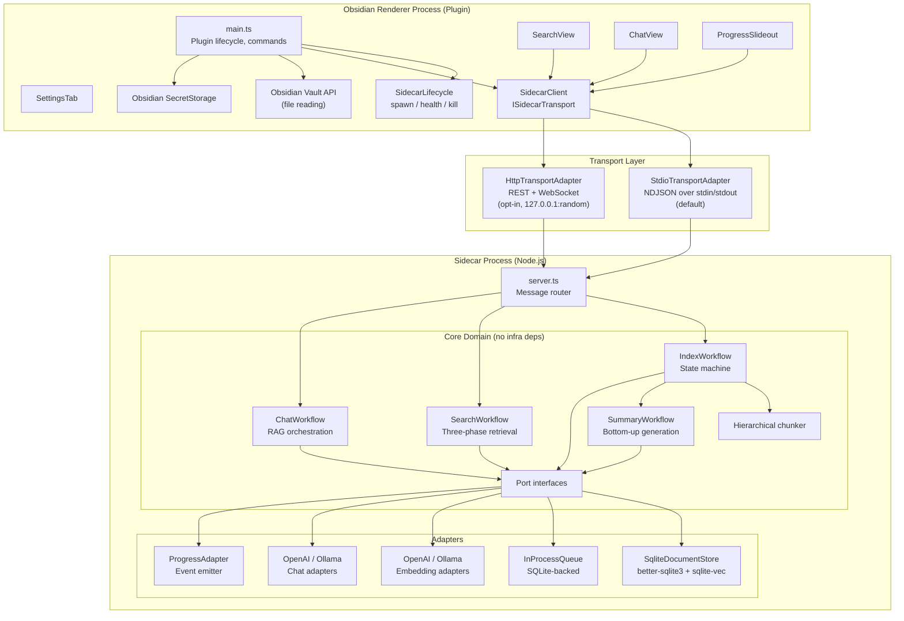
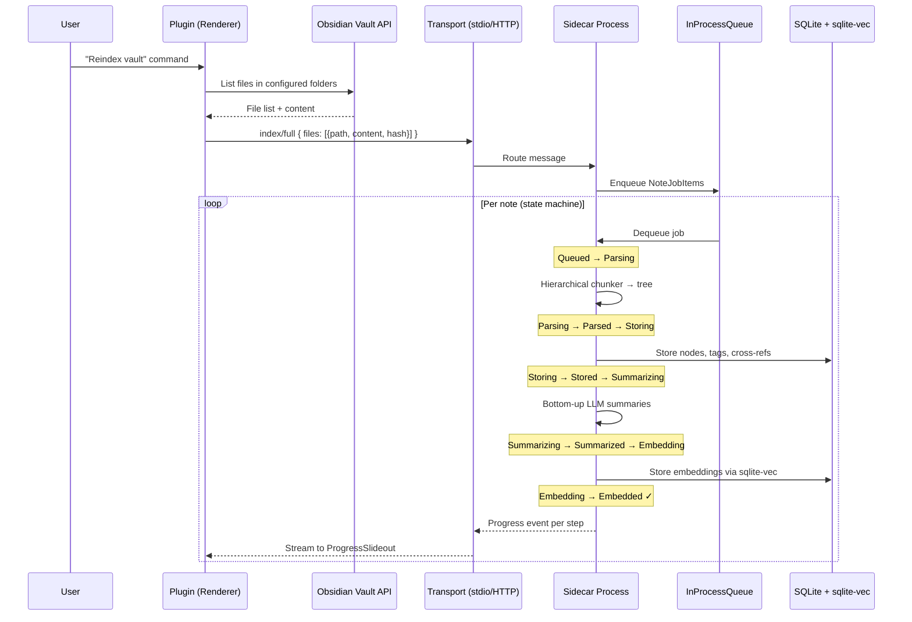
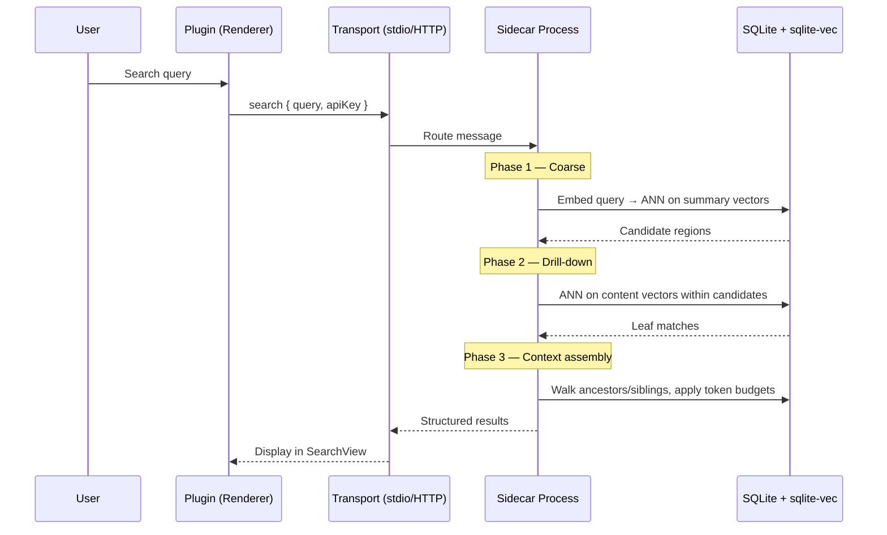
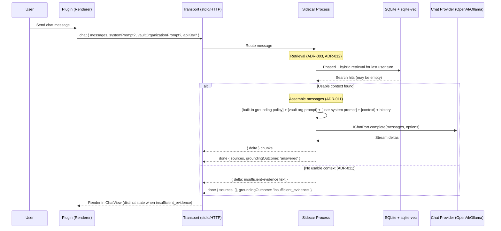
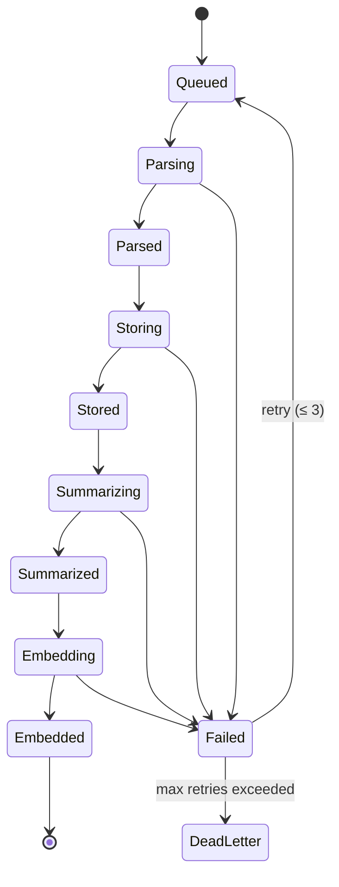

# Obsidian AI Plugin — Iteration 3

## Preface

This project represents 2 things. The first is AI capabilities in Obsidian. There are multiple iterations each experimenting with implementations, architectures, stacks, etc. The second is to practice using Cursor's agent features. It was built using the following agents:

- Architect
  - Refines requirements to produce architecture design records and Gherkin scenarios.
  - Build the high-level design document. It doesn't write the code, only makes sure the project is properly spec'd to be built correctly and cleanly. A template is used to assure completeness.
  - Create user stories. Uses a template to spec everything out sufficiently so that the code meets the requirements. The critical piece is the acceptance criteria.
- Implementer 
  - Writes the actual code. It must follow the spec EXACTLY and generate evidence that the code meets the criteria. If any ambiguities are found, it is instructed to stop and ask how to proceed.
- QA 
  - Reviews implemented code to verify that each test associated with the acceptance criteria pass.  Any failed tests are returned to the implementer for resolution.
  - Runs all regression tests
- Documenter 
  - Updates the documentation with any changes precipitated by the latest work.
  - Updates project status.
- Auditor
  - Performs security, reliability, database, performance and test coverage audits

Commands were used to execute the various steps and templates were used to maintain consistency.

## Purpose

A community Obsidian plugin that brings **semantic search** and **RAG-powered chat** to your vault. Notes are parsed into a **hierarchical tree** (headings → topics → paragraphs → bullets), enriched with **bottom-up LLM summaries**, and indexed with **vector embeddings** so queries find meaning, not just keywords.

**Iteration 2** replaces the fragile WASM-in-renderer approach from iteration 1 with a **sidecar architecture**: the plugin `main.js` stays a thin UI client while a local Node.js sidecar process handles SQLite, embeddings, summarization, and search — communicating over a transport-abstracted channel (stdio IPC by default, HTTP opt-in).

I**teration 3** improves search by expanding `k` values in addition to a hybrid search using full-text search.  This iteration was also the testing ground for the new versions of the Cursor agents.

## Table of Contents

- [Obsidian AI Plugin — Iteration 3](#obsidian-ai-plugin--iteration-3)
  - [Preface](#preface)
  - [Purpose](#purpose)
  - [Table of Contents](#table-of-contents)
  - [Requirements](#requirements)
  - [High-Level Architecture](#high-level-architecture)
    - [Data Flow: Vault → Index](#data-flow-vault--index)
    - [Data Flow: Search Query](#data-flow-search-query)
    - [Data Flow: Chat Query](#data-flow-chat-query)
    - [Indexing State Machine](#indexing-state-machine)
  - [Technical Stack](#technical-stack)
  - [Key Design Decisions](#key-design-decisions)
    - [1. Hexagonal Architecture (Ports and Adapters)](#1-hexagonal-architecture-ports-and-adapters)
    - [2. Sidecar Architecture](#2-sidecar-architecture)
    - [3. Transport Abstraction](#3-transport-abstraction)
    - [4. Hierarchical Document Model](#4-hierarchical-document-model)
    - [5. Bottom-Up Summaries](#5-bottom-up-summaries)
    - [6. Sentence Splitting](#6-sentence-splitting)
    - [7. Bullet Grouping](#7-bullet-grouping)
    - [8. SQLite Schema](#8-sqlite-schema)
    - [9. Three-Phase Retrieval](#9-three-phase-retrieval)
    - [10. Structured Context Formatting](#10-structured-context-formatting)
    - [11. Scoped Tags](#11-scoped-tags)
    - [12. Cross-References](#12-cross-references)
    - [13. Incremental Summaries](#13-incremental-summaries)
    - [14. Provider Abstraction](#14-provider-abstraction)
    - [15. Startup Performance](#15-startup-performance)
    - [16. Agent File Operations](#16-agent-file-operations)
    - [17. Local Data Constraint](#17-local-data-constraint)
    - [18. Queue Abstraction](#18-queue-abstraction)
    - [19. Idempotent Indexing State Machine](#19-idempotent-indexing-state-machine)
    - [20. Logging and Observability](#20-logging-and-observability)
    - [21. Source Provenance Contract](#21-source-provenance-contract)
    - [22. Natural-Language Date Range Resolution](#22-natural-language-date-range-resolution)
    - [23. User-Text Safety for Full-Text Search](#23-user-text-safety-for-full-text-search)
    - [Project Structure](#project-structure)
  - [Prerequisites](#prerequisites)
  - [Getting Started](#getting-started)
    - [1. Install dependencies](#1-install-dependencies)
    - [2. Build](#2-build)
    - [3. Install into an Obsidian vault](#3-install-into-an-obsidian-vault)
    - [4. Enable the plugin](#4-enable-the-plugin)
    - [5. Development mode](#5-development-mode)
    - [6. Debugging the sidecar](#6-debugging-the-sidecar)
  - [Available Scripts](#available-scripts)
  - [UI Components](#ui-components)
    - [SearchView](#searchview)
    - [ChatView](#chatview)
    - [ProgressSlideout](#progressslideout)
  - [API Contract](#api-contract)
    - [Port Interfaces (Internal Service Contracts)](#port-interfaces-internal-service-contracts)
    - [Sidecar Message Protocol](#sidecar-message-protocol)
  - [Plugin Settings](#plugin-settings)
  - [Backlog Items](#backlog-items)
    - [Epic 1: Scaffold, toolchain, and domain contracts](#epic-1-scaffold-toolchain-and-domain-contracts)
    - [Epic 2: Hierarchical chunking and note metadata](#epic-2-hierarchical-chunking-and-note-metadata)
    - [Epic 3: SQLite store, vectors, and indexing persistence](#epic-3-sqlite-store-vectors-and-indexing-persistence)
    - [Epic 4: Index, summary, and embedding workflows](#epic-4-index-summary-and-embedding-workflows)
    - [Epic 5: Retrieval, search workflow, and chat workflow](#epic-5-retrieval-search-workflow-and-chat-workflow)
    - [Epic 6: Provider adapters](#epic-6-provider-adapters)
    - [Epic 7: Sidecar server, routes, and observability](#epic-7-sidecar-server-routes-and-observability)
    - [Epic 8: Plugin client, settings, secrets, and vault I/O](#epic-8-plugin-client-settings-secrets-and-vault-io)
    - [Epic 9: Plugin UI, commands, and agent file operations](#epic-9-plugin-ui-commands-and-agent-file-operations)
    - [Epic 10: Testing, authoring guide, and release hardening](#epic-10-testing-authoring-guide-and-release-hardening)
    - [Epic 11: Chat accuracy and UX bug fixes (REQ-006)](#epic-11-chat-accuracy-and-ux-bug-fixes-req-006)
  - [License](#license)

---

## Requirements

- [docs/requirements/REQUIREMENTS.md](docs/requirements/REQUIREMENTS.md) — Canonical product and technical requirements (iteration 2)
- [docs/guides/authoring-for-ai-indexing.md](docs/guides/authoring-for-ai-indexing.md) — How headings, lists, tags, and links affect indexing (REQUIREMENTS §5)
- [docs/guides/user-storage-and-uninstall.md](docs/guides/user-storage-and-uninstall.md) — Index DB location, sync risks, uninstall (REQUIREMENTS §8)
- [docs/guides/chat-behavior-tuning.md](docs/guides/chat-behavior-tuning.md) — Writing effective `chatSystemPrompt` and `vaultOrganizationPrompt` for grounded chat (REQUIREMENTS §6, [ADR-011](docs/decisions/ADR-011-vault-only-chat-grounding.md))
- [.cursor/plans/obsidian_ai_iteration_2_95fe6b8a.plan.md](.cursor/plans/obsidian_ai_iteration_2_95fe6b8a.plan.md) — Iteration 2 architectural plan and implementation phases
- [docs/requirements/REQ-006-bug-001-chat-accuracy-ux-search.md](docs/requirements/REQ-006-bug-001-chat-accuracy-ux-search.md) — BUG-001: chat source accuracy, selectable messages, vault-organization time queries, and search-safe prompts (refined from [docs/requests/BUG-001.md](docs/requests/BUG-001.md))

**Architecture decisions (traceability for backlog alignment)**

- [docs/decisions/ADR-001-wasm-sqlite-vec-shipped-plugin.md](docs/decisions/ADR-001-wasm-sqlite-vec-shipped-plugin.md) — Superseded by ADR-006; documents iteration 1 constraint context
- [docs/decisions/ADR-002-hierarchical-document-model.md](docs/decisions/ADR-002-hierarchical-document-model.md) — Hierarchical tree and node types
- [docs/decisions/ADR-003-phased-retrieval-strategy.md](docs/decisions/ADR-003-phased-retrieval-strategy.md) — Three-phase retrieval
- [docs/decisions/ADR-004-per-vault-index-storage.md](docs/decisions/ADR-004-per-vault-index-storage.md) — Per-vault DB location and lazy init
- [docs/decisions/ADR-005-provider-abstraction.md](docs/decisions/ADR-005-provider-abstraction.md) — Pluggable embedding and chat providers
- [docs/decisions/ADR-006-sidecar-architecture.md](docs/decisions/ADR-006-sidecar-architecture.md) — Sidecar process and transport abstraction
- [docs/decisions/ADR-007-queue-abstraction.md](docs/decisions/ADR-007-queue-abstraction.md) — Queue port and SQLite-backed in-process queue
- [docs/decisions/ADR-008-idempotent-indexing-state-machine.md](docs/decisions/ADR-008-idempotent-indexing-state-machine.md) — Per-note job steps, retries, dead-letter
- [docs/decisions/ADR-009-chat-cancellation-and-timeout.md](docs/decisions/ADR-009-chat-cancellation-and-timeout.md) — Chat streaming `AbortSignal` + `timeoutMs` across `IChatPort` and transport
- [docs/decisions/ADR-010-structured-logging-sidecar.md](docs/decisions/ADR-010-structured-logging-sidecar.md) — Pino structured logging on the Node.js sidecar (stderr, levels, redaction)
- [docs/decisions/ADR-011-vault-only-chat-grounding.md](docs/decisions/ADR-011-vault-only-chat-grounding.md) — Always-on grounding policy + user system / vault-organization prompts + insufficient-evidence response
- [docs/decisions/ADR-012-hybrid-retrieval-and-coarse-k.md](docs/decisions/ADR-012-hybrid-retrieval-and-coarse-k.md) — Configurable coarse-K, content-only fallback, and hybrid (FTS5 + vector via RRF) retrieval
- [docs/decisions/ADR-013-structured-note-summaries.md](docs/decisions/ADR-013-structured-note-summaries.md) — Structured rubric for `note` / `topic` / `subtopic` summaries; skip `bullet_group`
- [docs/decisions/ADR-014-temporal-and-path-filters.md](docs/decisions/ADR-014-temporal-and-path-filters.md) — Optional `pathGlobs` + `dateRange` filters on retrieval
- [docs/decisions/ADR-015-source-provenance-contract.md](docs/decisions/ADR-015-source-provenance-contract.md) — Sources returned on chat/search equal the notes actually used to produce the reply
- [docs/decisions/ADR-016-natural-language-date-range-resolution.md](docs/decisions/ADR-016-natural-language-date-range-resolution.md) — Local-time anchor with UTC-offset fallback; rolling N×7 days inclusive of today; open-ended ranges inclusive at both ends
- [docs/decisions/ADR-017-fts-query-construction.md](docs/decisions/ADR-017-fts-query-construction.md) — Tokenize and sanitize user text before FTS5 `MATCH`; no syntax errors surfaced for ordinary punctuation or backticks

---

## High-Level Architecture

The system is split into two OS-level processes connected by a transport abstraction:



### Data Flow: Vault → Index



### Data Flow: Search Query



### Data Flow: Chat Query



### Indexing State Machine



---

## Technical Stack

| Layer               | Technology                              | Rationale                                                                        |
| ------------------- | --------------------------------------- | -------------------------------------------------------------------------------- |
| Plugin runtime      | Obsidian plugin API (Electron renderer) | Required by the Obsidian plugin model; thin client with no native addons         |
| Sidecar runtime     | Node.js >= 18                           | Enables native modules, proper queues, and heavy compute off the renderer thread |
| Language            | TypeScript (strict)                     | Type safety across plugin, core, and sidecar; single language for all layers     |
| Build (plugin)      | esbuild                                 | Fast bundling to a single `main.js` for Obsidian; tree-shaking                   |
| Build (sidecar)     | tsc + esbuild                           | Type checking via tsc, bundling via esbuild for the sidecar entry                |
| Database            | SQLite via `better-sqlite3`             | Synchronous, fast, single-file relational DB; runs natively in the sidecar       |
| Vector search       | `sqlite-vec` (`vec0` virtual table)     | ANN search co-located with relational data; no separate vector DB process        |
| Transport (default) | stdio IPC (NDJSON)                      | Zero-config, no TCP overhead, inherently private parent/child channel            |
| Transport (opt-in)  | HTTP REST + WebSocket                   | Curl-accessible debugging, future remote-sidecar support                         |
| Embedding providers | OpenAI API, Ollama                      | MVP coverage for cloud and local models; pluggable via `IEmbeddingPort`          |
| Chat providers      | OpenAI API, Ollama                      | MVP coverage; pluggable via `IChatPort`                                          |
| Secrets             | Obsidian SecretStorage                  | Platform-native credential storage; secrets passed per-request to sidecar        |
| Testing             | Vitest                                  | Fast, TypeScript-native, ESM-compatible                                          |
| Linting             | ESLint + Prettier                       | Consistent code style                                                            |

---

## Key Design Decisions

### 1. Hexagonal Architecture (Ports and Adapters)

Core domain logic in `src/core/` has **zero infrastructure dependencies**. All external concerns are behind port interfaces defined in `src/core/ports/`:

| Port                | Responsibility                                                             |
| ------------------- | -------------------------------------------------------------------------- |
| `IDocumentStore`    | CRUD for hierarchical nodes, summaries, embeddings, tags, cross-references |
| `IQueuePort<T>`     | Enqueue/dequeue/ack/nack work items with crash recovery                    |
| `IEmbeddingPort`    | Embed text → vectors                                                       |
| `IChatPort`         | Chat completion (streaming)                                                |
| `IVaultAccessPort`  | Read vault files (implemented plugin-side, content sent to sidecar)        |
| `IProgressPort`     | Emit progress events to UI                                                 |
| `ISidecarTransport` | Send/receive messages between plugin and sidecar                           |

**Note:** There is no `ISecretPort`. API keys are read from Obsidian SecretStorage by the plugin and passed to the sidecar **per-request** in message payloads. The sidecar never persists or caches secrets.

Adapter implementations for iteration 2 live in `src/sidecar/adapters/` (sidecar-side) and `src/plugin/client/` (plugin-side transport). The domain can be unit-tested with in-memory fakes — no Obsidian mocks, no SQLite, no network.

> **ADR:** This architecture is the foundational design pattern. See also [ADR-005](docs/decisions/ADR-005-provider-abstraction.md) for provider-specific abstraction.

### 2. Sidecar Architecture

> **ADR:** [ADR-006 — Sidecar architecture with transport abstraction](docs/decisions/ADR-006-sidecar-architecture.md) (Accepted, supersedes [ADR-001](docs/decisions/ADR-001-wasm-sqlite-vec-shipped-plugin.md))

Heavy compute runs in a **local Node.js sidecar process** spawned by the plugin on load and terminated on unload:

| Concern                   | Plugin (renderer)                         | Sidecar (Node.js)        |
| ------------------------- | ----------------------------------------- | ------------------------ |
| UI rendering              | ✅ SearchView, ChatView, ProgressSlideout | —                        |
| Obsidian API              | ✅ Vault file reading, settings, secrets  | —                        |
| Sidecar lifecycle         | ✅ Spawn, health check, shutdown          | —                        |
| SQLite + sqlite-vec       | —                                         | ✅ Native better-sqlite3 |
| Embedding / summarization | —                                         | ✅ Provider API calls    |
| Queue management          | —                                         | ✅ InProcessQueue        |
| Search / chat workflows   | —                                         | ✅ Core domain logic     |

The plugin ships **no native addons** — the ADR-001 constraint is preserved for the plugin bundle. Native modules exist only in the sidecar.

**Vault access stays in the plugin.** The plugin reads vault files via the Obsidian API and sends content to the sidecar for processing. The sidecar does **not** access the vault filesystem directly — it is a stateless compute engine.

### 3. Transport Abstraction

> **ADR:** [ADR-006 §3](docs/decisions/ADR-006-sidecar-architecture.md)

Communication between plugin and sidecar is behind an `ISidecarTransport` port interface:

| Transport                         | Channel                                               | Auth                                             | Use case                                             |
| --------------------------------- | ----------------------------------------------------- | ------------------------------------------------ | ---------------------------------------------------- |
| `StdioTransportAdapter` (default) | stdin/stdout of spawned child process, NDJSON framing | None needed — inherently private                 | Production default; low latency, zero config         |
| `HttpTransportAdapter` (opt-in)   | HTTP REST + WebSocket, `127.0.0.1:random`             | Per-session auth token in `Authorization` header | Debugging (curl-accessible), future remote scenarios |

The sidecar's API contract (message shapes and route semantics) is **identical** regardless of transport — only the framing layer differs. Switching transports requires changing one adapter binding; no domain or UI code changes.

### 4. Hierarchical Document Model

> **ADR:** [ADR-002 — Hierarchical document model](docs/decisions/ADR-002-hierarchical-document-model.md) (Accepted)

Each note is represented as a **tree of typed nodes**, not flat chunks:

```
note
├── topic (H1)
│   ├── subtopic (H2)
│   │   ├── paragraph
│   │   │   ├── sentence_part (split on sentence boundary)
│   │   │   └── sentence_part
│   │   ├── bullet_group
│   │   │   ├── bullet
│   │   │   └── bullet
│   │   │       └── bullet (nested)
│   │   └── paragraph
│   └── subtopic (H2)
└── topic (H1)
```

Node types: `note`, `topic`, `subtopic`, `paragraph`, `sentence_part`, `bullet_group`, `bullet`.

Every node carries: `id`, `type`, `parentId`, `noteId`, `headingTrail` (full path of ancestor headings), `siblingOrder`, `depth`, `content`, `contentHash`.

### 5. Bottom-Up Summaries

LLM-generated summaries are built **bottom-up**: leaf nodes provide raw content as their "summary"; parent nodes receive summaries composed from their children's summaries. When a child's content changes, summaries propagate upward toward the root.

This ensures:

- Summary embeddings represent the semantic meaning of an entire subtree.
- Coarse retrieval (Phase 1) can locate relevant **regions** without scanning every leaf.
- Summaries stay fresh via incremental regeneration (see [§13](#13-incremental-summaries)).

### 6. Sentence Splitting

Paragraphs that exceed the embedding model's token limit are split on **sentence boundaries** using a rule-based splitter (regex-based, handling abbreviations and edge cases). Each resulting `sentence_part` node:

- Retains a `siblingOrder` for reassembly.
- Shares the same `parentId` (the original paragraph node).
- Gets its own content embedding.

This preserves semantic coherence within each chunk while respecting embedding limits.

### 7. Bullet Grouping

Consecutive bullets without a blank line separator are grouped into a `bullet_group` node. This enables:

- **Group-level retrieval:** Searching at the group granularity when bullets are thematically related.
- **Bullet-level retrieval:** Drilling into individual bullets when fine-grained matches are needed.
- **Nested bullets:** Modeled as children of their parent bullet, preserving indentation semantics.

### 8. SQLite Schema

The full schema carried forward from iteration 1, extended with queue and job tracking tables for iteration 2:

```sql
-- Hierarchical document nodes
CREATE TABLE IF NOT EXISTS nodes (
    id            TEXT PRIMARY KEY,
    note_id       TEXT NOT NULL,
    parent_id     TEXT,
    type          TEXT NOT NULL CHECK (type IN (
                    'note','topic','subtopic',
                    'paragraph','sentence_part',
                    'bullet_group','bullet')),
    heading_trail TEXT,            -- JSON array of ancestor headings
    depth         INTEGER NOT NULL DEFAULT 0,
    sibling_order INTEGER NOT NULL DEFAULT 0,
    content       TEXT NOT NULL,
    content_hash  TEXT NOT NULL,
    created_at    TEXT NOT NULL DEFAULT (datetime('now')),
    updated_at    TEXT NOT NULL DEFAULT (datetime('now')),
    FOREIGN KEY (parent_id) REFERENCES nodes(id) ON DELETE CASCADE
);
CREATE INDEX IF NOT EXISTS idx_nodes_note   ON nodes(note_id);
CREATE INDEX IF NOT EXISTS idx_nodes_parent ON nodes(parent_id);
CREATE INDEX IF NOT EXISTS idx_nodes_type   ON nodes(type);
CREATE INDEX IF NOT EXISTS idx_nodes_hash   ON nodes(content_hash);

-- LLM-generated summaries (one per non-leaf node; `bullet_group` skipped per ADR-013)
CREATE TABLE IF NOT EXISTS summaries (
    node_id        TEXT PRIMARY KEY,
    summary        TEXT NOT NULL,
    generated_at   TEXT NOT NULL DEFAULT (datetime('now')),
    model          TEXT,             -- model used to generate
    prompt_version TEXT NOT NULL DEFAULT 'legacy', -- STO-4 / WKF-4
    FOREIGN KEY (node_id) REFERENCES nodes(id) ON DELETE CASCADE
);
CREATE INDEX IF NOT EXISTS idx_summaries_prompt_version ON summaries(prompt_version);

-- Vector embeddings (content and summary vectors)
-- Uses sqlite-vec vec0 virtual table for ANN search
CREATE VIRTUAL TABLE IF NOT EXISTS vec_content USING vec0(
    node_id  TEXT PRIMARY KEY,
    embedding FLOAT[1536]         -- dimension matches embedding model
);
CREATE VIRTUAL TABLE IF NOT EXISTS vec_summary USING vec0(
    node_id  TEXT PRIMARY KEY,
    embedding FLOAT[1536]
);

-- Embedding metadata (model, dimension, timestamps)
CREATE TABLE IF NOT EXISTS embedding_meta (
    node_id       TEXT NOT NULL,
    vector_type   TEXT NOT NULL CHECK (vector_type IN ('content','summary')),
    model         TEXT NOT NULL,
    dimension     INTEGER NOT NULL,
    content_hash  TEXT NOT NULL,   -- hash of input text at embed time
    created_at    TEXT NOT NULL DEFAULT (datetime('now')),
    PRIMARY KEY (node_id, vector_type),
    FOREIGN KEY (node_id) REFERENCES nodes(id) ON DELETE CASCADE
);

-- Tags scoped to nodes
CREATE TABLE IF NOT EXISTS tags (
    id        INTEGER PRIMARY KEY AUTOINCREMENT,
    node_id   TEXT NOT NULL,
    tag       TEXT NOT NULL,
    source    TEXT NOT NULL CHECK (source IN ('frontmatter','inline')),
    FOREIGN KEY (node_id) REFERENCES nodes(id) ON DELETE CASCADE
);
CREATE INDEX IF NOT EXISTS idx_tags_tag     ON tags(tag);
CREATE INDEX IF NOT EXISTS idx_tags_node    ON tags(node_id);

-- Cross-references (wikilinks, markdown links)
CREATE TABLE IF NOT EXISTS cross_refs (
    id             INTEGER PRIMARY KEY AUTOINCREMENT,
    source_node_id TEXT NOT NULL,
    target_path    TEXT NOT NULL,   -- vault-relative path of linked note
    link_text      TEXT,            -- display text of the link
    FOREIGN KEY (source_node_id) REFERENCES nodes(id) ON DELETE CASCADE
);
CREATE INDEX IF NOT EXISTS idx_xref_source ON cross_refs(source_node_id);
CREATE INDEX IF NOT EXISTS idx_xref_target ON cross_refs(target_path);

-- Note-level metadata (for incremental indexing)
CREATE TABLE IF NOT EXISTS note_meta (
    note_id       TEXT PRIMARY KEY,
    vault_path    TEXT NOT NULL,
    content_hash  TEXT NOT NULL,
    indexed_at    TEXT NOT NULL DEFAULT (datetime('now')),
    node_count    INTEGER NOT NULL DEFAULT 0,
    note_date     TEXT              -- ISO YYYY-MM-DD parsed from daily-note filenames (ADR-014 / RET-6); NULL otherwise
);
CREATE INDEX IF NOT EXISTS idx_note_meta_note_date ON note_meta(note_date);

-- FTS5 keyword index mirroring nodes.content (ADR-012 / RET-5 / STO-4)
CREATE VIRTUAL TABLE IF NOT EXISTS nodes_fts USING fts5(
    content,
    content='nodes',
    content_rowid='rowid',
    tokenize='unicode61 remove_diacritics 1'
);
-- Triggers keep nodes_fts synchronized with nodes (`src/sidecar/db/migrations/002_fts.sql`; keyword search in [RET-5](docs/features/RET-5.md))

-- Queue items (crash recovery for InProcessQueue) [ADR-007]
CREATE TABLE IF NOT EXISTS queue_items (
    id           TEXT PRIMARY KEY,
    queue_name   TEXT NOT NULL,
    payload      TEXT NOT NULL,     -- JSON-serialized queue item
    status       TEXT NOT NULL CHECK (status IN (
                   'pending','processing','completed','dead_letter')),
    retry_count  INTEGER NOT NULL DEFAULT 0,
    error_message TEXT,
    enqueued_at  TEXT NOT NULL DEFAULT (datetime('now')),
    updated_at   TEXT NOT NULL DEFAULT (datetime('now'))
);
CREATE INDEX IF NOT EXISTS idx_queue_status ON queue_items(queue_name, status);

-- Job step tracking (idempotent indexing state machine) [ADR-008]
CREATE TABLE IF NOT EXISTS job_steps (
    job_id        TEXT PRIMARY KEY,
    note_path     TEXT NOT NULL,
    current_step  TEXT NOT NULL CHECK (current_step IN (
                    'queued','parsing','parsed','storing','stored',
                    'summarizing','summarized','embedding','embedded',
                    'failed','dead_letter')),
    content_hash  TEXT NOT NULL,
    retry_count   INTEGER NOT NULL DEFAULT 0,
    error_message TEXT,
    updated_at    TEXT NOT NULL DEFAULT (datetime('now'))
);
CREATE INDEX IF NOT EXISTS idx_jobs_step ON job_steps(current_step);
CREATE INDEX IF NOT EXISTS idx_jobs_note ON job_steps(note_path);
```

### 9. Three-Phase Retrieval

> **ADRs:** [ADR-003 — Phased retrieval strategy](docs/decisions/ADR-003-phased-retrieval-strategy.md) (Accepted), amended by [ADR-012 — Hybrid retrieval and configurable coarse-K](docs/decisions/ADR-012-hybrid-retrieval-and-coarse-k.md) and [ADR-014 — Temporal and path filters](docs/decisions/ADR-014-temporal-and-path-filters.md).

| Phase               | What                                        | How                                                                                                                                                                                                           |
| ------------------- | ------------------------------------------- | ------------------------------------------------------------------------------------------------------------------------------------------------------------------------------------------------------------- |
| 1. Coarse           | Find candidate **regions**                  | Embed query → ANN on `vec_summary` (top-`coarseK`, user-configurable, default 32) **and** — when `enableHybridSearch` is on — BM25 on `nodes_fts`; merge with reciprocal rank fusion (`k = 60`).              |
| 1b. Fallback        | Catch recall misses                         | If Phase 1 returns fewer than `max(4, floor(coarseK / 4))` usable hits, run an **unrestricted** `vec_content` ANN and merge results (deduped by `nodeId`).                                                    |
| 2. Drill-down       | Find specific **content** within candidates | ANN on `vec_content` restricted to descendants of Phase 1 hits; `NodeFilter` applies optional `tags`, `pathGlobs`, and `dateRange` filters to both Phase 1 and Phase 2.                                       |
| 3. Context assembly | Build **structured context**                | Walk ancestors for heading trail, collect sibling context, include parent summaries; apply per-tier token budgets (matched content, sibling context, parent summaries).                                       |

All vectors (query, content, summary) must be in the **same embedding space** (same model and dimensions).

**Summary-vector coverage** (ADR-002, ADR-013): summaries — and therefore `vec_summary` rows — exist only for `note`, `topic`, and `subtopic` nodes. `bullet_group` is a grouping artifact and is **skipped** to reduce noise; its contents are still reachable via Phase 2 content ANN under the enclosing `subtopic`.

### 10. Structured Context Formatting

Context blocks sent to the chat model and displayed in search results preserve note structure:

```
## Note: "Project Planning" (projects/planning.md)
### Section: Goals > Q1 Targets

**Matched content:**
- Launch beta by March 15
- Onboard 50 pilot users
  - Focus on enterprise segment
  - Track activation rate

**Sibling context:**
Revenue target: $100K ARR by Q1 end.

**Parent summary:**
This section covers Q1 planning goals including launch timeline,
user acquisition targets, and revenue milestones.
```

Token budgets per tier (configurable):

- Matched content: 60% of context window
- Sibling context: 25%
- Parent summaries: 15%

### 11. Scoped Tags

Tags are tracked at the **node level**, not just the note level. Frontmatter tags attach to the `note` node; inline tags (`#tag`) attach to the nearest enclosing structural node (paragraph, bullet, topic). This enables:

- Filtering search results by tags scoped to specific sections.
- Understanding which **topics** within a note are tagged, not just which notes.

### 12. Cross-References

Wikilinks (`[[Target Note]]`) and markdown links to vault files are parsed and stored in the `cross_refs` table. During context assembly (Phase 3), the retrieval pipeline can pull in related context from linked notes when the token budget allows, improving chat answer quality for interconnected knowledge.

### 13. Incremental Summaries

When a note is re-indexed (content hash changed):

1. The chunker produces a new tree.
2. Nodes with unchanged `content_hash` retain existing embeddings (skip embedding step).
3. Changed nodes get new embeddings.
4. Summaries are regenerated **bottom-up** from the changed leaf to the root — only nodes on the path from the edit to the root are re-summarized.
5. The `generatedAt` timestamp on summaries is compared against node `updatedAt` to detect staleness.

This minimizes LLM API calls on incremental re-indexes.

### 14. Provider Abstraction

> **ADR:** [ADR-005 — Pluggable embedding and chat providers](docs/decisions/ADR-005-provider-abstraction.md) (Accepted)

MVP ships two providers behind the port interfaces:

| Provider | Embedding                          | Chat                    | Notes                    |
| -------- | ---------------------------------- | ----------------------- | ------------------------ |
| OpenAI   | `text-embedding-3-small` (default) | `gpt-4o-mini` (default) | Cloud; requires API key  |
| Ollama   | Configurable model                 | Configurable model      | Local; no API key needed |

Adding a provider is additive: implement `IEmbeddingPort` and/or `IChatPort`, register in the provider factory. No changes to domain workflows.

**Backlog — implementation stories:** [PRV-1 — embedding adapters](docs/features/PRV-1.md), [PRV-2 — streaming chat adapters](docs/features/PRV-2.md).

Provider configuration (base URL, model name, timeouts) is user-visible in the settings tab. Secrets (API keys) use Obsidian SecretStorage.

### 15. Startup Performance

Plugin initialization must complete in **under 2 seconds** on representative hardware. The budget includes spawning the sidecar process. Heavy work is deferred:

- SQLite database open + migrations: deferred to first use (lazy init per [ADR-004](docs/decisions/ADR-004-per-vault-index-storage.md)).
- Sidecar health check: async, non-blocking.
- No indexing work runs on startup unless explicitly triggered by the user.

### 16. Agent File Operations

Chat may create or update notes when the user requests it:

- **Allowed output folders** are configurable and distinct from indexed-folder rules.
- **Max generated note size**: configurable, default 5,000 characters.
- File operations are performed by the plugin (via Obsidian API), not the sidecar.

### 17. Local Data Constraint

> **ADR:** [ADR-004 — Per-vault index database outside the vault](docs/decisions/ADR-004-per-vault-index-storage.md) (Accepted)

- Embeddings, the vector index, and all indexed data stay **local** on the user's machine.
- Default database path: `~/.obsidian-ai/{vault-name-normalized}.db` (outside the vault).
- Optional per-vault absolute path override.
- One database per vault — no cross-vault data mixing.
- Documentation warns against cloud-synced or network paths (locking/corruption risk).

### 18. Queue Abstraction

> **ADR:** [ADR-007 — Queue abstraction for indexing orchestration](docs/decisions/ADR-007-queue-abstraction.md) (Accepted)

All indexing work items flow through `IQueuePort<T>`:

```typescript
interface IQueuePort<T> {
  enqueue(items: T[]): Promise<void>;
  dequeue(batchSize: number): Promise<QueueItem<T>[]>;
  ack(itemId: string): Promise<void>;
  nack(itemId: string, reason: string): Promise<void>;
  peek(): Promise<number>;
}
```

Iteration 2 adapter: `InProcessQueue` — in-memory array for fast dequeue, SQLite-backed persistence (`queue_items` table) for crash recovery. Configurable concurrency (default 1 for rate-limit-sensitive steps). Dead-letter after 3 retries (configurable).

Future adapters (not in iteration 2): `RabbitMQAdapter`, `SQSAdapter`.

### 19. Idempotent Indexing State Machine

> **ADR:** [ADR-008 — Idempotent indexing state machine](docs/decisions/ADR-008-idempotent-indexing-state-machine.md) (Accepted)

Each note's indexing progress is tracked per-step in the `job_steps` table:

**States:** `Queued → Parsing → Parsed → Storing → Stored → Summarizing → Summarized → Embedding → Embedded`

**Key properties:**

- **Idempotent:** Each step checks content hash + step status before executing. Re-running a completed pipeline is a no-op.
- **Restartable:** On crash/restart, incomplete jobs are reloaded from `job_steps` and resume from the last completed step.
- **Observable:** Each state transition emits a progress event via `IProgressPort` for real-time UI feedback.
- **Dead-letter:** Notes that fail the same step 3+ times (configurable) are excluded from automatic retry and surfaced for manual re-queue.

**Incremental indexing:** Compares vault file hashes against stored `content_hash`. Only changed or new notes are enqueued. Deleted notes trigger direct cleanup (no state machine needed).

### 20. Logging and Observability

- **Logger:** Structured JSON logger with scoped instances (e.g. `logger.child({ scope: 'IndexWorkflow', jobId })`) — library TBD (Pino preferred for Node.js sidecar; plugin-side uses a lightweight custom logger compatible with the Obsidian console).
- **Format:** Structured JSON in the sidecar; human-readable in development via `pino-pretty` or equivalent.
- **Correlation IDs:** Each indexing run gets a `runId` (UUID). Each note job carries a `jobId`. These propagate through all log entries and progress events for end-to-end tracing.
- **Log levels:** Standard `debug`, `info`, `warn`, `error`. Default level: `info`. Configurable via plugin settings.
- **Sensitive data:** API keys, note content, and user PII must **never** appear in logs. Embeddings are logged only as dimensions/counts, not raw vectors. Note paths may appear in `debug` level only.
- **Operation scopes:** Key operations (`index.full`, `index.incremental`, `search`, `chat`) are logged at `info` with timing metrics (duration, note count, error count).

### 21. Source Provenance Contract

> **ADR:** [ADR-015 — Source provenance contract](docs/decisions/ADR-015-source-provenance-contract.md) (Accepted). Traces to [REQ-006](docs/requirements/REQ-006-bug-001-chat-accuracy-ux-search.md) S1, S2, S7.

The `sources` array returned on every `chat` completion and `search` response equals the set of notes whose content was **actually used** to produce the reply — nothing more, nothing less:

- Every note that contributed to the answer (including aggregation answers where no single note is named inline) appears in `sources`.
- No note that failed the turn's filtering (`tags`, `pathGlobs`, `dateRange` per [ADR-014](docs/decisions/ADR-014-temporal-and-path-filters.md)) may appear in `sources`, regardless of what the retrieval stage produced upstream.
- The set reflects **post-filter, post-rerank usage**, not the raw coarse-K candidates.

Chat assembly tracks which retrieved nodes were placed into the final context window; only the notes owning those nodes are emitted as sources. On the insufficient-evidence path ([ADR-011](docs/decisions/ADR-011-vault-only-chat-grounding.md)), `sources` is empty.

### 22. Natural-Language Date Range Resolution

> **ADR:** [ADR-016 — Natural-language date range resolution](docs/decisions/ADR-016-natural-language-date-range-resolution.md) (Accepted). Traces to [REQ-006](docs/requirements/REQ-006-bug-001-chat-accuracy-ux-search.md) S2, S4. Extends [ADR-014](docs/decisions/ADR-014-temporal-and-path-filters.md).

Chat and search time phrases (`"last 2 weeks"`, `"from March 16 onwards"`, `"this month"`) are resolved server-side in the sidecar into a concrete `dateRange` applied via [ADR-014](docs/decisions/ADR-014-temporal-and-path-filters.md):

| Rule | Value |
|------|-------|
| Anchor for "today" | Machine local time when determinable at runtime |
| Fallback when local time is unavailable | `timezoneUtcOffsetHours` setting (integer, default `0`) |
| "Last N weeks" | Rolling `N × 7` days inclusive of today — `[today − (N×7 − 1), today]` |
| "From X onwards" and other open-ended ranges | Start inclusive, end = today inclusive |
| Closed explicit ranges | Both endpoints inclusive |

When the user's `vaultOrganizationPrompt` describes a daily-note layout (e.g. `daily/**/YYYY-MM-DD.md`), the chat workflow composes the resolved `dateRange` together with `dailyNotePathGlobs` on the retrieval request. The user prompt is a hint to the product, not a raw query to the LLM — the product does the date math, so an organization prompt that already defines the layout does **not** trigger an "insufficient evidence / please narrow your query" response for a well-formed time phrase.

### 23. User-Text Safety for Full-Text Search

> **ADR:** [ADR-017 — FTS query construction from user text](docs/decisions/ADR-017-fts-query-construction.md) (Accepted). Traces to [REQ-006](docs/requirements/REQ-006-bug-001-chat-accuracy-ux-search.md) S5, S6. Constrains hybrid retrieval ([ADR-012](docs/decisions/ADR-012-hybrid-retrieval-and-coarse-k.md)).

User chat and search text is free-form natural language. It may contain `?`, `!`, `.`, inline `` ` ``, and other characters that are syntactically meaningful in SQLite FTS5 `MATCH` expressions. The hybrid-retrieval leg **must not** forward raw user text into `MATCH`:

1. **Tokenize** the user text with the same tokenizer configured on `nodes_fts` (`unicode61 remove_diacritics 1`); discard punctuation.
2. **Quote each token as a phrase** (FTS5 `"token"`) to neutralize stray operators (`AND`, `OR`, `NEAR`, `"`, `*`).
3. **Combine with `OR`** into a conservative disjunction; apply `prefix` matching only if a deliberate future story adds it.
4. If tokenization yields **zero terms**, skip the BM25 leg and rely on vector retrieval alone. Never surface an FTS syntax error to the user.

This is applied at the adapter boundary (`SqliteDocumentStore.searchFts(...)` / the hybrid search helper), not in user-facing code. Vector retrieval is unaffected — it embeds the raw text.

### Project Structure

```
obsidian-ai-plugin/
├── src/
│   ├── plugin/                              # Obsidian plugin (thin client)
│   │   ├── main.ts                          # Plugin entry: lifecycle, views, commands
│   │   ├── settings.ts                      # Settings tab
│   │   ├── ui/
│   │   │   ├── SearchView.ts                # Semantic search pane
│   │   │   ├── ChatView.ts                  # Chat pane
│   │   │   └── ProgressSlideout.ts          # Non-blocking progress feedback
│   │   └── client/
│   │       ├── SidecarClient.ts             # Implements ISidecarTransport consumer
│   │       ├── SidecarLifecycle.ts           # Spawn / health check / kill sidecar
│   │       ├── StdioTransportAdapter.ts      # NDJSON over stdin/stdout
│   │       └── HttpTransportAdapter.ts       # REST + WebSocket transport
│   ├── core/                                # Domain logic (portable, no infra deps)
│   │   ├── ports/
│   │   │   ├── IDocumentStore.ts
│   │   │   ├── IQueuePort.ts
│   │   │   ├── IEmbeddingPort.ts
│   │   │   ├── IChatPort.ts
│   │   │   ├── IVaultAccessPort.ts
│   │   │   ├── IProgressPort.ts
│   │   │   └── ISidecarTransport.ts
│   │   ├── domain/
│   │   │   ├── types.ts                     # DocumentNode, NodeType, enums
│   │   │   ├── chunker.ts                   # Hierarchical tree builder
│   │   │   ├── sentenceSplitter.ts          # Sentence-boundary splitting
│   │   │   ├── wikilinkParser.ts            # [[wikilink]] and link extraction
│   │   │   └── tokenEstimator.ts            # Token counting for budget enforcement
│   │   └── workflows/
│   │       ├── IndexWorkflow.ts             # State machine orchestrator
│   │       ├── SearchWorkflow.ts            # Three-phase retrieval
│   │       ├── ChatWorkflow.ts              # RAG orchestration
│   │       └── SummaryWorkflow.ts           # Bottom-up summary generation
│   └── sidecar/                             # Sidecar process
│       ├── server.ts                        # Message router (stdio + HTTP)
│       ├── routes/                          # Route handlers
│       │   ├── indexRoutes.ts
│       │   ├── searchRoutes.ts
│       │   ├── chatRoutes.ts
│       │   └── healthRoutes.ts
│       └── adapters/
│           ├── SqliteDocumentStore.ts        # better-sqlite3 + sqlite-vec
│           ├── InProcessQueue.ts             # SQLite-backed queue
│           ├── OpenAIEmbeddingAdapter.ts
│           ├── OllamaEmbeddingAdapter.ts
│           ├── OpenAIChatAdapter.ts
│           ├── OllamaChatAdapter.ts
│           └── ProgressAdapter.ts            # Progress event emitter
├── tests/                                   # Vitest (`*.test.ts`); mirrors `src/{core,plugin,sidecar}`
│   ├── core/
│   ├── plugin/
│   └── sidecar/
├── scripts/
│   └── query-store.mjs                      # Dev utility: inspect SQLite store
├── docs/
│   ├── features/                            # Per-story specs (/plan-story)
│   ├── decisions/                           # Architecture Decision Records
│   │   ├── ADR-001-wasm-sqlite-vec-shipped-plugin.md   # SUPERSEDED
│   │   ├── ADR-002-hierarchical-document-model.md      # Accepted
│   │   ├── ADR-003-phased-retrieval-strategy.md        # Accepted
│   │   ├── ADR-004-per-vault-index-storage.md          # Accepted
│   │   ├── ADR-005-provider-abstraction.md             # Accepted
│   │   ├── ADR-006-sidecar-architecture.md             # Accepted
│   │   ├── ADR-007-queue-abstraction.md                # Accepted
│   │   ├── ADR-008-idempotent-indexing-state-machine.md # Accepted
│   │   ├── ADR-009-chat-cancellation-and-timeout.md      # Accepted
│   │   ├── ADR-010-structured-logging-sidecar.md         # Accepted
│   │   ├── ADR-011-vault-only-chat-grounding.md          # Accepted
│   │   ├── ADR-012-hybrid-retrieval-and-coarse-k.md      # Accepted
│   │   ├── ADR-013-structured-note-summaries.md          # Accepted
│   │   ├── ADR-014-temporal-and-path-filters.md          # Accepted
│   │   ├── ADR-015-source-provenance-contract.md         # Accepted
│   │   ├── ADR-016-natural-language-date-range-resolution.md # Accepted
│   │   └── ADR-017-fts-query-construction.md             # Accepted
│   ├── requirements/
│   │   ├── REQUIREMENTS.md
│   │   ├── REQ-001-grounding-policy.md
│   │   ├── REQ-002-user-chat-prompts.md
│   │   ├── REQ-003-recall-tuning.md
│   │   ├── REQ-004-hybrid-and-filters.md
│   │   ├── REQ-005-structured-summaries.md
│   │   └── REQ-006-bug-001-chat-accuracy-ux-search.md
│   └── requests/
│       └── BUG-001.md
├── styles.css                               # Obsidian theme-aware styles
├── manifest.json                            # Obsidian plugin manifest
├── package.json
├── tsconfig.json
├── tsconfig.sidecar.json                    # Separate tsconfig for sidecar
├── esbuild.config.mjs                       # Plugin build config
├── esbuild.sidecar.mjs                      # Sidecar build config
├── tsconfig.test.json                       # Typecheck for `tests/**`
└── vitest.config.ts
```

**FND-1 scaffold note:** The tree above is the **target** layout for iteration 2. As of [FND-1](docs/features/FND-1.md), only minimal sources exist under `src/plugin/` (`main.ts`), `src/core/` (`index.ts`), and `src/sidecar/` (`server.ts`); other paths are introduced by later backlog stories.

---

## Prerequisites

| Requirement    | Version   | Notes                                                                        |
| -------------- | --------- | ---------------------------------------------------------------------------- |
| Node.js        | >= 18     | Required to run the sidecar process                                          |
| npm            | >= 9      | Package management                                                           |
| ESLint         | 9+        | Flat config in `eslint.config.mjs` (`npm run lint`)                          |
| Obsidian       | >= 1.11.4 | Minimum version with SecretStorage API                                       |
| OpenAI API key | —         | Required if using OpenAI as embedding/chat provider                          |
| Ollama         | Latest    | Required if using Ollama as embedding/chat provider; must be running locally |

---

## Getting Started

### 1. Install dependencies

```bash
git clone <repo-url> obsidian-ai-plugin
cd obsidian-ai-plugin
npm install
```

### 2. Build

```bash
# Build the plugin (outputs to dist/plugin/: main.js, manifest.json, styles.css)
npm run build:plugin

# Build the sidecar (dist/sidecar/server.cjs + migrations/)
npm run build:sidecar

# Build both
npm run build

# Optional: verify plugin output has no sidecar-native markers (FND-1 gate; run after build:plugin)
npm run verify:plugin-bundle
```

### 3. Install into an Obsidian vault

The plugin loads in Obsidian (Electron), but the **sidecar must run under standalone Node.js** (see [ADR-006](docs/decisions/ADR-006-sidecar-architecture.md)). **Set “Node executable path”** in Obsidian AI settings to the absolute path of `node` (from `which node` in Terminal)—especially when Obsidian starts from the Dock and auto-detection fails. Optional: `OBSIDIAN_AI_NODE` or launching Obsidian from a terminal.

**Recommended:** deploy from the repo (builds, copies artifacts, and runs `npm install` under `sidecar/` for native modules):

```bash
VAULT_PATH="/path/to/your/vault"
npm run deploy:plugin -- "$VAULT_PATH"
# Sidecar only (after plugin files are already in the vault):
npm run deploy:sidecar -- "$VAULT_PATH"
```

**Manual copy** (then install sidecar native deps next to `server.cjs`):

```bash
VAULT_PATH="/path/to/your/vault"
mkdir -p "$VAULT_PATH/.obsidian/plugins/obsidian-ai"
cp dist/plugin/main.js dist/plugin/manifest.json dist/plugin/styles.css "$VAULT_PATH/.obsidian/plugins/obsidian-ai/"
mkdir -p "$VAULT_PATH/.obsidian/plugins/obsidian-ai/sidecar"
cp -r dist/sidecar/* "$VAULT_PATH/.obsidian/plugins/obsidian-ai/sidecar/"
(cd "$VAULT_PATH/.obsidian/plugins/obsidian-ai/sidecar" && npm install --omit=dev better-sqlite3 sqlite-vec)
```

To skip `npm install` during deploy (offline CI, etc.), set `OBSIDIAN_AI_SKIP_SIDECAR_NPM=1`.

### 4. Enable the plugin

1. Open Obsidian → Settings → Community Plugins
2. Enable "Obsidian AI"
3. Configure provider settings (API keys via the secret storage prompt, model names, base URLs)

### 5. Development mode

```bash
# Watch mode — rebuilds plugin and sidecar on file changes
npm run dev
```

The dev script watches `src/` and rebuilds on change. For hot-reload in Obsidian, use the [Hot-Reload plugin](https://github.com/pjeby/hot-reload).

### 6. Debugging the sidecar

The sidecar runs as a separate **Node.js process**, so you can debug it independently from Obsidian.

1. In Obsidian AI settings, set **Node executable path** if needed.
2. Enable **Enable sidecar inspector**.
3. Reload the plugin.
4. Open the Obsidian developer console and look for:

- `Obsidian AI: sidecar process created` (includes the sidecar `pid`)
- `Obsidian AI: sidecar stderr` containing Node's inspector banner, e.g. `Debugger listening on ws://127.0.0.1:NNNNN/...`

5. Attach a debugger to that Node process.

**Cursor / VS Code:** yes, you can attach to the sidecar process using the built-in Node debugger.

- Easiest: use **Run and Debug** and choose **Attach to Node Process**, then pick the sidecar PID from the console log.
- Or attach by port/URL using a `launch.json` config similar to:

```json
{
  "type": "node",
  "request": "attach",
  "name": "Attach Obsidian AI Sidecar",
  "port": 9229,
  "restart": false
}
```

If you enabled `--inspect=0`, Node chooses a random port, so **Attach to Node Process** is usually easier than a fixed-port config.

---

## Available Scripts

| Command                        | Description                                                                                  |
| ------------------------------ | -------------------------------------------------------------------------------------------- |
| `npm run build`                | Build plugin and sidecar for production                                                      |
| `npm run build:plugin`         | Build plugin bundle into `dist/plugin/` (`main.js`, `manifest.json`, `styles.css`)           |
| `npm run build:sidecar`        | Build sidecar CJS bundle (`dist/sidecar/server.cjs`) and copy SQL migrations                 |
| `npm run typecheck`            | Type-check `src/core`, `src/plugin`, `src/sidecar`, and `tests/`\*\* (no emit)               |
| `npm run test`                 | Full Vitest run: `tests/**` including `tests/integration` (e.g. STO-4 binding tests) and `tests/sidecar` |
| `npm run test:unit`            | Unit tests: `tests/core` and `tests/plugin` only (no native sidecar stack)                   |
| `npm run test:integration`     | Integration-focused: `tests/sidecar` (SQLite, sqlite-vec, HTTP, runtime); use `npm run test` for `tests/integration` |
| `npm run lint`                 | ESLint 9 flat config over repo sources and tooling configs                                   |
| `npm run lint:fix`             | ESLint with `--fix`                                                                          |
| `npm run format`               | Prettier write                                                                               |
| `npm run format:check`         | Prettier check (CI-friendly)                                                                 |
| `npm run verify:plugin-bundle` | Fail if `dist/plugin/main.js` contains forbidden native/SQLite stack markers (FND-1)         |
| `npm run verify:stack`        | Static checks for migration 002 / sidecar test surface (FTS tokenizer literal, no loose `any`, import paths) ([STO-4](docs/features/STO-4.md)) |
| `npm run check:boundaries`     | Fail if `src/core` or `src/plugin` violate import boundaries (FND-1)                         |
| `npm run smoke:sidecar`        | Run built sidecar entry once (`dist/sidecar/server.cjs`; expects prior `build:sidecar`)      |
| `npm run deploy:plugin`        | Build (unless `--no-build`), copy `dist/plugin/` + `dist/sidecar/` into the vault plugin dir |
| `npm run deploy:sidecar`       | Build sidecar only (unless `--no-build`), copy into vault `sidecar/` and install natives     |
| `npm run dev`                  | Watch mode for both plugin and sidecar                                                       |
| `npm run dev:plugin`           | Watch mode for plugin only                                                                   |
| `npm run dev:sidecar`          | Watch mode for sidecar only                                                                  |

Planned later: `query-store` (dev utility to inspect SQLite store contents).

| Command               | Description                                          |
| --------------------- | ---------------------------------------------------- |
| `npm run query-store` | Dev utility: inspect SQLite store contents _(later)_ |

---

## UI Components

### SearchView

The semantic search pane, registered as an Obsidian `ItemView`.

- **Input:** Text field at the top with search button. Supports "search selection" command (pre-fills with selected text from the active note).
- **Results:** Each result is a visually distinct card with:
  - Note title and vault-relative path
  - Snippet with structural context (heading trail preserved)
  - Similarity score indicator
  - Click-to-navigate: opens the source note (and navigates to the relevant section where possible)
- **Selection:** All result text is selectable for copy/paste.
- **Reuse:** The command palette reuses an existing pane instance (no duplicate panes).

### ChatView

The RAG-powered chat pane, registered as an Obsidian `ItemView`.

- **Message display:** User and assistant messages are visually distinct (alignment, styling). **All message text — both user and assistant — is selectable** for normal copy/paste via pointer and keyboard, per [REQ-006](docs/requirements/REQ-006-bug-001-chat-accuracy-ux-search.md) S3.
- **Sources:** Retrieval sources are shown as navigable pills/links beneath assistant messages. Clicking opens the corresponding note.
- **Copy:** Full assistant reply copy button on each message.
- **Input:** Multi-line text area at the bottom of the pane with send and cancel affordances.
- **Conversation:** Subsequent turns include prior messages. "New conversation" button clears history.
- **Timeout:** Configurable chat timeout (default 30s) for slow local models.
- **Grounding (ADR-011):** Every request carries the built-in grounding policy plus the user's `chatSystemPrompt` and `vaultOrganizationPrompt` (both from settings) in the order defined by [ADR-011](docs/decisions/ADR-011-vault-only-chat-grounding.md). The assistant answers only from vault context.
- **Insufficient-evidence state:** When retrieval returns nothing usable, the assistant bubble renders in a **distinct state** — no source pills, product-owned copy explaining nothing matched — instead of asking the user to paste notes. Behavior is gated by `groundingOutcome === 'insufficient_evidence'` on the terminal stream event.
- **Theming:** All styles use Obsidian CSS theme variables for light/dark mode compatibility.

### ProgressSlideout

A non-blocking overlay that shows real-time indexing progress.

- **Per-note progress:** Each note shows its current step in the state machine (Parsing, Storing, Summarizing, Embedding).
- **Aggregate progress:** Total notes processed / total, estimated time remaining.
- **Error visibility:** Failed notes are highlighted with error messages. Dead-lettered notes are separately listed.
- **Events:** Streamed from the sidecar via the transport layer in real-time.

---

## API Contract

### Port Interfaces (Internal Service Contracts)

| Port               | Method                 | Signature                                                                                                                                                                   | Description                                    |
| ------------------ | ---------------------- | --------------------------------------------------------------------------------------------------------------------------------------------------------------------------- | ---------------------------------------------- |
| `IDocumentStore`   | `upsertNodes`          | `(nodes: DocumentNode[]) → Promise<void>`                                                                                                                                   | Insert or update hierarchical nodes            |
| `IDocumentStore`   | `getNodesByNote`       | `(noteId: string) → Promise<DocumentNode[]>`                                                                                                                                | Retrieve all nodes for a note                  |
| `IDocumentStore`   | `deleteNote`           | `(noteId: string) → Promise<void>`                                                                                                                                          | Remove a note and all its nodes                |
| `IDocumentStore`   | `upsertSummary`        | `(nodeId: string, summary: string, model: string, promptVersion: string) → Promise<void>`                                                                                    | Store a generated summary + rubric-era stamp (WKF-4) |
| `IDocumentStore`   | `upsertEmbedding`      | `(nodeId: string, type: VectorType, vector: Float32Array, meta: EmbedMeta) → Promise<void>`                                                                                 | Store an embedding vector                      |
| `IDocumentStore`   | `searchSummaryVectors` | `(query: Float32Array, k: number) → Promise<VectorMatch[]>`                                                                                                                 | ANN search on summary embeddings               |
| `IDocumentStore`   | `searchContentVectors` | `(query: Float32Array, k: number, filter?: NodeFilter) → Promise<VectorMatch[]>`                                                                                            | ANN search on content embeddings               |
| `IDocumentStore`   | `getAncestors`         | `(nodeId: string) → Promise<DocumentNode[]>`                                                                                                                                | Walk up to root for context assembly           |
| `IDocumentStore`   | `getSiblings`          | `(nodeId: string) → Promise<DocumentNode[]>`                                                                                                                                | Get sibling nodes for context                  |
| `IDocumentStore`   | `getNoteMeta`          | `(noteId: string) → Promise<NoteMeta \| null>`                                                                                                                              | Get note-level metadata                        |
| `IDocumentStore`   | `upsertNoteMeta`       | `(meta: NoteMeta) → Promise<void>`                                                                                                                                          | Store note-level metadata                      |
| `IQueuePort<T>`    | `enqueue`              | `(items: T[]) → Promise<void>`                                                                                                                                              | Add items to the queue                         |
| `IQueuePort<T>`    | `dequeue`              | `(batchSize: number) → Promise<QueueItem<T>[]>`                                                                                                                             | Pull items for processing                      |
| `IQueuePort<T>`    | `ack`                  | `(itemId: string) → Promise<void>`                                                                                                                                          | Acknowledge successful processing              |
| `IQueuePort<T>`    | `nack`                 | `(itemId: string, reason: string) → Promise<void>`                                                                                                                          | Report failure (triggers retry or dead-letter) |
| `IQueuePort<T>`    | `peek`                 | `() → Promise<number>`                                                                                                                                                      | Get pending item count                         |
| `IEmbeddingPort`   | `embed`                | `(texts: string[], apiKey?: string) → Promise<Float32Array[]>`                                                                                                              | Embed text into vectors                        |
| `IChatPort`        | `complete`             | `(messages, context, apiKey?, options?) → AsyncIterable<string>`; `options`: `{ signal?, timeoutMs? }` ([ADR-009](docs/decisions/ADR-009-chat-cancellation-and-timeout.md)) | Streaming chat completion; cancel/timeout      |
| `IVaultAccessPort` | `listFiles`            | `(folders: string[]) → Promise<VaultFile[]>`                                                                                                                                | List vault files in configured folders         |
| `IVaultAccessPort` | `readFile`             | `(path: string) → Promise<string>`                                                                                                                                          | Read a vault file's content                    |
| `IProgressPort`    | `emit`                 | `(event: ProgressEvent) → void`                                                                                                                                             | Emit a progress event to the UI                |

### Sidecar Message Protocol

These messages are sent between the plugin and sidecar over the transport layer. The same message shapes work over both stdio (NDJSON) and HTTP transports.

| Message / Route     | Direction        | Payload                                                                                                                                                           | Response                                                                                                        |
| ------------------- | ---------------- | ----------------------------------------------------------------------------------------------------------------------------------------------------------------- | --------------------------------------------------------------------------------------------------------------- |
| `index/full`        | Plugin → Sidecar | `{ files: [{path, content, hash}], apiKey? }`                                                                                                                     | `{ runId, noteCount }` + progress stream                                                                        |
| `index/incremental` | Plugin → Sidecar | `{ files: [{path, content, hash}], deletedPaths: string[], apiKey? }`                                                                                             | `{ runId, noteCount }` + progress stream                                                                        |
| `index/status`      | Plugin → Sidecar | `{}`                                                                                                                                                              | `{ pending, processing, completed, failed, deadLetter, jobs: JobStep[] }`                                       |
| `search`            | Plugin → Sidecar | `{ query, k?, apiKey?, tags?, coarseK?, enableHybridSearch?, pathGlobs?, dateRange? }` (tag OR / case-insensitive; `pathGlobs` + `dateRange` per [ADR-014](docs/decisions/ADR-014-temporal-and-path-filters.md); `coarseK` / `enableHybridSearch` per [ADR-012](docs/decisions/ADR-012-hybrid-retrieval-and-coarse-k.md); query string sanitized before FTS `MATCH` per [ADR-017](docs/decisions/ADR-017-fts-query-construction.md)) | `{ results: SearchResult[] }` — each result's `noteId` corresponds to the content actually scored by retrieval ([ADR-015](docs/decisions/ADR-015-source-provenance-contract.md))                                                                                 |
| `chat`              | Plugin → Sidecar | `{ messages, apiKey?, context?, timeoutMs?, systemPrompt?, vaultOrganizationPrompt?, groundingPolicyVersion?, coarseK?, enableHybridSearch?, pathGlobs?, dateRange? }` + transport `streamChat(payload, { signal? })` ([ADR-009](docs/decisions/ADR-009-chat-cancellation-and-timeout.md), [ADR-011](docs/decisions/ADR-011-vault-only-chat-grounding.md), [ADR-012](docs/decisions/ADR-012-hybrid-retrieval-and-coarse-k.md), [ADR-014](docs/decisions/ADR-014-temporal-and-path-filters.md), [ADR-017](docs/decisions/ADR-017-fts-query-construction.md); natural-language date phrases resolved server-side per [ADR-016](docs/decisions/ADR-016-natural-language-date-range-resolution.md)) | Streaming: `{ delta: string }` chunks, final `{ sources: Source[], groundingOutcome: 'answered' \| 'insufficient_evidence', groundingPolicyVersion }`; `sources` equals the notes whose content was actually used to produce the reply ([ADR-015](docs/decisions/ADR-015-source-provenance-contract.md)); cancel/timeout via `signal` / `timeoutMs` |
| `chat/clear`        | Plugin → Sidecar | `{}`                                                                                                                                                              | `{ ok: true }`                                                                                                  |
| `health`            | Plugin → Sidecar | `{}`                                                                                                                                                              | `{ status: 'ok', uptime, dbReady }`                                                                             |
| `progress`          | Sidecar → Plugin | `{ event: IndexProgressEvent }`                                                                                                                                   | — (push notification)                                                                                           |

When using **HTTP transport**, these map to REST routes (`POST /index/full`, `GET /index/status`, etc.) with WebSocket for progress events. When using **stdio transport**, they are NDJSON messages with a `type` field corresponding to the route name.

---

## Plugin Settings

| Setting                | Type                                               | Default                       | Description                                  |
| ---------------------- | -------------------------------------------------- | ----------------------------- | -------------------------------------------- |
| `embeddingProvider`    | `'openai' \| 'ollama'`                            | `'openai'`                    | Which provider to use for embeddings         |
| `embeddingModel`       | `string`                                           | `'text-embedding-3-small'`    | Embedding model name                         |
| `embeddingBaseUrl`     | `string`                                           | `'https://api.openai.com/v1'` | Embedding provider base URL                  |
| `chatProvider`         | `'openai' \| 'ollama'`                            | `'openai'`                    | Which provider to use for chat completions   |
| `chatModel`            | `string`                                           | `'gpt-4o-mini'`               | Chat model name                              |
| `chatBaseUrl`          | `string`                                           | `'https://api.openai.com/v1'` | Chat provider base URL                       |
| `chatTimeout`          | `number`                                           | `30000`                       | Chat completion timeout in milliseconds      |
| `chatSystemPrompt`     | `string`                                           | `''`                          | User-supplied persona/style system prompt, appended after the built-in grounding policy ([ADR-011](docs/decisions/ADR-011-vault-only-chat-grounding.md)) |
| `vaultOrganizationPrompt` | `string`                                        | `''`                          | User-supplied description of vault conventions (daily notes, tags, folders) used to help the assistant target retrieval ([ADR-011](docs/decisions/ADR-011-vault-only-chat-grounding.md)) |
| `indexedFolders`       | `string[]`                                         | `[]` (all folders)            | Folders to include in indexing (empty = all) |
| `excludedFolders`      | `string[]`                                         | `[]`                          | Folders to exclude from indexing             |
| `agentOutputFolders`   | `string[]`                                         | `['AI-Generated']`            | Allowed folders for agent-created notes      |
| `maxGeneratedNoteSize` | `number`                                           | `5000`                        | Max characters for agent-generated notes     |
| `dbPath`               | `string`                                           | `''` (use default)            | Custom absolute path for the SQLite database |
| `transport`            | `'stdio' \| 'http'`                               | `'stdio'`                     | Sidecar transport method                     |
| `logLevel`             | `'debug' \| 'info' \| 'warn' \| 'error'`          | `'info'`                      | Logging verbosity                            |
| `searchResultCount`    | `number`                                           | `20`                          | Number of search results to return           |
| `chatCoarseK`          | `number` (1–256)                                   | `32`                          | Phase-1 summary ANN cap for chat + semantic search; change applies on the next query without reindexing ([ADR-012](docs/decisions/ADR-012-hybrid-retrieval-and-coarse-k.md)) |
| `enableHybridSearch`   | `boolean`                                          | `true`                        | Combine vector ANN with FTS5 BM25 keyword hits via reciprocal rank fusion ([ADR-012](docs/decisions/ADR-012-hybrid-retrieval-and-coarse-k.md)) |
| `dailyNotePathGlobs`   | `string[]`                                         | `['Daily/**/*.md']`           | Glob patterns whose matching files are treated as daily notes for `dateRange` filtering ([ADR-014](docs/decisions/ADR-014-temporal-and-path-filters.md)) |
| `dailyNoteDatePattern` | `string`                                           | `'YYYY-MM-DD'`                | Filename pattern used to extract `note_meta.note_date` from daily notes ([ADR-014](docs/decisions/ADR-014-temporal-and-path-filters.md)) |
| `timezoneUtcOffsetHours` | `number` (integer, −12 to +14)                   | `0`                           | Fallback UTC offset (in hours) used only when the sidecar cannot determine the machine's local time at runtime. Used to resolve natural-language time phrases like "last 2 weeks" and "from March 16 onwards" into a concrete `dateRange` ([ADR-016](docs/decisions/ADR-016-natural-language-date-range-resolution.md) / [REQ-006](docs/requirements/REQ-006-bug-001-chat-accuracy-ux-search.md)) |
| `matchedContentBudget` | `number`                                           | `0.60`                        | Token budget fraction for matched content    |
| `siblingContextBudget` | `number`                                           | `0.25`                        | Token budget fraction for sibling context    |
| `parentSummaryBudget`  | `number`                                           | `0.15`                        | Token budget fraction for parent summaries   |
| `queueConcurrency`     | `number`                                           | `1`                           | Max concurrent queue workers                 |
| `maxRetries`           | `number`                                           | `3`                           | Max retries before dead-lettering a job      |
| `embeddingDimension`   | `number`                                           | `1536`                        | Embedding vector dimension                   |

---

## Backlog Items

Stories are listed in a recommended dependency order within each epic. Run `/plan-story` per ID to add `docs/features/` specs and link the ID column when ready.

### Epic 1: Scaffold, toolchain, and domain contracts

Repository layout, builds, quality gates, and portable core boundaries per hexagonal architecture ([§1](#1-hexagonal-architecture-ports-and-adapters), [REQUIREMENTS §13](docs/requirements/REQUIREMENTS.md)).

| ID                              | Status   | Story                                                                          | Size | Notes                                                                            |
| ------------------------------- | -------- | ------------------------------------------------------------------------------ | ---- | -------------------------------------------------------------------------------- |
| [FND-1](docs/features/FND-1.md) | Complete | Monorepo layout, `tsconfig` split, esbuild for plugin and sidecar, npm scripts | M    | Matches [Project Structure](#project-structure); no native code in plugin bundle |
| [FND-2](docs/features/FND-2.md) | Complete | ESLint, Prettier, Vitest config, CI-friendly `test` / `typecheck` / `lint`     | S    | Align with [Available Scripts](#available-scripts)                               |
| [FND-3](docs/features/FND-3.md) | Complete | Core `ports/`\* interfaces and `domain/types.ts`                               | M    | No Obsidian/SQLite imports in `src/core/`                                        |

### Epic 2: Hierarchical chunking and note metadata

Parsing pipeline for [§4 hierarchical model](#4-hierarchical-document-model), [ADR-002](docs/decisions/ADR-002-hierarchical-document-model.md), and REQUIREMENTS §5.

| ID                              | Status   | Story                                                                 | Size | Notes                                                |
| ------------------------------- | -------- | --------------------------------------------------------------------- | ---- | ---------------------------------------------------- |
| [CHK-1](docs/features/CHK-1.md) | Complete | Hierarchical chunker (headings, paragraphs, ordering, heading trails) | L    | `chunkNote` pipeline in `src/core/domain/chunker.ts` |
| [CHK-2](docs/features/CHK-2.md) | Complete | Sentence-boundary splitting for embedding limits                      | M    | `sentenceSplitter.ts`, `tokenEstimator.ts`           |
| [CHK-3](docs/features/CHK-3.md) | Complete | Bullet groups and nested bullets                                      | M    | `bullet_group` in chunker                            |
| [CHK-4](docs/features/CHK-4.md) | Complete | Wikilinks and markdown links → `cross_refs`                           | M    | `wikilinkParser.ts`; `ChunkNoteResult`               |
| [CHK-5](docs/features/CHK-5.md) | Complete | Scoped tags (frontmatter on note, inline on enclosing nodes)          | M    | `frontmatterTags.ts`, `inlineTags.ts`                |

### Epic 3: SQLite store, vectors, and indexing persistence

`SqliteDocumentStore`, schema, sqlite-vec, per-vault paths ([ADR-004](docs/decisions/ADR-004-per-vault-index-storage.md)), queue and job tables ([ADR-007](docs/decisions/ADR-007-queue-abstraction.md), [ADR-008](docs/decisions/ADR-008-idempotent-indexing-state-machine.md)).

| ID                              | Status   | Story                                                                                                  | Size | Notes                                                                                                       |
| ------------------------------- | -------- | ------------------------------------------------------------------------------------------------------ | ---- | ----------------------------------------------------------------------------------------------------------- |
| [STO-1](docs/features/STO-1.md) | Complete | SQLite migrations: `nodes`, `summaries`, `tags`, `cross_refs`, `note_meta`, `queue_items`, `job_steps` | M    | [§8 SQLite Schema](#8-sqlite-schema)                                                                        |
| [STO-2](docs/features/STO-2.md) | Complete | `vec0` virtual tables + `embedding_meta`; dimension aligned with settings                              | M    | `better-sqlite3` + `sqlite-vec` in sidecar only                                                             |
| [STO-3](docs/features/STO-3.md) | Complete | `SqliteDocumentStore` implementing `IDocumentStore`                                                    | L    | CRUD, ANN search, ancestors/siblings, note meta                                                             |
| [STO-4](docs/features/STO-4.md) | Complete | `002_fts.sql`: FTS5 virtual table + `note_meta.note_date` + `summaries.prompt_version`                 | M    | `runMigrations` / `runMigration002`; `npm run verify:stack`; enables RET-5 / RET-6 / WKF-4 ([ADR-012](docs/decisions/ADR-012-hybrid-retrieval-and-coarse-k.md), [ADR-014](docs/decisions/ADR-014-temporal-and-path-filters.md)) |
| [QUE-1](docs/features/QUE-1.md) | Complete | `InProcessQueue` + `IQueuePort` with crash-safe `queue_items`                                          | M    | Configurable concurrency; ack/nack/dead-letter                                                              |
| [QUE-2](docs/features/QUE-2.md) | Complete | `job_steps` integration: idempotent steps, resume, retry cap                                           | L    | Emit step transitions for progress ([ADR-008](docs/decisions/ADR-008-idempotent-indexing-state-machine.md)) |

### Epic 4: Index, summary, and embedding workflows

Orchestration in core workflows; incremental behavior ([§13](#13-incremental-summaries), REQUIREMENTS §5).

| ID                              | Status   | Story                                                                            | Size | Notes                                                                  |
| ------------------------------- | -------- | -------------------------------------------------------------------------------- | ---- | ---------------------------------------------------------------------- |
| [WKF-1](docs/features/WKF-1.md) | Complete | `SummaryWorkflow` bottom-up LLM summaries                                        | L    | Uses `IChatPort`; skip redundant work when hashes unchanged; partially superseded by WKF-4 |
| [WKF-2](docs/features/WKF-2.md) | Complete | `IndexWorkflow` state machine: queue dequeue → parse → store → summarize → embed | L    | Wire `IQueuePort`, `IDocumentStore`, `IEmbeddingPort`, `IProgressPort` |
| [WKF-3](docs/features/WKF-3.md) | Complete | Incremental indexing: changed-note detection, partial embed/summary reuse        | M    | Deleted notes: direct cleanup without full state machine               |
| [WKF-4](docs/features/WKF-4.md) | Complete | Structured note/topic/subtopic summaries; skip `bullet_group`                    | M    | `src/core/domain/summaryPrompts.ts` + `prompt_version` on `upsertSummary` / `getSummary` ([ADR-013](docs/decisions/ADR-013-structured-note-summaries.md)) |

### Epic 5: Retrieval, search workflow, and chat workflow

Three-phase search ([ADR-003](docs/decisions/ADR-003-phased-retrieval-strategy.md)), structured context ([§10](#10-structured-context-formatting)), RAG chat (REQUIREMENTS §6), chat cancel/timeout ([ADR-009](docs/decisions/ADR-009-chat-cancellation-and-timeout.md)).

| ID                                | Status   | Story                                                                     | Size | Notes                                                                                                              |
| --------------------------------- | -------- | ------------------------------------------------------------------------- | ---- | ------------------------------------------------------------------------------------------------------------------ |
| [RET-1](docs/features/RET-1.md)   | Complete | `SearchWorkflow`: coarse summary ANN → drill-down content → assembly      | L    | Same embedding space for query and vectors; expose `k` / result shape for plugin; coarse-K cap superseded by RET-4 |
| [RET-2](docs/features/RET-2.md)   | Complete | Token budgets and structured snippet formatting                           | M    | Config fractions: matched / sibling / parent ([Plugin Settings](#plugin-settings))                                 |
| [RET-3](docs/features/RET-3.md)   | Complete | Tag-aware filtering in search (where index exposes tags)                  | S    | REQUIREMENTS §5 tags; `NodeFilter` surface extended by RET-6                                                       |
| [RET-4](docs/features/RET-4.md)   | Complete | Configurable coarse-K + content-only fallback                             | M    | Removes `Math.min(k, 8)` cap; fallback unrestricted `vec_content` ANN ([ADR-012](docs/decisions/ADR-012-hybrid-retrieval-and-coarse-k.md)) |
| [RET-5](docs/features/RET-5.md)   | Complete | Hybrid retrieval (vector + FTS5 via RRF)                                  | M    | `enableHybridSearch` toggle; BM25 on `nodes_fts` merged with ANN at rank level ([ADR-012](docs/decisions/ADR-012-hybrid-retrieval-and-coarse-k.md)) |
| [RET-6](docs/features/RET-6.md)   | Complete | Temporal and path filters (`pathGlobs` + `dateRange`)                     | M    | Daily-note date parsed into `note_meta.note_date`; slash-command UI in chat input ([ADR-014](docs/decisions/ADR-014-temporal-and-path-filters.md)) |
| [CHAT-1](docs/features/CHAT-1.md) | Complete | `ChatWorkflow`: retrieve → assemble context → stream completion → sources | L    | Vault-only retrieval path; conversation history in payload                                                         |
| [CHAT-2](docs/features/CHAT-2.md) | Complete | Chat cancel/timeout behavior end-to-end                                   | S    | [ADR-009](docs/decisions/ADR-009-chat-cancellation-and-timeout.md); configurable timeout; cancel through transport |
| [CHAT-3](docs/features/CHAT-3.md) | Complete | Always-on grounding policy + insufficient-evidence response               | M    | [ADR-011](docs/decisions/ADR-011-vault-only-chat-grounding.md); built-in policy every request; distinct UI state   |
| [CHAT-4](docs/features/CHAT-4.md) | Complete | User chat system prompt + vault-organization prompt                       | M    | [ADR-011](docs/decisions/ADR-011-vault-only-chat-grounding.md); two new settings; ordered merge into messages      |

### Epic 6: Provider adapters

OpenAI and Ollama behind ports ([ADR-005](docs/decisions/ADR-005-provider-abstraction.md), REQUIREMENTS §7).

| ID                              | Status   | Story                                               | Size | Notes                                    |
| ------------------------------- | -------- | --------------------------------------------------- | ---- | ---------------------------------------- |
| [PRV-1](docs/features/PRV-1.md) | Complete | `OpenAIEmbeddingAdapter` / `OllamaEmbeddingAdapter` | M    | Batch embed; API key optional in payload |
| [PRV-2](docs/features/PRV-2.md) | Complete | `OpenAIChatAdapter` / `OllamaChatAdapter` streaming | M    | Base URL and model from settings         |

### Epic 7: Sidecar server, routes, and observability

Message router, protocol parity across transports ([ADR-006](docs/decisions/ADR-006-sidecar-architecture.md)), [§20](#20-logging-and-observability), logging ([ADR-010](docs/decisions/ADR-010-structured-logging-sidecar.md)).

| ID                              | Status   | Story                                                                | Size | Notes                                                                                                                          |
| ------------------------------- | -------- | -------------------------------------------------------------------- | ---- | ------------------------------------------------------------------------------------------------------------------------------ |
| [SRV-1](docs/features/SRV-1.md) | Complete | `server.ts` + route modules; stdio NDJSON framing                    | L    | Map message `type` to handlers; lazy DB open on first use                                                                      |
| [SRV-2](docs/features/SRV-2.md) | Complete | HTTP adapter surface: REST + WebSocket progress; `127.0.0.1` + token | M    | Same payloads as stdio; [API Contract](#api-contract)                                                                          |
| [SRV-3](docs/features/SRV-3.md) | Complete | `health` route and startup handshake fields (`dbReady`, uptime)      | S    | Plugin startup under 2s budget ([§15](#15-startup-performance))                                                                |
| [SRV-4](docs/features/SRV-4.md) | Complete | Structured logging, `runId` / `jobId`, redaction policy              | M    | Pino sidecar ([ADR-010](docs/decisions/ADR-010-structured-logging-sidecar.md)); plugin logger compatible with Obsidian console |
| [SRV-5](docs/features/SRV-5.md) | Complete | `ProgressAdapter` / push path for `IndexProgressEvent`               | M    | Real-time slideout feed                                                                                                        |

### Epic 8: Plugin client, settings, secrets, and vault I/O

Thin client: lifecycle, transport, settings, per-request secrets (REQUIREMENTS §2–3, §8).

| ID                              | Status   | Story                                                                | Size | Notes                                                             |
| ------------------------------- | -------- | -------------------------------------------------------------------- | ---- | ----------------------------------------------------------------- |
| [PLG-1](docs/features/PLG-1.md) | Complete | `SidecarLifecycle`: spawn, async health, shutdown on unload          | M    | Sidecar at `sidecar/server.cjs` + standalone `node` (see ADR-006) |
| [PLG-2](docs/features/PLG-2.md) | Complete | `StdioTransportAdapter` (NDJSON)                                     | M    | Default transport                                                 |
| [PLG-3](docs/features/PLG-3.md) | Complete | `HttpTransportAdapter` (REST + WS, session token)                    | L    | Opt-in setting                                                    |
| [PLG-4](docs/features/PLG-4.md) | Complete | Settings tab: providers, folders, DB path, transport, budgets, queue | M    | Mirror [Plugin Settings](#plugin-settings)                        |
| [PLG-5](docs/features/PLG-5.md) | Complete | Obsidian `SecretStorage` read; pass secrets per message only         | S    | Never persist keys in sidecar                                     |
| [PLG-6](docs/features/PLG-6.md) | Complete | Vault listing/reading for index commands; hash computation           | M    | `IVaultAccessPort` implementation in plugin                       |

### Epic 9: Plugin UI, commands, and agent file operations

Panes and command palette (REQUIREMENTS §3, §6, §10); agent writes ([§16](#16-agent-file-operations)).

| ID                              | Status   | Story                                                                  | Size | Notes                          |
| ------------------------------- | -------- | ---------------------------------------------------------------------- | ---- | ------------------------------ |
| [UI-1](docs/features/UI-1.md)   | Complete | `SearchView`: query, results cards, navigation, selectable text        | L    | Reuse single pane instance     |
| [UI-2](docs/features/UI-2.md)   | Complete | Semantic search selection command                                      | S    | Pre-fill from editor selection |
| [UI-3](docs/features/UI-3.md)   | Complete | `ChatView`: history, streaming, sources, copy, new conversation        | L    | Theme variables; bottom input  |
| [UI-4](docs/features/UI-4.md)   | Complete | `ProgressSlideout`: per-note steps + aggregate + errors/dead-letter    | M    | Poll `index/status` while open |
| [UI-5](docs/features/UI-5.md)   | Complete | Commands: reindex vault, incremental index, open search/chat panes     | S    | Discoverable palette entries   |
| [AGT-1](docs/features/AGT-1.md) | Complete | Agent create/update notes via Obsidian API; allowed folders + max size | M    | Distinct from `indexedFolders` |

### Epic 10: Testing, authoring guide, and release hardening

MVP quality bar (REQUIREMENTS §5 user docs, §8–§9). Guides: [Authoring for indexing](docs/guides/authoring-for-ai-indexing.md), [Storage and uninstall](docs/guides/user-storage-and-uninstall.md).

| ID                              | Status   | Story                                                               | Size | Notes                                                                                  |
| ------------------------------- | -------- | ------------------------------------------------------------------- | ---- | -------------------------------------------------------------------------------------- |
| [TST-1](docs/features/TST-1.md) | Complete | `test:unit`: core + plugin only (no `tests/sidecar` tests)          | M    | [Available Scripts](#available-scripts)                                                |
| [TST-2](docs/features/TST-2.md) | Complete | `test:integration`: `tests/sidecar` (SQLite + sqlite-vec)           | M    | Pairs with TST-1                                                                       |
| [DOC-1](docs/features/DOC-1.md) | Complete | Authoring-oriented guide (headings, bullets, tags, links)           | M    | [docs/guides/authoring-for-ai-indexing.md](docs/guides/authoring-for-ai-indexing.md)   |
| [DOC-2](docs/features/DOC-2.md) | Complete | User docs: DB location, sync warnings, uninstall / reindex recovery | S    | [docs/guides/user-storage-and-uninstall.md](docs/guides/user-storage-and-uninstall.md) |

### Epic 11: Chat accuracy and UX bug fixes (REQ-006)

Fixes surfaced by [BUG-001](docs/requests/BUG-001.md) and refined in [REQ-006](docs/requirements/REQ-006-bug-001-chat-accuracy-ux-search.md): sources must equal the notes actually used to produce a reply ([§21](#21-source-provenance-contract)), chat messages must be selectable, time phrases like "last 2 weeks" and "from March 16 onwards" must resolve correctly when the vault-organization prompt describes a daily-note layout ([§22](#22-natural-language-date-range-resolution)), and user text with `?`, `!`, `.`, or `` ` `` must not produce FTS5 syntax errors ([§23](#23-user-text-safety-for-full-text-search)).

| ID                              | Status      | Story                                                                                 | Size | Notes                                                                                                      |
| ------------------------------- | ----------- | ------------------------------------------------------------------------------------- | ---- | ---------------------------------------------------------------------------------------------------------- |
| [BUG-1](docs/features/BUG-1.md) | Complete | Source provenance contract: sources equal notes actually used for the reply            | M    | Implements REQ-006 S1/S2/S7; creates [ADR-015](docs/decisions/ADR-015-source-provenance-contract.md); tracks per-turn used-note set through `ChatWorkflow` and `SearchWorkflow`; affects `chat` / `search` response assembly |
| [BUG-2](docs/features/BUG-2.md) | Complete | ChatView selectable text for both user and assistant messages                          | S    | Implements REQ-006 S3; CSS/markup in `src/plugin/ui/ChatView.ts` and `styles.css`; `tests/plugin/ui/ChatView.selection.test.ts` |
| [BUG-3](docs/features/BUG-3.md) | Not Started | Natural-language date range resolution with local-time anchor and UTC-offset fallback  | M    | Implements REQ-006 S4 (and strengthens S2); creates [ADR-016](docs/decisions/ADR-016-natural-language-date-range-resolution.md); new setting `timezoneUtcOffsetHours`; parses "last N weeks" / "from X onwards" in the sidecar and composes `dateRange` + `pathGlobs` per [ADR-014](docs/decisions/ADR-014-temporal-and-path-filters.md) |
| [BUG-4](docs/features/BUG-4.md) | Not Started | FTS query construction: sanitize user text before SQLite FTS5 `MATCH`                  | M    | Implements REQ-006 S5/S6; creates [ADR-017](docs/decisions/ADR-017-fts-query-construction.md); tokenize → quote-as-phrase → OR; zero-token fallback to vector-only; touches hybrid search in `SqliteDocumentStore` |

**Design sections affected (applied inline above):** Requirements log (REQ-006 added); Key Design Decisions §21/§22/§23; UI Components → ChatView; API Contract → Sidecar Message Protocol (`chat`, `search` rows); Plugin Settings (`timezoneUtcOffsetHours`); Project Structure (ADRs + requirements listings).

---

## License

MIT © Philip Teitel
