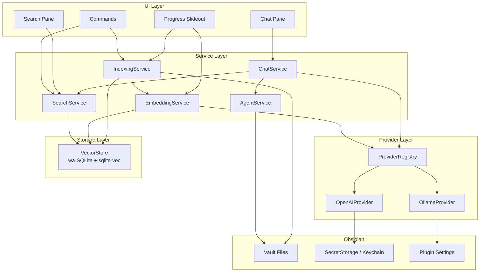

# Obsidian AI Plugin

An Obsidian plugin that adds AI-powered **semantic search** and **chat completions** over your vault. Notes are indexed locally with embeddings stored in wa-SQLite/sqlite-vec. Chat uses only vault content as context and can create or update notes on request. Supports OpenAI and Ollama providers (abstracted for future additions).

Requirements: [docs/prompts/initial.md](docs/prompts/initial.md)

## Table of Contents

- [High-Level Architecture](#high-level-architecture)
- [Technical Stack](#technical-stack)
- [Key Design Decisions](#key-design-decisions)
- [Prerequisites](#prerequisites)
- [Getting Started](#getting-started)
- [Available Scripts](#available-scripts)
- [UI Components](#ui-components)
- [API Contract (Internal Service Interfaces)](#api-contract-internal-service-interfaces)
- [Plugin Settings](#plugin-settings)
- [Backlog Items](#backlog-items)

## High-Level Architecture

The plugin is a single TypeScript codebase running inside Obsidian's renderer process. It has four layers: **UI**, **Services**, **Providers**, and **Storage**.



### Data Flow

1. **Indexing:** `IndexingService` reads vault files, splits them into chunks (by heading/paragraph) with metadata (note name, heading, tags). `EmbeddingService` generates vectors via the configured provider. Chunks + vectors are stored in `VectorStore`.
2. **Semantic Search:** User enters a query → `EmbeddingService` embeds the query → `VectorStore` performs nearest-neighbor search → results returned with source metadata.
3. **Chat:** User sends a message → `SearchService` retrieves relevant chunks as context → `ChatService` sends the message + context to the chat provider → response streamed back. Only vault content is used as context.
4. **Agent Operations:** When the user asks the chat to create/update files, `AgentService` writes to allowed folders with configurable max file size (default 5k chars).

## Technical Stack

| Layer | Technology | Rationale |
|-------|-----------|-----------|
| Language | TypeScript | Required by Obsidian plugin API; confirmed in requirements |
| Plugin Framework | Obsidian Plugin API (>= 1.11.4) | Minimum version that includes SecretStorage API for secure key management |
| Vector Store | wa-SQLite + sqlite-vec | Confirmed in requirements; runs entirely in-browser via WASM, keeps all data local |
| Build Tool | esbuild | Standard Obsidian plugin build tool; fast, zero-config for TS |
| Embedding Providers | OpenAI API, Ollama | Two providers for MVP; abstracted behind a common interface for future additions |
| Chat Providers | OpenAI API, Ollama | Same providers as embedding; may use different models per task |
| Testing | Vitest | Fast TS-native test runner; works well with esbuild projects |
| Linting | ESLint | Standard for TypeScript projects |

## Key Design Decisions

### 1. Provider Abstraction

Both embedding and chat operations go through a `Provider` interface so that adding new providers (e.g., Anthropic, local llama.cpp) requires only implementing the interface and registering it — no changes to core services.

```typescript
interface EmbeddingProvider {
  id: string;
  name: string;
  embed(texts: string[]): Promise<number[][]>;
  dimensions(): number;
}

interface ChatProvider {
  id: string;
  name: string;
  complete(
    messages: ChatMessage[],
    options: ChatOptions,
  ): AsyncIterable<string>;
}
```

OpenAI and Ollama each implement both interfaces. A `ProviderRegistry` maps provider IDs to instances and is the single lookup point for services.

### 2. Chunking Strategy

Notes are split into **chunks** at heading boundaries. Within a heading section, long content is further split by paragraph/bullet. Each chunk carries metadata:

| Field | Source |
|-------|--------|
| `noteTitle` | File basename |
| `notePath` | Vault-relative path |
| `heading` | Nearest parent heading(s) |
| `tags` | Obsidian tags from frontmatter + inline |
| `content` | Raw text of the chunk |
| `hash` | SHA-256 of `content` for change detection |

This preserves the structural context required by the spec while keeping chunks small enough for effective embedding.

### 3. Incremental Indexing

Each chunk's `hash` is stored alongside its embedding. On "Index changes":
1. Walk configured folders and compute hashes for current chunks.
2. Compare against stored hashes — skip unchanged, embed new/modified, delete removed.
3. This avoids re-embedding the entire vault on every change.

"Reindex vault" bypasses the comparison and re-processes everything.

### 4. Startup Performance (< 2 seconds)

- The wa-SQLite database file is opened lazily on first query or background index, not during `onload()`.
- `onload()` only registers views, commands, and the settings tab.
- No indexing runs at startup; the user triggers it via commands or it can be triggered after a configurable delay post-load.

### 5. Agent File Operations

The chat agent can create/update notes only in user-configured "allowed output folders." This is enforced in `AgentService` before any write. Max generated file size is configurable (default 5,000 characters). The agent cannot delete files.

### 6. Local Data Constraint

All indexed data (chunks, embeddings, metadata) lives in the plugin's data directory (`.obsidian/plugins/obsidian-ai/`). Raw note content is never sent to external indexing services. Only the text of individual chunks is sent to the embedding provider, and only query + retrieved context is sent to the chat provider.

### 7. SQLite Schema

```sql
CREATE TABLE chunks (
  id         INTEGER PRIMARY KEY,
  note_path  TEXT NOT NULL,
  heading    TEXT,
  content    TEXT NOT NULL,
  hash       TEXT NOT NULL,
  tags       TEXT,           -- JSON array
  updated_at INTEGER NOT NULL
);

CREATE VIRTUAL TABLE chunk_embeddings USING vec0(
  chunk_id INTEGER PRIMARY KEY,
  embedding FLOAT[{dimensions}]  -- dimension set by chosen embedding model
);

CREATE TABLE metadata (
  key   TEXT PRIMARY KEY,
  value TEXT
);
```

### Project Structure

```
obsidian-ai-plugin/
├── src/
│   ├── main.ts                     # Plugin entry: onload/onunload, register views/commands
│   ├── settings.ts                 # PluginSettingTab + defaults
│   ├── types.ts                    # Shared type definitions
│   ├── ui/
│   │   ├── SearchView.ts           # Semantic search pane (ItemView)
│   │   ├── ChatView.ts             # Chat completions pane (ItemView)
│   │   └── ProgressSlideout.ts     # Long-running task progress UI
│   ├── services/
│   │   ├── IndexingService.ts      # Vault reading, chunking, orchestrating embedding
│   │   ├── EmbeddingService.ts     # Embedding generation via provider
│   │   ├── SearchService.ts        # Query embedding + vector nearest-neighbor lookup
│   │   ├── ChatService.ts          # RAG: retrieve context + chat completion
│   │   └── AgentService.ts         # File create/update with folder + size guards
│   ├── providers/
│   │   ├── Provider.ts             # EmbeddingProvider + ChatProvider interfaces
│   │   ├── ProviderRegistry.ts     # Registry mapping IDs → provider instances
│   │   ├── OpenAIProvider.ts       # OpenAI implementation (embeddings + chat)
│   │   └── OllamaProvider.ts       # Ollama implementation (embeddings + chat)
│   ├── db/
│   │   ├── VectorStore.ts          # wa-SQLite + sqlite-vec wrapper
│   │   └── migrations.ts           # Schema creation and versioned migrations
│   └── utils/
│       ├── chunker.ts              # Markdown parsing → chunks with metadata
│       └── hasher.ts               # SHA-256 content hashing
├── styles.css                      # Plugin CSS
├── manifest.json                   # Obsidian plugin manifest
├── versions.json                   # Obsidian version compatibility map
├── package.json
├── tsconfig.json
├── esbuild.config.mjs              # Build configuration
├── .eslintrc.cjs
└── docs/
    ├── prompts/
    │   └── initial.md              # Requirements document
    └── features/                   # Story documents (created during planning)
```

## Prerequisites

- **Node.js** >= 18
- **npm** >= 9
- **Obsidian** >= 1.11.4 (required for SecretStorage API)
- For **Ollama** provider: Ollama installed and running locally (see [ollama.com](https://ollama.com))
- For **OpenAI** provider: An OpenAI API key

## Getting Started

### 1. Install dependencies

```bash
npm install
```

### 2. Build the plugin

```bash
npm run build
```

### 3. Install into Obsidian vault for development

Copy or symlink the build output into your test vault:

```bash
# Create plugin directory in your test vault
mkdir -p /path/to/vault/.obsidian/plugins/obsidian-ai

# Symlink build artifacts
ln -s "$(pwd)/main.js" /path/to/vault/.obsidian/plugins/obsidian-ai/main.js
ln -s "$(pwd)/manifest.json" /path/to/vault/.obsidian/plugins/obsidian-ai/manifest.json
ln -s "$(pwd)/styles.css" /path/to/vault/.obsidian/plugins/obsidian-ai/styles.css
```

### 4. Enable the plugin

1. Open Obsidian Settings → Community Plugins.
2. Enable "Obsidian AI."
3. Configure provider connection details in the plugin settings tab.
4. Add API keys via the Keychain settings (SecretStorage).

### 5. Development with hot reload

```bash
npm run dev
```

This watches `src/` and rebuilds on changes. Reload Obsidian (Cmd+R / Ctrl+R) to pick up changes, or use the [Hot Reload plugin](https://github.com/pjeby/hot-reload).

## Available Scripts

| Command | Description |
|---------|-------------|
| `npm run dev` | Build with esbuild in watch mode |
| `npm run build` | Production build (minified) |
| `npm run lint` | Run ESLint on `src/` |
| `npm run test` | Run Vitest test suite |
| `npm run typecheck` | Run `tsc --noEmit` for type checking |

## UI Components

Obsidian UI views registered by the plugin:

| Component | Type | Description |
|-----------|------|-------------|
| `SearchView` | `ItemView` | Semantic search pane. Text input for query, results list showing matching chunks with note title, heading, snippet, and relevance score. Clicking a result opens the note at the matching location. |
| `ChatView` | `ItemView` | Chat completions pane. Message input, scrollable conversation history, streaming responses. The chat agent can create/update files when asked. Sources (retrieved chunks) shown alongside responses. |
| `ProgressSlideout` | Custom slideout | Slideout panel showing progress for long-running operations (indexing, embedding). Displays current task, progress bar/count, and elapsed time. |

### Commands

| Command | ID | Description |
|---------|----|-------------|
| Reindex vault | `obsidian-ai:reindex-vault` | Full reindex — re-chunks and re-embeds all notes in configured folders |
| Index changes | `obsidian-ai:index-changes` | Incremental index — only processes new/modified/deleted notes |
| Semantic search selection | `obsidian-ai:search-selection` | Embeds the currently selected text and runs semantic search |

## API Contract (Internal Service Interfaces)

This is an Obsidian plugin, not a REST API. The table below describes the key internal service methods that form the contract between layers.

| Service | Method | Signature | Description |
|---------|--------|-----------|-------------|
| `IndexingService` | `reindexVault()` | `() → Promise<IndexResult>` | Full reindex of all configured folders |
| `IndexingService` | `indexChanges()` | `() → Promise<IndexResult>` | Incremental index of changed files |
| `SearchService` | `search(query, opts?)` | `(string, SearchOptions?) → Promise<SearchResult[]>` | Embed query and return nearest chunks |
| `ChatService` | `chat(messages, opts?)` | `(ChatMessage[], ChatOptions?) → AsyncIterable<ChatEvent>` | RAG chat: retrieve context, stream completion |
| `AgentService` | `createNote(path, content)` | `(string, string) → Promise<void>` | Create a note in an allowed folder |
| `AgentService` | `updateNote(path, content)` | `(string, string) → Promise<void>` | Update an existing note in an allowed folder |
| `EmbeddingService` | `embed(texts)` | `(string[]) → Promise<number[][]>` | Generate embeddings via configured provider |
| `VectorStore` | `upsertChunks(chunks)` | `(ChunkWithEmbedding[]) → Promise<void>` | Insert or update chunks + vectors |
| `VectorStore` | `queryNearest(vec, k)` | `(number[], number) → Promise<ChunkResult[]>` | k-nearest-neighbor search |
| `ProviderRegistry` | `getEmbedding()` | `() → EmbeddingProvider` | Return the active embedding provider |
| `ProviderRegistry` | `getChat()` | `() → ChatProvider` | Return the active chat provider |

## Plugin Settings

Settings stored via `Plugin.loadData()` / `Plugin.saveData()` in `.obsidian/plugins/obsidian-ai/data.json`. API keys are stored separately in Obsidian's SecretStorage (Keychain).

| Setting | Type | Default | Description |
|---------|------|---------|-------------|
| `embeddingProvider` | `string` | `"openai"` | Active embedding provider ID (`openai` or `ollama`) |
| `chatProvider` | `string` | `"openai"` | Active chat provider ID (`openai` or `ollama`) |
| `embeddingModel` | `string` | `"text-embedding-3-small"` | Model name for embeddings |
| `chatModel` | `string` | `"gpt-4o-mini"` | Model name for chat completions |
| `ollamaEndpoint` | `string` | `"http://localhost:11434"` | Ollama server URL |
| `openaiEndpoint` | `string` | `"https://api.openai.com/v1"` | OpenAI-compatible API base URL |
| `indexedFolders` | `string[]` | `["/"]` | Folders to include in indexing (vault-relative) |
| `excludedFolders` | `string[]` | `[]` | Folders to exclude from indexing |
| `agentOutputFolders` | `string[]` | `[]` | Folders the agent is allowed to create/update files in |
| `maxGeneratedNoteSize` | `number` | `5000` | Max characters for agent-generated notes |
| `chatTimeout` | `number` | `30000` | Chat completion timeout in milliseconds |

Secrets (stored in SecretStorage, not in `data.json`):

| Secret Key | Description |
|------------|-------------|
| `openai-api-key` | OpenAI API key |

## Backlog Items

TBD — Epics and stories will be defined in the next planning step.

