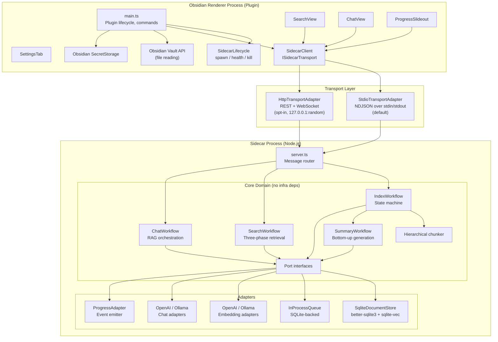
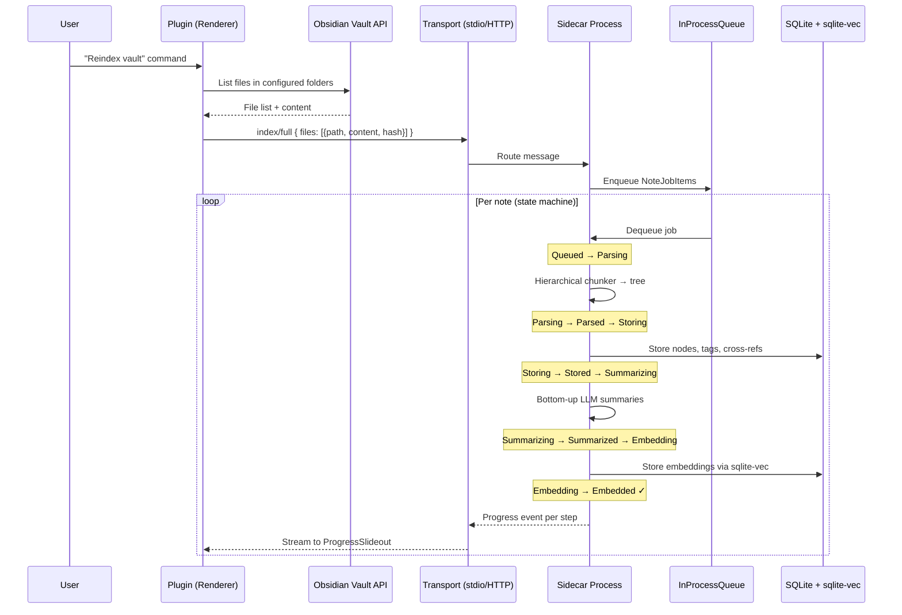
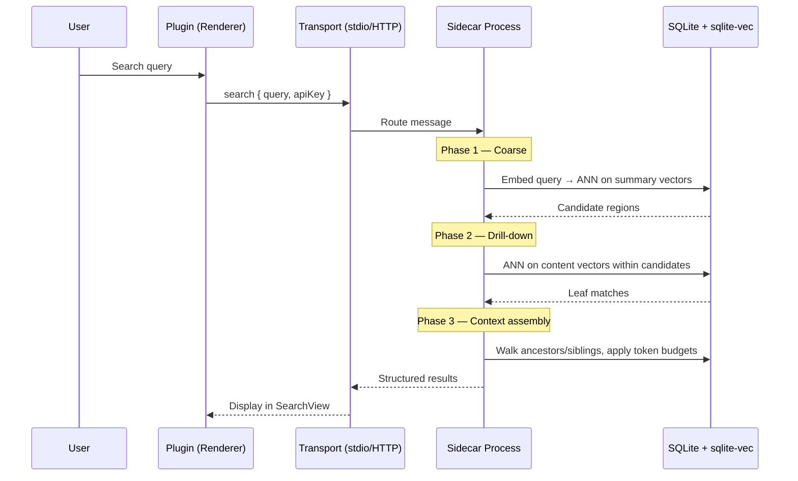
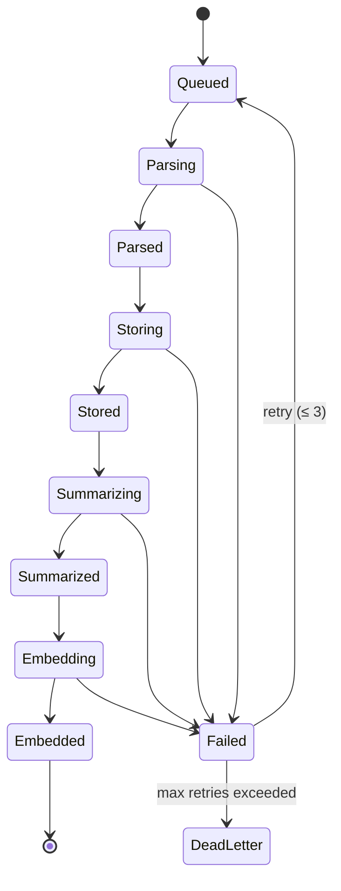

# Obsidian AI Plugin — Iteration 2

## Preface

This project represents 2 things for me.  The first is AI capabilities in Obsidian.  This isn't even the first time I've built it.  It's become my "Hello World" project where I experiment with various ways of building software.  The second is to practice using Cursor's subagent features.  It was built using the following subagents:

- Architect
  - Build the high-level design document.  It doesn't write the code, only makes sure the project is properly spec'd to be built correctly and cleanly.  A template is used to assure completeness.
  - Create user stories.  Uses a template to spec everything out sufficiently so that the code meets the requirements.  The critical piece is the acceptance criteria.
- Implementer -  Writes the actual code.  It must follow the spec EXACTLY and generate evidence that the code meets the criteria.  If any ambiguities are found, it is instructed to stop and ask how to proceed.  
- QA - Runs all tests to verify acceptance criteria are met and no regressions are added
- Documenter - Updates the documentation with any changes precipitated by the latest work.

Commands were used to execute the various steps and templates were used to maintain consistency.

## Purpose

A community Obsidian plugin that brings **semantic search** and **RAG-powered chat** to your vault. Notes are parsed into a **hierarchical tree** (headings → topics → paragraphs → bullets), enriched with **bottom-up LLM summaries**, and indexed with **vector embeddings** so queries find meaning, not just keywords.

Iteration 2 replaces the fragile WASM-in-renderer approach from iteration 1 with a **sidecar architecture**: the plugin `main.js` stays a thin UI client while a local Node.js sidecar process handles SQLite, embeddings, summarization, and search — communicating over a transport-abstracted channel (stdio IPC by default, HTTP opt-in).

## Lessons Learned

### AI-Assisted Development

Since one of the main objectives of this plugin was to explore the concepts of AI-assisted development, it is important to keep track of lessons learned.

- Context Management - The key to success here is managing context.  The models can only focus on so much at a time.  You have ~200 KB of a window.  That means that you have to keep things concise.  You can go to the Max models with 1 MB but some have shown that the drift increases rapidly beyond ~250 KB so that's not as cool as it sounds nor is it price-efficient.
  - By separating the concerns, the context can be managed more effectively.  This also produces a better result.  Most of the efforts I've seen people say something like "I want to build an application that does..."  They then see that the application doesn't necessarily do what they want.  The code isn't clean, readable or maintainable.  The problem there is no separation of concerns where the lifecycle is concerned.  Designing and planning are very different from coding.  To make it worse, there's no real human in the loop to manage the development as it proceeds.  Most that I see doing the AI-assisted development are essentially doing end-to-end testing.  They might get the functionality they're looking for but, again, are disappointed in how it was implemented.  I separated the architecting from the coding.  This at least manages the context in terms of the lifecycle, but is still insufficient to get the desired result.
  - Keeping actions small enough for the model to handle them without drift is essential.  
    - For the architect-related functions, designing and planning are separate activities.  This not only has the advantage of being done in a more consistent manner but it also creates a natural checkpoint for the human to verify things are proceeding the way they want, e.g. "Do I agree with the stack choices?", "Are the endpoints following standards?", "Do the data flows make sense?", etc. are the sorts of things the developer needs to specify or verify.  This can also surface undecided design decisions.
    - Planning is also its own activity.  Designing is done so how will this be implemented in a sensible, efficient manner.  The architect can then determine what actions need to be done and in what order.  I separated planning the application from planning the stories.  Planning a story can actually be a pretty involved process.  Keeping it within its own window allows for solid results in addition to another checkpoint for verification.
    - Implementation is its separate activity.  It's a different concern.  It requires a different context as well.  For this, special instructions are needed to prevent hallucinations, surface any ambiguities, etc.  I created a separate sub-agent for this.  This also allows a setting coding and style standards.  Trying to set architectural standards along with coding standards really multiplies the complexities which can push against the window.  A proper plan ahead of time is one of the key components here.
- How actions are batched can make a big difference in costs.  I've found that keeping related things together in requests really helps efficiently by getting more cache hits.  Of course that context window is always a concern so finding the right balance is critical.  I've seen cache hits go from 75% to >95% when batching operations.  This is particularly important with design and implementation where the whole codebase needs to be considered.  As the coding progresses, having that already in memory can greatly reduce costs as cache reads are much cheaper than inputs and cache writes.  *This is particularly relevant when you're paying for it!*
- There's a sweetspot for how large the batches.  You might want to keep them small until you're confident the requirements are solid and the agents are producing what you're intending.
- The particular model you use is very important.
  - Composer - Fine for simple things not requiring a lot of reasoning
  - ChatGPT Codex - Good for coding.  Good for designing.  Not bad for problem solving.  Can be pricey
  - Opus - Very good.  Very pricey.  Very good at debugging problems.  Good for designing, but Codex may have a tiny advantage based on some of my observations.
  - ChatGPT 4.6 - Very good.  Very good for designing.  It's new so haven't had enough experience to compare with Opus 4.6.

### Indexing, Embedding, RAG and Search

- Getting the notes properly indexed is a lot harder than it looks.
  - The context window for embedding is much smaller than an LLM's.
  - It's also important to keep things atomic enough to retain meaning while also retaining context.
  - Simply shoving a whole note into the embedding model won't work because the note is likely too large.
  - Breaking things down to sentences loses context.  Your search results can only pull up particular sentences with close enough matches to the search terms but will miss the real context which might have better confidence.
- Finding a scheme that maintains context while also fitting into the window of the embedding model is more of an art than science.
- I tried breaking things down by topic, paragraph, bullet list then sentences and having summaries for each step except the sentences produced very relevant results but the performance was horrible.  
  - Not only is the complexity of the tree structure higher but the number of nodes that must be saved combinitorically higher.
  - That also made the indexing and retrieval process much more complicated.  
    - Search the summaries for the term
    - Traverse the nodes of the note down to the relevant section
    - Search for all of those nodes
    - Reassemble
    - Feed into the LLM to complete the chat

### Obsidian and Plugins

- Obsidian has its own way of saving data.  This creates bottlenecks and ineffeciencies
- Privacy is a core requirement.  Keeping the data local at least sets up a border.  Obsidian has some idiosyncracies that require some thought:
  - Obsidian's file watcher does look into the plugin's directory, particularly the `data.json` file so that if any configuration changes occur, it can reflect them.  
  - Obsidian has its own save function which may not be what you want for file write-heavy operations, like say indexing.
- Obsidian doesn't support dynamic loading of dependencies.

---

## Table of Contents

- [Requirements](#requirements)
- [High-Level Architecture](#high-level-architecture)
- [Technical Stack](#technical-stack)
- [Key Design Decisions](#key-design-decisions)
  - [1. Hexagonal Architecture (Ports and Adapters)](#1-hexagonal-architecture-ports-and-adapters)
  - [2. Sidecar Architecture](#2-sidecar-architecture)
  - [3. Transport Abstraction](#3-transport-abstraction)
  - [4. Hierarchical Document Model](#4-hierarchical-document-model)
  - [5. Bottom-Up Summaries](#5-bottom-up-summaries)
  - [6. Sentence Splitting](#6-sentence-splitting)
  - [7. Bullet Grouping](#7-bullet-grouping)
  - [8. SQLite Schema](#8-sqlite-schema)
  - [9. Three-Phase Retrieval](#9-three-phase-retrieval)
  - [10. Structured Context Formatting](#10-structured-context-formatting)
  - [11. Scoped Tags](#11-scoped-tags)
  - [12. Cross-References](#12-cross-references)
  - [13. Incremental Summaries](#13-incremental-summaries)
  - [14. Provider Abstraction](#14-provider-abstraction)
  - [15. Startup Performance](#15-startup-performance)
  - [16. Agent File Operations](#16-agent-file-operations)
  - [17. Local Data Constraint](#17-local-data-constraint)
  - [18. Queue Abstraction](#18-queue-abstraction)
  - [19. Idempotent Indexing State Machine](#19-idempotent-indexing-state-machine)
  - [20. Logging and Observability](#20-logging-and-observability)
  - [Project Structure](#project-structure)
- [Prerequisites](#prerequisites)
- [Getting Started](#getting-started)
- [Available Scripts](#available-scripts)
- [UI Components](#ui-components)
- [API Contract](#api-contract)
- [Plugin Settings](#plugin-settings)
- [Backlog Items](#backlog-items)
- [License](#license)

---

## Requirements

- [docs/requirements/REQUIREMENTS.md](docs/requirements/REQUIREMENTS.md) — Canonical product and technical requirements (iteration 2)
- [.cursor/plans/obsidian_ai_iteration_2_95fe6b8a.plan.md](.cursor/plans/obsidian_ai_iteration_2_95fe6b8a.plan.md) — Iteration 2 architectural plan and implementation phases

---

## High-Level Architecture

The system is split into two OS-level processes connected by a transport abstraction:



### Data Flow: Vault → Index



### Data Flow: Search Query



### Indexing State Machine



---

## Technical Stack

| Layer | Technology | Rationale |
|-------|-----------|-----------|
| Plugin runtime | Obsidian plugin API (Electron renderer) | Required by the Obsidian plugin model; thin client with no native addons |
| Sidecar runtime | Node.js >= 18 | Enables native modules, proper queues, and heavy compute off the renderer thread |
| Language | TypeScript (strict) | Type safety across plugin, core, and sidecar; single language for all layers |
| Build (plugin) | esbuild | Fast bundling to a single `main.js` for Obsidian; tree-shaking |
| Build (sidecar) | tsc + esbuild | Type checking via tsc, bundling via esbuild for the sidecar entry |
| Database | SQLite via `better-sqlite3` | Synchronous, fast, single-file relational DB; runs natively in the sidecar |
| Vector search | `sqlite-vec` (`vec0` virtual table) | ANN search co-located with relational data; no separate vector DB process |
| Transport (default) | stdio IPC (NDJSON) | Zero-config, no TCP overhead, inherently private parent/child channel |
| Transport (opt-in) | HTTP REST + WebSocket | Curl-accessible debugging, future remote-sidecar support |
| Embedding providers | OpenAI API, Ollama | MVP coverage for cloud and local models; pluggable via `IEmbeddingPort` |
| Chat providers | OpenAI API, Ollama | MVP coverage; pluggable via `IChatPort` |
| Secrets | Obsidian SecretStorage | Platform-native credential storage; secrets passed per-request to sidecar |
| Testing | Vitest | Fast, TypeScript-native, ESM-compatible |
| Linting | ESLint + Prettier | Consistent code style |

---

## Key Design Decisions

### 1. Hexagonal Architecture (Ports and Adapters)

Core domain logic in `src/core/` has **zero infrastructure dependencies**. All external concerns are behind port interfaces defined in `src/core/ports/`:

| Port | Responsibility |
|------|---------------|
| `IDocumentStore` | CRUD for hierarchical nodes, summaries, embeddings, tags, cross-references |
| `IQueuePort<T>` | Enqueue/dequeue/ack/nack work items with crash recovery |
| `IEmbeddingPort` | Embed text → vectors |
| `IChatPort` | Chat completion (streaming) |
| `IVaultAccessPort` | Read vault files (implemented plugin-side, content sent to sidecar) |
| `IProgressPort` | Emit progress events to UI |
| `ISidecarTransport` | Send/receive messages between plugin and sidecar |

**Note:** There is no `ISecretPort`. API keys are read from Obsidian SecretStorage by the plugin and passed to the sidecar **per-request** in message payloads. The sidecar never persists or caches secrets.

Adapter implementations for iteration 2 live in `src/sidecar/adapters/` (sidecar-side) and `src/plugin/client/` (plugin-side transport). The domain can be unit-tested with in-memory fakes — no Obsidian mocks, no SQLite, no network.

> **ADR:** This architecture is the foundational design pattern. See also [ADR-005](docs/decisions/ADR-005-provider-abstraction.md) for provider-specific abstraction.

### 2. Sidecar Architecture

> **ADR:** [ADR-006 — Sidecar architecture with transport abstraction](docs/decisions/ADR-006-sidecar-architecture.md) (Accepted, supersedes [ADR-001](docs/decisions/ADR-001-wasm-sqlite-vec-shipped-plugin.md))

Heavy compute runs in a **local Node.js sidecar process** spawned by the plugin on load and terminated on unload:

| Concern | Plugin (renderer) | Sidecar (Node.js) |
|---------|-------------------|-------------------|
| UI rendering | ✅ SearchView, ChatView, ProgressSlideout | — |
| Obsidian API | ✅ Vault file reading, settings, secrets | — |
| Sidecar lifecycle | ✅ Spawn, health check, shutdown | — |
| SQLite + sqlite-vec | — | ✅ Native better-sqlite3 |
| Embedding / summarization | — | ✅ Provider API calls |
| Queue management | — | ✅ InProcessQueue |
| Search / chat workflows | — | ✅ Core domain logic |

The plugin ships **no native addons** — the ADR-001 constraint is preserved for the plugin bundle. Native modules exist only in the sidecar.

**Vault access stays in the plugin.** The plugin reads vault files via the Obsidian API and sends content to the sidecar for processing. The sidecar does **not** access the vault filesystem directly — it is a stateless compute engine.

### 3. Transport Abstraction

> **ADR:** [ADR-006 §3](docs/decisions/ADR-006-sidecar-architecture.md)

Communication between plugin and sidecar is behind an `ISidecarTransport` port interface:

| Transport | Channel | Auth | Use case |
|-----------|---------|------|----------|
| `StdioTransportAdapter` (default) | stdin/stdout of spawned child process, NDJSON framing | None needed — inherently private | Production default; low latency, zero config |
| `HttpTransportAdapter` (opt-in) | HTTP REST + WebSocket, `127.0.0.1:random` | Per-session auth token in `Authorization` header | Debugging (curl-accessible), future remote scenarios |

The sidecar's API contract (message shapes and route semantics) is **identical** regardless of transport — only the framing layer differs. Switching transports requires changing one adapter binding; no domain or UI code changes.

### 4. Hierarchical Document Model

> **ADR:** [ADR-002 — Hierarchical document model](docs/decisions/ADR-002-hierarchical-document-model.md) (Accepted)

Each note is represented as a **tree of typed nodes**, not flat chunks:

```
note
├── topic (H1)
│   ├── subtopic (H2)
│   │   ├── paragraph
│   │   │   ├── sentence_part (split on sentence boundary)
│   │   │   └── sentence_part
│   │   ├── bullet_group
│   │   │   ├── bullet
│   │   │   └── bullet
│   │   │       └── bullet (nested)
│   │   └── paragraph
│   └── subtopic (H2)
└── topic (H1)
```

Node types: `note`, `topic`, `subtopic`, `paragraph`, `sentence_part`, `bullet_group`, `bullet`.

Every node carries: `id`, `type`, `parentId`, `noteId`, `headingTrail` (full path of ancestor headings), `siblingOrder`, `depth`, `content`, `contentHash`.

### 5. Bottom-Up Summaries

LLM-generated summaries are built **bottom-up**: leaf nodes provide raw content as their "summary"; parent nodes receive summaries composed from their children's summaries. When a child's content changes, summaries propagate upward toward the root.

This ensures:
- Summary embeddings represent the semantic meaning of an entire subtree.
- Coarse retrieval (Phase 1) can locate relevant **regions** without scanning every leaf.
- Summaries stay fresh via incremental regeneration (see [§13](#13-incremental-summaries)).

### 6. Sentence Splitting

Paragraphs that exceed the embedding model's token limit are split on **sentence boundaries** using a rule-based splitter (regex-based, handling abbreviations and edge cases). Each resulting `sentence_part` node:
- Retains a `siblingOrder` for reassembly.
- Shares the same `parentId` (the original paragraph node).
- Gets its own content embedding.

This preserves semantic coherence within each chunk while respecting embedding limits.

### 7. Bullet Grouping

Consecutive bullets without a blank line separator are grouped into a `bullet_group` node. This enables:
- **Group-level retrieval:** Searching at the group granularity when bullets are thematically related.
- **Bullet-level retrieval:** Drilling into individual bullets when fine-grained matches are needed.
- **Nested bullets:** Modeled as children of their parent bullet, preserving indentation semantics.

### 8. SQLite Schema

The full schema carried forward from iteration 1, extended with queue and job tracking tables for iteration 2:

```sql
-- Hierarchical document nodes
CREATE TABLE IF NOT EXISTS nodes (
    id            TEXT PRIMARY KEY,
    note_id       TEXT NOT NULL,
    parent_id     TEXT,
    type          TEXT NOT NULL CHECK (type IN (
                    'note','topic','subtopic',
                    'paragraph','sentence_part',
                    'bullet_group','bullet')),
    heading_trail TEXT,            -- JSON array of ancestor headings
    depth         INTEGER NOT NULL DEFAULT 0,
    sibling_order INTEGER NOT NULL DEFAULT 0,
    content       TEXT NOT NULL,
    content_hash  TEXT NOT NULL,
    created_at    TEXT NOT NULL DEFAULT (datetime('now')),
    updated_at    TEXT NOT NULL DEFAULT (datetime('now')),
    FOREIGN KEY (parent_id) REFERENCES nodes(id) ON DELETE CASCADE
);
CREATE INDEX IF NOT EXISTS idx_nodes_note   ON nodes(note_id);
CREATE INDEX IF NOT EXISTS idx_nodes_parent ON nodes(parent_id);
CREATE INDEX IF NOT EXISTS idx_nodes_type   ON nodes(type);
CREATE INDEX IF NOT EXISTS idx_nodes_hash   ON nodes(content_hash);

-- LLM-generated summaries (one per non-leaf node)
CREATE TABLE IF NOT EXISTS summaries (
    node_id      TEXT PRIMARY KEY,
    summary      TEXT NOT NULL,
    generated_at TEXT NOT NULL DEFAULT (datetime('now')),
    model        TEXT,             -- model used to generate
    FOREIGN KEY (node_id) REFERENCES nodes(id) ON DELETE CASCADE
);

-- Vector embeddings (content and summary vectors)
-- Uses sqlite-vec vec0 virtual table for ANN search
CREATE VIRTUAL TABLE IF NOT EXISTS vec_content USING vec0(
    node_id  TEXT PRIMARY KEY,
    embedding FLOAT[1536]         -- dimension matches embedding model
);
CREATE VIRTUAL TABLE IF NOT EXISTS vec_summary USING vec0(
    node_id  TEXT PRIMARY KEY,
    embedding FLOAT[1536]
);

-- Embedding metadata (model, dimension, timestamps)
CREATE TABLE IF NOT EXISTS embedding_meta (
    node_id       TEXT NOT NULL,
    vector_type   TEXT NOT NULL CHECK (vector_type IN ('content','summary')),
    model         TEXT NOT NULL,
    dimension     INTEGER NOT NULL,
    content_hash  TEXT NOT NULL,   -- hash of input text at embed time
    created_at    TEXT NOT NULL DEFAULT (datetime('now')),
    PRIMARY KEY (node_id, vector_type),
    FOREIGN KEY (node_id) REFERENCES nodes(id) ON DELETE CASCADE
);

-- Tags scoped to nodes
CREATE TABLE IF NOT EXISTS tags (
    id        INTEGER PRIMARY KEY AUTOINCREMENT,
    node_id   TEXT NOT NULL,
    tag       TEXT NOT NULL,
    source    TEXT NOT NULL CHECK (source IN ('frontmatter','inline')),
    FOREIGN KEY (node_id) REFERENCES nodes(id) ON DELETE CASCADE
);
CREATE INDEX IF NOT EXISTS idx_tags_tag     ON tags(tag);
CREATE INDEX IF NOT EXISTS idx_tags_node    ON tags(node_id);

-- Cross-references (wikilinks, markdown links)
CREATE TABLE IF NOT EXISTS cross_refs (
    id             INTEGER PRIMARY KEY AUTOINCREMENT,
    source_node_id TEXT NOT NULL,
    target_path    TEXT NOT NULL,   -- vault-relative path of linked note
    link_text      TEXT,            -- display text of the link
    FOREIGN KEY (source_node_id) REFERENCES nodes(id) ON DELETE CASCADE
);
CREATE INDEX IF NOT EXISTS idx_xref_source ON cross_refs(source_node_id);
CREATE INDEX IF NOT EXISTS idx_xref_target ON cross_refs(target_path);

-- Note-level metadata (for incremental indexing)
CREATE TABLE IF NOT EXISTS note_meta (
    note_id       TEXT PRIMARY KEY,
    vault_path    TEXT NOT NULL,
    content_hash  TEXT NOT NULL,
    indexed_at    TEXT NOT NULL DEFAULT (datetime('now')),
    node_count    INTEGER NOT NULL DEFAULT 0
);

-- Queue items (crash recovery for InProcessQueue) [ADR-007]
CREATE TABLE IF NOT EXISTS queue_items (
    id           TEXT PRIMARY KEY,
    queue_name   TEXT NOT NULL,
    payload      TEXT NOT NULL,     -- JSON-serialized queue item
    status       TEXT NOT NULL CHECK (status IN (
                   'pending','processing','completed','dead_letter')),
    retry_count  INTEGER NOT NULL DEFAULT 0,
    error_message TEXT,
    enqueued_at  TEXT NOT NULL DEFAULT (datetime('now')),
    updated_at   TEXT NOT NULL DEFAULT (datetime('now'))
);
CREATE INDEX IF NOT EXISTS idx_queue_status ON queue_items(queue_name, status);

-- Job step tracking (idempotent indexing state machine) [ADR-008]
CREATE TABLE IF NOT EXISTS job_steps (
    job_id        TEXT PRIMARY KEY,
    note_path     TEXT NOT NULL,
    current_step  TEXT NOT NULL CHECK (current_step IN (
                    'queued','parsing','parsed','storing','stored',
                    'summarizing','summarized','embedding','embedded',
                    'failed','dead_letter')),
    content_hash  TEXT NOT NULL,
    retry_count   INTEGER NOT NULL DEFAULT 0,
    error_message TEXT,
    updated_at    TEXT NOT NULL DEFAULT (datetime('now'))
);
CREATE INDEX IF NOT EXISTS idx_jobs_step ON job_steps(current_step);
CREATE INDEX IF NOT EXISTS idx_jobs_note ON job_steps(note_path);
```

### 9. Three-Phase Retrieval

> **ADR:** [ADR-003 — Phased retrieval strategy](docs/decisions/ADR-003-phased-retrieval-strategy.md) (Accepted)

| Phase | What | How |
|-------|------|-----|
| 1. Coarse | Find candidate **regions** | Embed query → ANN search on `vec_summary` → top-K summary matches |
| 2. Drill-down | Find specific **content** within candidates | ANN search on `vec_content` for descendants of Phase 1 hits → recursive descent until high-confidence leaf matches |
| 3. Context assembly | Build **structured context** | Walk ancestors for heading trail, collect sibling context, include parent summaries; apply per-tier token budgets (matched content, sibling context, parent summaries) |

All vectors (query, content, summary) must be in the **same embedding space** (same model and dimensions).

### 10. Structured Context Formatting

Context blocks sent to the chat model and displayed in search results preserve note structure:

```
## Note: "Project Planning" (projects/planning.md)
### Section: Goals > Q1 Targets

**Matched content:**
- Launch beta by March 15
- Onboard 50 pilot users
  - Focus on enterprise segment
  - Track activation rate

**Sibling context:**
Revenue target: $100K ARR by Q1 end.

**Parent summary:**
This section covers Q1 planning goals including launch timeline,
user acquisition targets, and revenue milestones.
```

Token budgets per tier (configurable):
- Matched content: 60% of context window
- Sibling context: 25%
- Parent summaries: 15%

### 11. Scoped Tags

Tags are tracked at the **node level**, not just the note level. Frontmatter tags attach to the `note` node; inline tags (`#tag`) attach to the nearest enclosing structural node (paragraph, bullet, topic). This enables:
- Filtering search results by tags scoped to specific sections.
- Understanding which **topics** within a note are tagged, not just which notes.

### 12. Cross-References

Wikilinks (`[[Target Note]]`) and markdown links to vault files are parsed and stored in the `cross_refs` table. During context assembly (Phase 3), the retrieval pipeline can pull in related context from linked notes when the token budget allows, improving chat answer quality for interconnected knowledge.

### 13. Incremental Summaries

When a note is re-indexed (content hash changed):
1. The chunker produces a new tree.
2. Nodes with unchanged `content_hash` retain existing embeddings (skip embedding step).
3. Changed nodes get new embeddings.
4. Summaries are regenerated **bottom-up** from the changed leaf to the root — only nodes on the path from the edit to the root are re-summarized.
5. The `generatedAt` timestamp on summaries is compared against node `updatedAt` to detect staleness.

This minimizes LLM API calls on incremental re-indexes.

### 14. Provider Abstraction

> **ADR:** [ADR-005 — Pluggable embedding and chat providers](docs/decisions/ADR-005-provider-abstraction.md) (Accepted)

MVP ships two providers behind the port interfaces:

| Provider | Embedding | Chat | Notes |
|----------|-----------|------|-------|
| OpenAI | `text-embedding-3-small` (default) | `gpt-4o-mini` (default) | Cloud; requires API key |
| Ollama | Configurable model | Configurable model | Local; no API key needed |

Adding a provider is additive: implement `IEmbeddingPort` and/or `IChatPort`, register in the provider factory. No changes to domain workflows.

Provider configuration (base URL, model name, timeouts) is user-visible in the settings tab. Secrets (API keys) use Obsidian SecretStorage.

### 15. Startup Performance

Plugin initialization must complete in **under 2 seconds** on representative hardware. The budget includes spawning the sidecar process. Heavy work is deferred:

- SQLite database open + migrations: deferred to first use (lazy init per [ADR-004](docs/decisions/ADR-004-per-vault-index-storage.md)).
- Sidecar health check: async, non-blocking.
- No indexing work runs on startup unless explicitly triggered by the user.

### 16. Agent File Operations

Chat may create or update notes when the user requests it:
- **Allowed output folders** are configurable and distinct from indexed-folder rules.
- **Max generated note size**: configurable, default 5,000 characters.
- File operations are performed by the plugin (via Obsidian API), not the sidecar.

### 17. Local Data Constraint

> **ADR:** [ADR-004 — Per-vault index database outside the vault](docs/decisions/ADR-004-per-vault-index-storage.md) (Accepted)

- Embeddings, the vector index, and all indexed data stay **local** on the user's machine.
- Default database path: `~/.obsidian-ai/{vault-name-normalized}.db` (outside the vault).
- Optional per-vault absolute path override.
- One database per vault — no cross-vault data mixing.
- Documentation warns against cloud-synced or network paths (locking/corruption risk).

### 18. Queue Abstraction

> **ADR:** [ADR-007 — Queue abstraction for indexing orchestration](docs/decisions/ADR-007-queue-abstraction.md) (Accepted)

All indexing work items flow through `IQueuePort<T>`:

```typescript
interface IQueuePort<T> {
  enqueue(items: T[]): Promise<void>;
  dequeue(batchSize: number): Promise<QueueItem<T>[]>;
  ack(itemId: string): Promise<void>;
  nack(itemId: string, reason: string): Promise<void>;
  peek(): Promise<number>;
}
```

Iteration 2 adapter: `InProcessQueue` — in-memory array for fast dequeue, SQLite-backed persistence (`queue_items` table) for crash recovery. Configurable concurrency (default 1 for rate-limit-sensitive steps). Dead-letter after 3 retries (configurable).

Future adapters (not in iteration 2): `RabbitMQAdapter`, `SQSAdapter`.

### 19. Idempotent Indexing State Machine

> **ADR:** [ADR-008 — Idempotent indexing state machine](docs/decisions/ADR-008-idempotent-indexing-state-machine.md) (Accepted)

Each note's indexing progress is tracked per-step in the `job_steps` table:

**States:** `Queued → Parsing → Parsed → Storing → Stored → Summarizing → Summarized → Embedding → Embedded`

**Key properties:**
- **Idempotent:** Each step checks content hash + step status before executing. Re-running a completed pipeline is a no-op.
- **Restartable:** On crash/restart, incomplete jobs are reloaded from `job_steps` and resume from the last completed step.
- **Observable:** Each state transition emits a progress event via `IProgressPort` for real-time UI feedback.
- **Dead-letter:** Notes that fail the same step 3+ times (configurable) are excluded from automatic retry and surfaced for manual re-queue.

**Incremental indexing:** Compares vault file hashes against stored `content_hash`. Only changed or new notes are enqueued. Deleted notes trigger direct cleanup (no state machine needed).

### 20. Logging and Observability

- **Logger:** Structured JSON logger with scoped instances (e.g. `logger.child({ scope: 'IndexWorkflow', jobId })`) — library TBD (Pino preferred for Node.js sidecar; plugin-side uses a lightweight custom logger compatible with the Obsidian console).
- **Format:** Structured JSON in the sidecar; human-readable in development via `pino-pretty` or equivalent.
- **Correlation IDs:** Each indexing run gets a `runId` (UUID). Each note job carries a `jobId`. These propagate through all log entries and progress events for end-to-end tracing.
- **Log levels:** Standard `debug`, `info`, `warn`, `error`. Default level: `info`. Configurable via plugin settings.
- **Sensitive data:** API keys, note content, and user PII must **never** appear in logs. Embeddings are logged only as dimensions/counts, not raw vectors. Note paths may appear in `debug` level only.
- **Operation scopes:** Key operations (`index.full`, `index.incremental`, `search`, `chat`) are logged at `info` with timing metrics (duration, note count, error count).

### Project Structure

```
obsidian-ai-plugin/
├── src/
│   ├── plugin/                              # Obsidian plugin (thin client)
│   │   ├── main.ts                          # Plugin entry: lifecycle, views, commands
│   │   ├── settings.ts                      # Settings tab
│   │   ├── ui/
│   │   │   ├── SearchView.ts                # Semantic search pane
│   │   │   ├── ChatView.ts                  # Chat pane
│   │   │   └── ProgressSlideout.ts          # Non-blocking progress feedback
│   │   └── client/
│   │       ├── SidecarClient.ts             # Implements ISidecarTransport consumer
│   │       ├── SidecarLifecycle.ts           # Spawn / health check / kill sidecar
│   │       ├── StdioTransportAdapter.ts      # NDJSON over stdin/stdout
│   │       └── HttpTransportAdapter.ts       # REST + WebSocket transport
│   ├── core/                                # Domain logic (portable, no infra deps)
│   │   ├── ports/
│   │   │   ├── IDocumentStore.ts
│   │   │   ├── IQueuePort.ts
│   │   │   ├── IEmbeddingPort.ts
│   │   │   ├── IChatPort.ts
│   │   │   ├── IVaultAccessPort.ts
│   │   │   ├── IProgressPort.ts
│   │   │   └── ISidecarTransport.ts
│   │   ├── domain/
│   │   │   ├── types.ts                     # DocumentNode, NodeType, enums
│   │   │   ├── chunker.ts                   # Hierarchical tree builder
│   │   │   ├── sentenceSplitter.ts          # Sentence-boundary splitting
│   │   │   ├── wikilinkParser.ts            # [[wikilink]] and link extraction
│   │   │   └── tokenEstimator.ts            # Token counting for budget enforcement
│   │   └── workflows/
│   │       ├── IndexWorkflow.ts             # State machine orchestrator
│   │       ├── SearchWorkflow.ts            # Three-phase retrieval
│   │       ├── ChatWorkflow.ts              # RAG orchestration
│   │       └── SummaryWorkflow.ts           # Bottom-up summary generation
│   └── sidecar/                             # Sidecar process
│       ├── server.ts                        # Message router (stdio + HTTP)
│       ├── routes/                          # Route handlers
│       │   ├── indexRoutes.ts
│       │   ├── searchRoutes.ts
│       │   ├── chatRoutes.ts
│       │   └── healthRoutes.ts
│       └── adapters/
│           ├── SqliteDocumentStore.ts        # better-sqlite3 + sqlite-vec
│           ├── InProcessQueue.ts             # SQLite-backed queue
│           ├── OpenAIEmbeddingAdapter.ts
│           ├── OllamaEmbeddingAdapter.ts
│           ├── OpenAIChatAdapter.ts
│           ├── OllamaChatAdapter.ts
│           └── ProgressAdapter.ts            # Progress event emitter
├── scripts/
│   └── query-store.mjs                      # Dev utility: inspect SQLite store
├── docs/
│   ├── decisions/                           # Architecture Decision Records
│   │   ├── ADR-001-wasm-sqlite-vec-shipped-plugin.md   # SUPERSEDED
│   │   ├── ADR-002-hierarchical-document-model.md      # Accepted
│   │   ├── ADR-003-phased-retrieval-strategy.md        # Accepted
│   │   ├── ADR-004-per-vault-index-storage.md          # Accepted
│   │   ├── ADR-005-provider-abstraction.md             # Accepted
│   │   ├── ADR-006-sidecar-architecture.md             # Accepted
│   │   ├── ADR-007-queue-abstraction.md                # Accepted
│   │   └── ADR-008-idempotent-indexing-state-machine.md # Accepted
│   └── requirements/
│       └── REQUIREMENTS.md
├── styles.css                               # Obsidian theme-aware styles
├── manifest.json                            # Obsidian plugin manifest
├── package.json
├── tsconfig.json
├── tsconfig.sidecar.json                    # Separate tsconfig for sidecar
├── esbuild.config.mjs                       # Plugin build config
├── esbuild.sidecar.mjs                      # Sidecar build config
└── vitest.config.ts
```

---

## Prerequisites

| Requirement | Version | Notes |
|-------------|---------|-------|
| Node.js | >= 18 | Required to run the sidecar process |
| npm | >= 9 | Package management |
| Obsidian | >= 1.11.4 | Minimum version with SecretStorage API |
| OpenAI API key | — | Required if using OpenAI as embedding/chat provider |
| Ollama | Latest | Required if using Ollama as embedding/chat provider; must be running locally |

---

## Getting Started

### 1. Install dependencies

```bash
git clone <repo-url> obsidian-ai-plugin
cd obsidian-ai-plugin
npm install
```

### 2. Build

```bash
# Build the plugin (main.js for Obsidian)
npm run build:plugin

# Build the sidecar (Node.js process)
npm run build:sidecar

# Build both
npm run build
```

### 3. Install into an Obsidian vault

```bash
# Copy plugin artifacts to your vault's plugin directory
VAULT_PATH="/path/to/your/vault"
mkdir -p "$VAULT_PATH/.obsidian/plugins/obsidian-ai"
cp main.js manifest.json styles.css "$VAULT_PATH/.obsidian/plugins/obsidian-ai/"
cp -r dist/sidecar "$VAULT_PATH/.obsidian/plugins/obsidian-ai/"
```

### 4. Enable the plugin

1. Open Obsidian → Settings → Community Plugins
2. Enable "Obsidian AI"
3. Configure provider settings (API keys via the secret storage prompt, model names, base URLs)

### 5. Development mode

```bash
# Watch mode — rebuilds plugin and sidecar on file changes
npm run dev
```

The dev script watches `src/` and rebuilds on change. For hot-reload in Obsidian, use the [Hot-Reload plugin](https://github.com/pjeby/hot-reload).

---

## Available Scripts

| Command | Description |
|---------|-------------|
| `npm run build` | Build plugin and sidecar for production |
| `npm run build:plugin` | Build plugin `main.js` via esbuild |
| `npm run build:sidecar` | Build sidecar bundle via tsc + esbuild |
| `npm run dev` | Watch mode for both plugin and sidecar |
| `npm run dev:plugin` | Watch mode for plugin only |
| `npm run dev:sidecar` | Watch mode for sidecar only |
| `npm run test` | Run all tests via Vitest |
| `npm run test:unit` | Run unit tests only (core domain) |
| `npm run test:integration` | Run integration tests (sidecar + SQLite) |
| `npm run lint` | Run ESLint |
| `npm run typecheck` | Type-check without emitting (tsc --noEmit) |
| `npm run query-store` | Dev utility: inspect SQLite store contents |

---

## UI Components

### SearchView

The semantic search pane, registered as an Obsidian `ItemView`.

- **Input:** Text field at the top with search button. Supports "search selection" command (pre-fills with selected text from the active note).
- **Results:** Each result is a visually distinct card with:
  - Note title and vault-relative path
  - Snippet with structural context (heading trail preserved)
  - Similarity score indicator
  - Click-to-navigate: opens the source note (and navigates to the relevant section where possible)
- **Selection:** All result text is selectable for copy/paste.
- **Reuse:** The command palette reuses an existing pane instance (no duplicate panes).

### ChatView

The RAG-powered chat pane, registered as an Obsidian `ItemView`.

- **Message display:** User and assistant messages are visually distinct (alignment, styling). Assistant text is selectable.
- **Sources:** Retrieval sources are shown as navigable pills/links beneath assistant messages. Clicking opens the corresponding note.
- **Copy:** Full assistant reply copy button on each message.
- **Input:** Multi-line text area at the bottom of the pane with send and cancel affordances.
- **Conversation:** Subsequent turns include prior messages. "New conversation" button clears history.
- **Timeout:** Configurable chat timeout (default 30s) for slow local models.
- **Theming:** All styles use Obsidian CSS theme variables for light/dark mode compatibility.

### ProgressSlideout

A non-blocking overlay that shows real-time indexing progress.

- **Per-note progress:** Each note shows its current step in the state machine (Parsing, Storing, Summarizing, Embedding).
- **Aggregate progress:** Total notes processed / total, estimated time remaining.
- **Error visibility:** Failed notes are highlighted with error messages. Dead-lettered notes are separately listed.
- **Events:** Streamed from the sidecar via the transport layer in real-time.

---

## API Contract

### Port Interfaces (Internal Service Contracts)

| Port | Method | Signature | Description |
|------|--------|-----------|-------------|
| `IDocumentStore` | `upsertNodes` | `(nodes: DocumentNode[]) → Promise<void>` | Insert or update hierarchical nodes |
| `IDocumentStore` | `getNodesByNote` | `(noteId: string) → Promise<DocumentNode[]>` | Retrieve all nodes for a note |
| `IDocumentStore` | `deleteNote` | `(noteId: string) → Promise<void>` | Remove a note and all its nodes |
| `IDocumentStore` | `upsertSummary` | `(nodeId: string, summary: string, model: string) → Promise<void>` | Store a generated summary |
| `IDocumentStore` | `upsertEmbedding` | `(nodeId: string, type: VectorType, vector: Float32Array, meta: EmbedMeta) → Promise<void>` | Store an embedding vector |
| `IDocumentStore` | `searchSummaryVectors` | `(query: Float32Array, k: number) → Promise<VectorMatch[]>` | ANN search on summary embeddings |
| `IDocumentStore` | `searchContentVectors` | `(query: Float32Array, k: number, filter?: NodeFilter) → Promise<VectorMatch[]>` | ANN search on content embeddings |
| `IDocumentStore` | `getAncestors` | `(nodeId: string) → Promise<DocumentNode[]>` | Walk up to root for context assembly |
| `IDocumentStore` | `getSiblings` | `(nodeId: string) → Promise<DocumentNode[]>` | Get sibling nodes for context |
| `IDocumentStore` | `getNoteMeta` | `(noteId: string) → Promise<NoteMeta \| null>` | Get note-level metadata |
| `IDocumentStore` | `upsertNoteMeta` | `(meta: NoteMeta) → Promise<void>` | Store note-level metadata |
| `IQueuePort<T>` | `enqueue` | `(items: T[]) → Promise<void>` | Add items to the queue |
| `IQueuePort<T>` | `dequeue` | `(batchSize: number) → Promise<QueueItem<T>[]>` | Pull items for processing |
| `IQueuePort<T>` | `ack` | `(itemId: string) → Promise<void>` | Acknowledge successful processing |
| `IQueuePort<T>` | `nack` | `(itemId: string, reason: string) → Promise<void>` | Report failure (triggers retry or dead-letter) |
| `IQueuePort<T>` | `peek` | `() → Promise<number>` | Get pending item count |
| `IEmbeddingPort` | `embed` | `(texts: string[], apiKey?: string) → Promise<Float32Array[]>` | Embed text into vectors |
| `IChatPort` | `complete` | `(messages: ChatMessage[], context: string, apiKey?: string) → AsyncIterable<string>` | Streaming chat completion |
| `IVaultAccessPort` | `listFiles` | `(folders: string[]) → Promise<VaultFile[]>` | List vault files in configured folders |
| `IVaultAccessPort` | `readFile` | `(path: string) → Promise<string>` | Read a vault file's content |
| `IProgressPort` | `emit` | `(event: ProgressEvent) → void` | Emit a progress event to the UI |

### Sidecar Message Protocol

These messages are sent between the plugin and sidecar over the transport layer. The same message shapes work over both stdio (NDJSON) and HTTP transports.

| Message / Route | Direction | Payload | Response |
|----------------|-----------|---------|----------|
| `index/full` | Plugin → Sidecar | `{ files: [{path, content, hash}], apiKey? }` | `{ runId, noteCount }` + progress stream |
| `index/incremental` | Plugin → Sidecar | `{ files: [{path, content, hash}], deletedPaths: string[], apiKey? }` | `{ runId, noteCount }` + progress stream |
| `index/status` | Plugin → Sidecar | `{}` | `{ pending, processing, completed, failed, deadLetter, jobs: JobStep[] }` |
| `search` | Plugin → Sidecar | `{ query, k?, apiKey? }` | `{ results: SearchResult[] }` |
| `chat` | Plugin → Sidecar | `{ messages: ChatMessage[], apiKey? }` | Streaming: `{ delta: string }` chunks, final `{ sources: Source[] }` |
| `chat/clear` | Plugin → Sidecar | `{}` | `{ ok: true }` |
| `health` | Plugin → Sidecar | `{}` | `{ status: 'ok', uptime, dbReady }` |
| `progress` | Sidecar → Plugin | `{ event: IndexProgressEvent }` | — (push notification) |

When using **HTTP transport**, these map to REST routes (`POST /index/full`, `GET /index/status`, etc.) with WebSocket for progress events. When using **stdio transport**, they are NDJSON messages with a `type` field corresponding to the route name.

---

## Plugin Settings

| Setting | Type | Default | Description |
|---------|------|---------|-------------|
| `embeddingProvider` | `'openai' \| 'ollama'` | `'openai'` | Which provider to use for embeddings |
| `embeddingModel` | `string` | `'text-embedding-3-small'` | Embedding model name |
| `embeddingBaseUrl` | `string` | `'https://api.openai.com/v1'` | Embedding provider base URL |
| `chatProvider` | `'openai' \| 'ollama'` | `'openai'` | Which provider to use for chat completions |
| `chatModel` | `string` | `'gpt-4o-mini'` | Chat model name |
| `chatBaseUrl` | `string` | `'https://api.openai.com/v1'` | Chat provider base URL |
| `chatTimeout` | `number` | `30000` | Chat completion timeout in milliseconds |
| `indexedFolders` | `string[]` | `[]` (all folders) | Folders to include in indexing (empty = all) |
| `excludedFolders` | `string[]` | `[]` | Folders to exclude from indexing |
| `agentOutputFolders` | `string[]` | `['AI-Generated']` | Allowed folders for agent-created notes |
| `maxGeneratedNoteSize` | `number` | `5000` | Max characters for agent-generated notes |
| `dbPath` | `string` | `''` (use default) | Custom absolute path for the SQLite database |
| `transport` | `'stdio' \| 'http'` | `'stdio'` | Sidecar transport method |
| `logLevel` | `'debug' \| 'info' \| 'warn' \| 'error'` | `'info'` | Logging verbosity |
| `searchResultCount` | `number` | `20` | Number of search results to return |
| `matchedContentBudget` | `number` | `0.60` | Token budget fraction for matched content |
| `siblingContextBudget` | `number` | `0.25` | Token budget fraction for sibling context |
| `parentSummaryBudget` | `number` | `0.15` | Token budget fraction for parent summaries |
| `queueConcurrency` | `number` | `1` | Max concurrent queue workers |
| `maxRetries` | `number` | `3` | Max retries before dead-lettering a job |
| `embeddingDimension` | `number` | `1536` | Embedding vector dimension |

---

## Backlog Items

Backlog will be populated by `/plan-project`.

---

## License

MIT © Philip Teitel
