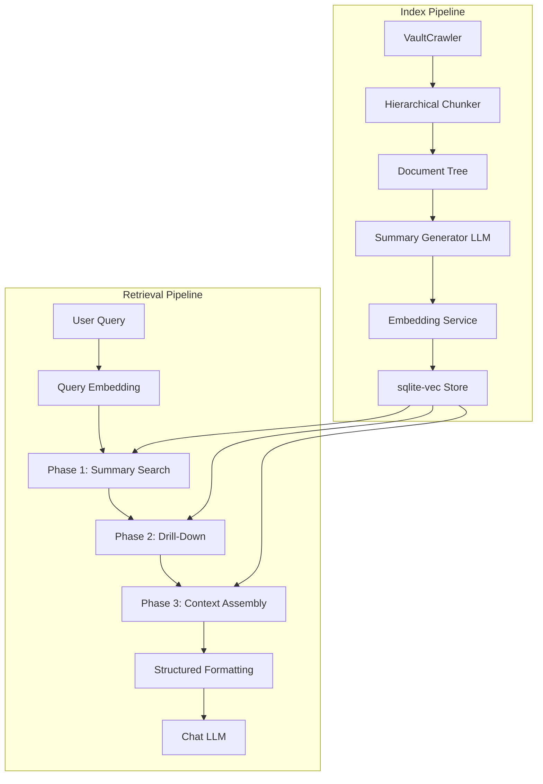

# Hierarchical Indexing and Context-Preserving Retrieval

## Problem Statement

The current pipeline chunks notes into flat, isolated fragments (individual bullets, small paragraphs truncated to 280 chars). Search returns these fragments out of context, and the chat assembles 5 x 280-char snippets with no awareness of document structure. The result is that the LLM receives decontextualized sentence fragments that don't faithfully represent the user's notes.

## Current Architecture (What Exists)

- **Chunker** ([src/utils/chunker.ts](src/utils/chunker.ts)): Splits by heading, individual bullet, or paragraph. Each bullet becomes its own chunk. Sub-bullets are concatenated as text into the parent bullet. Paragraphs are flattened to single strings and split at `maxChunkChars` word boundaries.
- **Vector Store Row** ([src/types.ts](src/types.ts) lines 100-109): Stores only `chunkId`, `notePath`, `noteTitle`, `heading` (last heading only), `snippet` (280 chars), `tags`, `embedding`, `updatedAt`. The full `headingTrail`, `blockRef`, `contextKind`, and full `content` are discarded.
- **Storage** ([src/storage/LocalVectorStoreRepository.ts](src/storage/LocalVectorStoreRepository.ts)): JSON-backed with brute-force cosine similarity. No relational queries.
- **Retrieval**: Flat top-K cosine similarity. No re-ranking, no hierarchical navigation, no context reassembly.
- **Chat Context** ([src/providers/chat/OpenAIChatProvider.ts](src/providers/chat/OpenAIChatProvider.ts) lines 26-37): Concatenates `[N] notePath (heading)\nsnippet` for 5 results. No token budget, no surrounding context.

## Requirements

### R1: Hierarchical Document Model

The chunker must produce a **tree** of nodes, not a flat list. Each Markdown note becomes a tree:

```
NoteNode (root)
  TopicNode (# heading)
    ParagraphNode (text block)
    BulletGroupNode (consecutive bullets)
      BulletNode (single bullet)
        BulletNode (sub-bullet, indented)
        BulletNode (sub-bullet, indented)
      BulletNode (single bullet)
    SubTopicNode (## heading)
      ParagraphNode
      BulletGroupNode
        ...
```

**Node types:**

- `note` — root, one per file
- `topic` — corresponds to `# heading`
- `subtopic` — corresponds to `## heading` through `###### heading`
- `paragraph` — contiguous non-blank, non-heading, non-bullet lines
- `bullet_group` — consecutive bullets with no blank line separating them (semantically related)
- `bullet` — individual bullet item, may have children (sub-bullets)

Each node must track:

- `nodeId` (stable hash)
- `parentId` (reference to parent node)
- `childIds` (ordered list of children)
- `notePath`, `noteTitle`
- `headingTrail` (full trail, not just last element)
- `depth` (nesting level in the tree)
- `nodeType` (from the list above)
- `content` (the raw text of this node, NOT truncated)
- `sequenceIndex` (ordering within siblings that share a parent — used to reassemble split paragraphs and preserve document order)
- `tags` (inherited from note + any inline tags in this node's scope)

### R2: LLM-Generated Summaries at Index Time

During the indexing pipeline, after chunking, the system must generate summaries bottom-up:

1. **Leaf nodes** (paragraphs, individual bullets): Their content IS their summary (no LLM call needed for short content).
2. **Bullet groups**: LLM generates a 1-2 sentence summary of the grouped bullets.
3. **Subtopics**: LLM generates a summary that encompasses all child nodes (paragraphs, bullet groups, deeper subtopics).
4. **Topics**: LLM generates a summary encompassing all subtopics and direct children.
5. **Note root**: LLM generates a note-level summary encompassing all topics.

Each summary must:

- Be stored in the `node_summaries` table (separate from the node's raw content — see R5 rationale)
- Be embedded as its own vector in `node_embeddings` with `embeddingType = "summary"` (this is what gets searched against in Phase 1 retrieval)
- Reference the node's children so retrieval can drill down
- Be concise (target 1-3 sentences) but capture the semantic essence

**Summary generation prompt guidance:** The LLM should be instructed to faithfully represent what the content says, not interpret or editorialize. The summary should preserve key terms, entities, and relationships mentioned in the content.

**Cost control:** Summaries only need regeneration when a note's content hash changes. Unchanged notes skip summary generation on incremental index.

### R3: Paragraph Splitting by Sentence

When a paragraph exceeds the chunk size limit, it must be split by sentence boundaries (not arbitrary word boundaries as today). Each sentence-split chunk must:

- Retain the same `parentId` as the original paragraph node
- Carry a `sequenceIndex` (0, 1, 2, ...) so the full paragraph can be reassembled in order via `SELECT * FROM nodes WHERE parentId = ? ORDER BY sequenceIndex`
- Preserve the full `headingTrail`

**Rationale (overlap window rejected):** Because the hierarchical model already supports reassembly via `parentId` + `sequenceIndex`, there is no need for overlapping content between chunks. Overlap wastes embedding tokens on duplicated text, degrades embedding quality, and complicates deduplication. Context assembly (R6 Phase 3) handles reunification at retrieval time.

### R4: Bullet List Semantic Grouping

- Consecutive bullets with no blank line separating them form a `bullet_group` node.
- Sub-bullets (indented) become children of their parent bullet node, forming a tree.
- The `bullet_group` gets its own summary embedding.
- Individual bullets within the group also get their own embeddings (for precise retrieval).
- Blank lines between bullets create separate `bullet_group` nodes.

Example from the user's note structure:

```markdown
## Bullet-lists
- Bullets with no new lines separating them should be considered as semantically related
- Bullets can have sub-bullets that are indented.
	- These essentially branches where one bullet may have details
	- These bullets are under the "Bullets can have sub-bullets" bullet.
```

This produces:

```
SubTopicNode("Bullet-lists")
  BulletGroupNode
    BulletNode("Bullets with no new lines...")
    BulletNode("Bullets can have sub-bullets...")
      BulletNode("These essentially branches...")  [child]
      BulletNode("These bullets are under...")     [child]
```

### R5: sqlite-vec Storage Migration

Migrate from JSON-backed storage to wa-SQLite + sqlite-vec. The schema must support the hierarchical model:

**Tables:**

- `nodes` — stores the document tree (nodeId, parentId, notePath, noteTitle, headingTrail JSON, depth, nodeType, content, sequenceIndex, tags JSON, updatedAt)
- `node_children` — ordered child relationships (parentId, childId, sortOrder)
- `node_summaries` — LLM-generated summaries, stored separately from source-of-truth nodes (nodeId, summary, modelUsed, promptVersion, generatedAt). Separate table because summaries are derived artifacts that may need independent regeneration (e.g., prompt changes, model upgrades, quality improvements). Staleness is detectable via `node_summaries.generatedAt < nodes.updatedAt`.
- `node_embeddings` — vector index via sqlite-vec (nodeId, embeddingType ["content" | "summary"], embedding)
- `node_tags` — normalized tag index (nodeId, tag) for tag-based filtering

**Indexes:**

- sqlite-vec virtual table for ANN on embeddings
- B-tree indexes on notePath, parentId, nodeType, tags

The existing `VectorStoreRepositoryContract` interface must be extended (or a new `HierarchicalStoreContract` created) to support:

- Tree traversal queries (get children, get parent, get siblings)
- Summary-level search (search only summary embeddings)
- Content-level search (search only content embeddings)
- Context assembly queries (given a nodeId, retrieve the full subtree or ancestor chain)

### R6: Hierarchical Retrieval Strategy

Replace the current flat top-K search with a two-phase retrieval:

**Phase 1 — Summary Search (coarse):**

- Embed the user's query
- Search against **summary embeddings only** (note-level and topic-level first)
- Return top-K candidate topic/subtopic nodes

**Phase 2 — Drill-Down (fine):**

- For each candidate from Phase 1, search its children's content embeddings
- Recurse into subtopics until leaf nodes with high similarity are found
- Collect the matching leaf nodes and their ancestor chains

**Phase 3 — Context Assembly:**

- For each matched leaf node, walk UP the tree to collect:
  - The full heading trail (for structural context)
  - Sibling nodes (for surrounding context within the same bullet group or section)
  - Parent summaries (for broader context)
- Assemble a coherent context block that preserves the original document structure
- Apply separate token budgets per context tier (see Resolved Design Decisions #5): matched content (~2000), sibling context (~1000), parent summaries (~1000). Track actual usage per tier for future tuning.

### R7: Context Formatting for Chat

The assembled context sent to the LLM must preserve document structure. Instead of flat snippets, format as:

```
Source: notePath
# Topic Heading
Summary: <topic summary>

## Subtopic Heading
<full paragraph text>

- Bullet 1
  - Sub-bullet 1a
  - Sub-bullet 1b
- Bullet 2
```

This ensures the LLM sees the notes as the user wrote them, with hierarchy and grouping intact.

### R8: Tag Tracking by Scope

Tags must be tracked at every level of the hierarchy:

- Note-level tags (from frontmatter)
- Inline tags within a specific topic/subtopic scope
- Tags should be queryable: "find all nodes tagged X under topic Y"

### R9: Cross-Reference Tracking

When a summary references content from another topic or note (e.g., via `[[wikilinks]]` or explicit mentions), store these as cross-references in the index. This enables:

- Following related topics during retrieval
- Expanding context to include referenced material

### R10: User-Facing Documentation

The chunking and retrieval scheme must be documented for end users in `docs/authoring-guide/`. This guide should help users understand how the plugin indexes their notes so they can write notes that are optimally structured for retrieval. The guide should cover:

- **How headings map to the index**: Explain that `#` headings create topics, `##`-`######` create subtopics, and each gets a summary. Encourage users to use headings to delineate distinct subjects.
- **How bullet lists are grouped**: Explain that consecutive bullets (no blank lines) are treated as semantically related. Sub-bullets (indented) are children of their parent bullet. Blank lines between bullets create separate groups.
- **How paragraphs are handled**: Long paragraphs are split by sentence. Short paragraphs are indexed whole. Keeping paragraphs focused on a single idea improves retrieval precision.
- **Tags**: Explain that frontmatter tags and inline `#tags` are tracked at every level of the hierarchy and can be used to filter search results.
- **Wikilinks and cross-references**: Explain that `[[links]]` between notes are tracked and used to pull in related context during retrieval.
- **Best practices**: Concise, actionable tips (e.g., "Use a heading for each distinct topic", "Keep bullet groups focused on one theme", "Use tags consistently to enable filtered search").

This documentation is part of the deliverable, not an afterthought.

## Files That Will Change

- [src/utils/chunker.ts](src/utils/chunker.ts) — Complete rewrite to produce hierarchical tree
- [src/types.ts](src/types.ts) — New node types, tree interfaces, extended store contract
- [src/storage/LocalVectorStoreRepository.ts](src/storage/LocalVectorStoreRepository.ts) — Replace with sqlite-vec implementation
- [src/storage/vectorStoreSchema.ts](src/storage/vectorStoreSchema.ts) — New schema for hierarchical model
- [src/services/IndexingService.ts](src/services/IndexingService.ts) — Add summary generation phase
- [src/services/SearchService.ts](src/services/SearchService.ts) — Implement hierarchical retrieval
- [src/services/ChatService.ts](src/services/ChatService.ts) — Context assembly and formatting
- [src/providers/chat/OpenAIChatProvider.ts](src/providers/chat/OpenAIChatProvider.ts) — New context formatting
- [src/providers/chat/OllamaChatProvider.ts](src/providers/chat/OllamaChatProvider.ts) — New context formatting
- New file: `src/services/SummaryService.ts` — LLM-based summary generation
- New file: `src/utils/sentenceSplitter.ts` — Sentence-boundary splitting
- New file: `src/storage/SqliteVecRepository.ts` — sqlite-vec backed store
- New file: `docs/authoring-guide/README.md` — User-facing guide on how to write notes for optimal indexing and retrieval

## Architecture Diagram



## Resolved Design Decisions

These are locked in and should be treated as requirements by the architect:

1. **wa-SQLite bundle strategy**: Bundle wa-SQLite as a plugin dependency. This gives full SQL capability needed for hierarchical queries, tree traversal, and relational joins across the node/summary/embedding tables.
2. **Summary generation model**: Use the user's configured chat model with a low `max_tokens` setting (target ~100 tokens per summary). No separate model configuration needed.
3. **Embedding model**: Summaries and content MUST use the same embedding model (the user's configured embedding model). This is a hard requirement — both embedding types live in the same vector space and are compared against the same query vectors. Using different models would produce incomparable vectors.
4. **Incremental summary updates**: When any node's content changes, regenerate summaries from the changed node up through all ancestors to the note root. This prevents stale parent summaries from misrepresenting updated child content.
5. **Token budget allocation**: Use separate configurable budgets per context tier rather than a single shared budget. Default tiers:
   - **Matched content** (the actual leaf nodes that matched): ~2000 tokens
   - **Sibling context** (surrounding bullets/paragraphs in the same group/section): ~1000 tokens
   - **Parent summaries** (ancestor topic/subtopic summaries for structural context): ~1000 tokens
   These defaults are initial estimates. The system must track actual token usage per tier during retrieval so that budgets can be tuned based on real usage data. The architect should design the budget system to be easily adjustable via settings.
