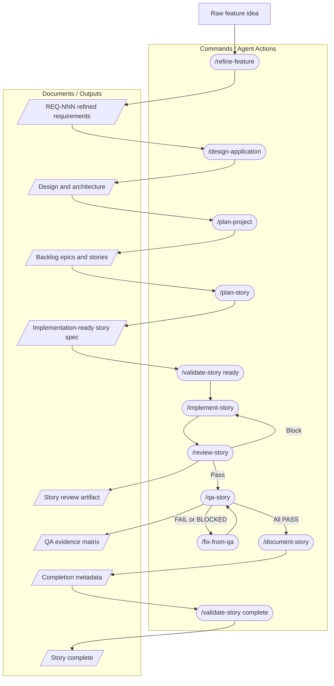
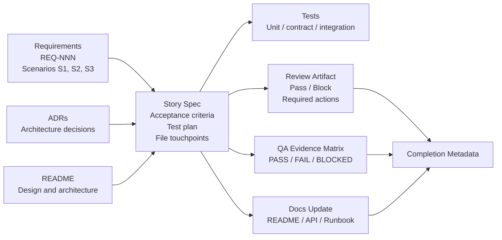
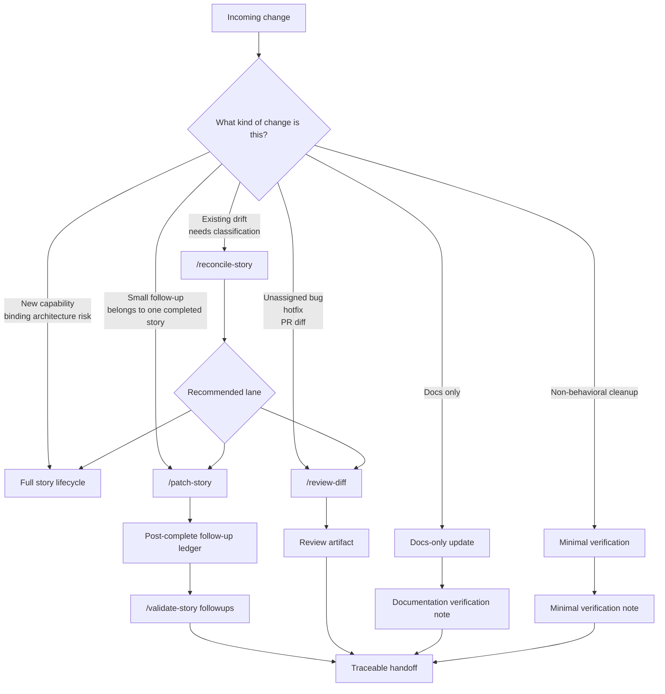

# Document-Led AI-Assisted Software Development Workflow

This guide describes a document-led software development workflow supported by the architect, implementer, QA, auditor, and documentor agents. The workflow turns raw ideas into refined requirements, design decisions, story-ready implementation specs, tested implementation, review evidence, QA evidence, and synchronized documentation.

The goal is not to make AI generate code faster in isolation. The goal is to create a controlled delivery system around AI-assisted development, where each step has clear inputs, constrained behavior, durable artifacts, and verifiable evidence.

The workflow is intentionally document-led. Each stage produces a source of truth that the next stage consumes. Agents do not guess across missing requirements, silently swap technical decisions, or treat a passing test as a substitute for an updated story document.

## Conceptual Model

This workflow separates four concerns that are often blurred in AI-assisted development:

1. **Context** — requirements, ADRs, design notes, existing code, backlog state, and previous story artifacts.
2. **Control** — agent definitions, commands, templates, validation rules, and acceptance criteria that constrain model behavior.
3. **Artifacts** — requirements documents, ADRs, story specs, review reports, QA matrices, documentation updates, and completion metadata.
4. **Evidence** — tests, changed files, review results, QA verification, traceability records, and follow-up ledgers.

The story spec is the central handoff artifact. It binds source context to implementation instructions, acceptance criteria, planned tests, file touchpoints, constraints, review expectations, QA evidence, and completion metadata.

## Workflow Building Blocks

| Building Block | Purpose | Examples |
|---|---|---|
| Agent | Defines role, responsibilities, and behavioral constraints | architect, implementer, QA, auditor, documentor |
| Command | Invokes a specific workflow step | `/plan-story`, `/implement-story`, `/qa-story` |
| Template | Shapes the required output | story spec template, review template, QA evidence matrix |
| Artifact | Durable output used by later steps | requirements doc, ADR, story spec, review report |
| Evidence | Proof used to validate completion | tests, changed files, QA matrix, review summary |
| Gate | Decision point that allows work to continue, return for repair, or escalate | review pass/block, QA pass/fail/blocked, validation result |

## Full Story Lifecycle

Use the full story lifecycle for new capability work, broad refactors, changes to persistence, auth, API contracts, ports or adapters, named dependencies, or anything that changes a binding architectural decision.

The lifecycle separates commands from artifacts so the flow is easier to reason about. Commands are agent actions. Artifacts are durable outputs that become context for the next step.

The happy path can be run one command at a time, or the story tail can be orchestrated with `/complete-story` after `/plan-story` has produced the story document. The tail is still the same sequence: implement, review, QA, document, record completion metadata, then validate the completed story.

`/audit-all` is not part of normal story completion. It is a periodic health check that can identify drift, stale documentation, missing traceability, or backlog issues.

## Traceability Model

The story spec is the traceability hub. Requirements, ADRs, and design decisions flow into the story before implementation begins. Acceptance criteria and test plan rows map those inputs to executable evidence. Review, QA, documentation updates, and completion metadata then record whether the implementation satisfied the original intent.

A story should make the trace path visible enough that a reviewer can answer:

- Which requirement or scenario caused this work?
- Which ADRs or design constraints bind the implementation?
- Which acceptance criteria define completion?
- Which tests or checks prove each criterion?
- Which files changed?
- Which review and QA gates passed?
- Which documentation surfaces were updated or intentionally left unchanged?

## What Each Stage Produces

| Stage | Primary Input | Primary Output | Traceability Role |
|---|---|---|---|
| `/refine-feature` | Raw notes, tickets, transcripts, pasted requirements | `docs/requirements/REQ-NNN-*.md` | Defines goals, non-goals, open questions, resolved questions, and scenario IDs |
| `/design-application` | Refined requirements | design, ADRs as needed | Records design, stack, setup, API contract, environment variables, and architectural decisions |
| `/plan-project` | Requirements and design | Backlog epics and story rows | Preserves backlog continuity and prevents orphaned story documents |
| `/plan-story` | Requirements, architecture/design artifacts, ADRs, backlog artifacts | `docs/features/{STORY-ID}-*.md` | Maps context to acceptance criteria, tests, constraints, touchpoints, and implementation order |
| `/validate-story ready` | Story document | Readiness validation | Confirms the story is complete enough to implement |
| `/implement-story` | Story spec and linked ADRs | Code, tests, updated story status | Produces implementation evidence and checks off passing criteria |
| `/review-story` | Story and changed surface | `docs/features/{STORY-ID}-review.md` | Identifies reliability, security, API contract, and test coverage issues before QA |
| `/qa-story` | Story acceptance criteria and executable evidence | Criterion evidence matrix | Verifies every criterion as `PASS`, `FAIL`, or `BLOCKED` |
| `/fix-from-qa` | Failed or blocked QA criteria | Targeted fix | Repairs only the failed or blocked criteria before returning to QA |
| `/document-story` | Completed story, metadata, follow-up ledger | Updated README, API docs, OpenAPI specs, runbooks, setup docs, or environment docs | Synchronizes project documentation with shipped behavior |
| `/validate-story complete` | Completed story document | Completion validation | Confirms metadata, evidence, and follow-up consistency |

### `/refine-feature`

`/refine-feature` turns raw notes, tickets, transcripts, or pasted requirements into `docs/requirements/REQ-NNN-*.md`. The architect asks clarifying questions, records resolved and open questions, and writes Gherkin scenarios such as `S1`, `S2`, and `S3`. Those scenario IDs become trace points for story test plans.

### `/design-application`

`/design-application` consumes refined requirements and produces or updates the project's high-level design artifacts: architecture, technical stack, key decisions, setup guidance, API contract, environment variables, UI structure, and remaining TBD items where the requirements do not yet specify enough.

When a durable technical decision is needed, the architect creates an ADR before later steps depend on that decision.

### `/plan-project`

`/plan-project` turns the design and requirements into backlog epics and story rows. It normally updates only the requirements log and backlog, preserving completed or in-progress work so existing story documents do not become orphaned.

### `/plan-story`

`/plan-story` produces `docs/features/{STORY-ID}-*.md`. This is the implementer's spec. It includes linked ADRs, binding constraints, ports and adapters, API and frontend flow notes, file touchpoints, acceptance criteria, test plan rows, implementation order, completion metadata, and the post-complete follow-up ledger.

When a story touches an integration boundary, the story must plan both contract tests for the port and integration tests for the adapter against the real backing service or fixture.

### `/implement-story`

`/implement-story` reads the story and linked ADRs before touching code. It sets the story to `In Progress`, follows the implementation order, uses red-first tests by default for each acceptance criterion, checks off criteria as they pass, and sets the story to `Complete` only after all criteria are checked.

The implementer should not reinterpret requirements, bypass binding ADRs, or silently change the planned design. If implementation reveals that the plan is wrong, the workflow should surface that as a story, design, or ADR issue rather than hiding it in code changes.

### `/review-story`

`/review-story` is the auditor gate between implementation and QA. It reviews the story's changed surface for reliability, security, API contract issues, and test coverage gaps. The output is `docs/features/{STORY-ID}-review.md`, with a machine-readable `REVIEW SUMMARY:` line and a `Pass` or `Block` gate result.

A block returns to implementation with required actions. A pass allows the story to move to QA.

### `/qa-story`

`/qa-story` verifies each acceptance criterion from the story document. QA reports a criterion evidence matrix with `PASS`, `FAIL`, or `BLOCKED` for every criterion.

Any failure loops through `/fix-from-qa`, where the implementer fixes only the failed or blocked criteria and then returns the story to QA.

### `/document-story`

`/document-story` is the documentor handoff. It reads the completed story, completion metadata, and follow-up ledger, then updates the README, API docs, OpenAPI specs, runbooks, setup instructions, or environment docs when the implemented behavior changed those surfaces.

Documentation updates are driven by the story source of truth. Documentor should not update unrelated documentation simply because it is nearby.

### `/validate-story`

`/validate-story` checks the story document itself. It can validate readiness before implementation, completion metadata after the story is done, or follow-up ledger consistency after post-complete work.

## Roles

### Architect

Architect work happens before implementation. The architect turns ambiguous inputs into clear requirements, designs the application, plans the backlog, and writes implementation-ready story specs. The architect also creates ADRs when a story needs a durable decision about persistence, transport, auth, adapters, embedding/vector stacks, or named dependencies.

### Implementer

Implementer work starts from the story document. The implementer follows the planned file touchpoints and test plan, preserves binding constraints, writes or tightens tests before production code unless an explicit exception applies, and updates the story status as criteria pass.

### QA

QA work checks story claims against executable evidence. QA does not infer completion from code alone; it verifies the evidence references and produces a criterion-by-criterion result. Failed or blocked criteria return to the implementer through a constrained repair loop.

### Auditor

Auditor work provides review gates. Per-story review focuses on the changed surface before QA, while diff review covers work that did not originate from a story. Full-repo audits are periodic health checks rather than story completion steps.

### Documentor

Documentor work keeps project documentation and status synchronized with the story source of truth. Story documents drive status. README, backlog, API docs, OpenAPI specs, runbooks, setup instructions, and environment docs are updated only when the story or follow-up ledger shows that they should change.

## Post-Story Work

After a story is complete, not every change should reopen the full workflow. Small follow-ups still need traceability, but they should not carry the same ceremony as a new capability or binding architecture change.

### `/patch-story`

Use `/patch-story` when the change clearly belongs to one completed story and is small: polish, copy adjustment, targeted bug fix, local debugging discovery, focused test repair, or documentation correction.

The command preserves the original acceptance criteria and appends a row to the story's post-complete follow-up ledger with intent, files touched, verification, docs impact, and AC impact.

### `/reconcile-story`

Use `/reconcile-story` when the working tree already has drift and you need to classify it before deciding what lane it belongs to.

It maps changed files to a story when possible, recommends a ledger entry or `/patch-story` for safe follow-ups, and escalates to `/review-diff` or a new story when the change is too broad.

### `/review-diff`

Use `/review-diff` for hotfixes, PR-style reviews, branch comparisons, or work that does not map cleanly to one completed story. It reviews the diff itself as the source of scope and writes a review artifact under `docs/reviews/`.

### Escalation back to the full story lane

Escalate back to the full story lane when a follow-up touches a binding constraint, changes an ADR-backed decision, modifies a port or adapter, changes an API contract, affects auth or persistence, or invalidates the original acceptance criteria.

## Example Walkthrough

Start with a raw feature request:

> Customers need to search their projects and open a result quickly.

That request is useful, but it does not yet define who searches, what fields are searchable, how empty states behave, what latency is acceptable, or how access control should work.

### 1. Refine the feature

Run `/refine-feature` against the source notes. The architect asks clarifying questions and writes a refined requirements file. The result includes goals, non-goals, personas, constraints, resolved questions, open questions, suggested ADR triggers, and Gherkin scenarios such as:

- `S1: search returns matching projects`
- `S2: no matches shows an empty state`
- `S3: unauthorized projects are not returned`

### 2. Design the application impact

Run `/design-application` with the refined requirements. The architect updates the project's design and onboarding artifacts with the high-level architecture, key decisions, API contract, environment variables, and setup notes.

If the search feature requires a durable decision, such as local SQLite versus an external search service, the decision is captured in an ADR before implementation depends on it.

### 3. Plan the project and story

Run `/plan-project` to add the relevant epic and story rows to the backlog. Then run `/plan-story SEARCH-1` to create the story spec.

The story maps the refined scenario IDs to acceptance criteria and planned tests. For example, `S1` might be covered by a service unit test and an API integration test, while `S3` might be covered by an authorization test that proves inaccessible projects are filtered.

### 4. Implement against the story

Run `/implement-story SEARCH-1`. The implementer reads the story and ADRs, prints the requirement traceability plan, writes or tightens tests first, makes the production changes, checks off each passing criterion, and marks the story complete only when every acceptance criterion is done.

### 5. Review and QA

Run `/review-story SEARCH-1`. If the auditor finds a high-severity coverage, security, reliability, or API contract issue, the gate blocks and the implementer fixes the required actions before review is run again.

Once the gate passes, run `/qa-story SEARCH-1`. QA verifies each criterion and either hands the all-pass matrix to documentor or sends failed criteria through `/fix-from-qa`.

### 6. Document and validate completion

Run `/document-story SEARCH-1` after QA is fully green. Documentor updates project documentation where the story changed setup, API behavior, environment variables, or operational procedures.

The story's completion metadata records the final review summary, QA result, docs handoff, and completion ref.

### 7. Handle later follow-up work

Later, suppose a product review finds that the empty-state copy should say "No projects found" instead of "No results."

If that is purely copy tied to the completed story and does not change the acceptance criteria, use `/patch-story SEARCH-1 correct empty-state copy`. The follow-up gets targeted verification and a ledger row, and the original story remains complete.

## Why This Works

This workflow keeps requirements, design, implementation, tests, review evidence, QA evidence, and documentation connected.

Refined requirements stop ambiguity from leaking into architecture. ADRs prevent silent substitution of important technical choices. Story specs make acceptance criteria and tests explicit before implementation begins. Review and QA gates catch different classes of mistakes. Documentor closes the loop so project documentation reflects what actually shipped. Post-story lanes keep small fixes visible without forcing every polish change through a full new feature workflow.

The result is an AI-assisted development process that is faster than manual-only delivery, but still reviewable, traceable, and grounded in software engineering discipline.
