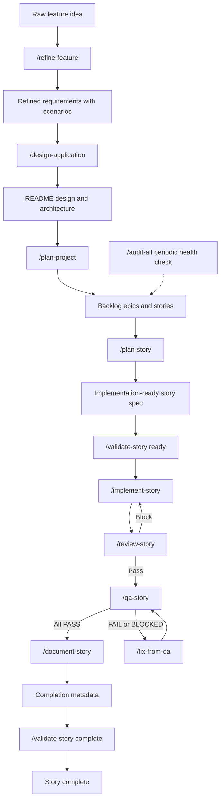
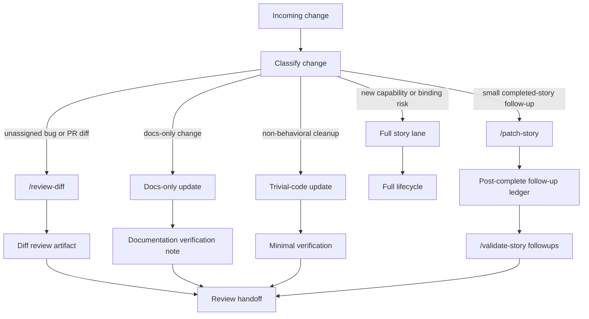

# Software Development Workflow

This guide demonstrates the software development workflow supported by the
architect, implementer, QA, auditor, and docs-pm agents. The goal is to make the
flow visible: raw ideas become refined requirements, requirements drive design,
design becomes story-ready implementation specs, implementation is verified with
tests and review gates, and completed stories stay traceable when follow-up work
appears later.

The workflow is intentionally document-led. Each stage produces a source of truth
that the next stage consumes. Agents do not guess across missing requirements,
silently swap technical decisions, or treat a passing test as a substitute for an
updated story document.

## Full Story Lifecycle

Use the full story lifecycle for new capability work, broad refactors, changes to
persistence, auth, API contracts, ports or adapters, named dependencies, or
anything that changes a binding architectural decision.

The happy path can be run one command at a time, or the story tail can be
orchestrated with `/complete-story` after `/plan-story` has produced the story
document. The tail is still the same sequence: implement, review, QA, document,
record completion metadata, then validate the completed story.

## What Each Stage Produces

`/refine-feature` turns raw notes, tickets, transcripts, or pasted requirements
into `docs/requirements/REQ-NNN-*.md`. The architect asks clarifying questions,
records resolved and open questions, and writes Gherkin scenarios such as `S1`,
`S2`, and `S3`. Those scenario IDs become trace points for story test plans.

`/design-application` consumes refined requirements and updates the project
`README.md` with the high-level design: architecture, technical stack, key
decisions, setup, API contract, environment variables, UI structure, and
remaining `TBD` items where the requirements do not yet specify enough.

`/plan-project` turns the design and requirements into backlog epics and story
rows. It normally updates only the requirements log and backlog, preserving
completed or in-progress work so existing story documents do not become
orphaned.

`/plan-story` produces `docs/features/{STORY-ID}-*.md`. This is the implementer's
spec. It includes linked ADRs, binding constraints, ports and adapters, API and
frontend flow notes, file touchpoints, acceptance criteria, test plan rows,
implementation order, completion metadata, and the post-complete follow-up
ledger. When a story touches an integration boundary, the story must plan both
contract tests for the port and integration tests for the adapter against the
real backing service or fixture.

`/implement-story` reads the story and linked ADRs before touching code. It sets
the story to `In Progress`, follows the implementation order, uses red-first
tests by default for each acceptance criterion, checks off criteria as they pass,
and sets the story to `Complete` only after all criteria are checked.

`/review-story` is the auditor gate between implementation and QA. It reviews the
story's changed surface for reliability, security, API contract issues, and test
coverage gaps. The output is `docs/features/{STORY-ID}-review.md`, with a
machine-readable `REVIEW SUMMARY:` line and a `Pass` or `Block` gate result.

`/qa-story` verifies each acceptance criterion from the story document. QA
reports a criterion evidence matrix with `PASS`, `FAIL`, or `BLOCKED` for every
criterion. Any failure loops through `/fix-from-qa`, where the implementer fixes
only the failed or blocked criteria and then returns the story to QA.

`/document-story` is the docs-pm handoff. It reads the completed story,
completion metadata, and follow-up ledger, then updates the README, API docs,
OpenAPI specs, runbooks, setup instructions, or environment docs when the
implemented behavior changed those surfaces.

`/validate-story` checks the story document itself. It can validate readiness
before implementation, completion metadata after the story is done, or follow-up
ledger consistency after post-complete work.

## Roles

Architect work happens before implementation. The architect turns ambiguous
inputs into clear requirements, designs the application, plans the backlog, and
writes implementation-ready story specs. The architect also creates ADRs when a
story needs a durable decision about persistence, transport, auth, adapters,
embedding/vector stacks, or named dependencies.

Implementer work starts from the story document. The implementer follows the
planned file touchpoints and test plan, preserves binding constraints, writes or
tightens tests before production code unless an explicit exception applies, and
updates the story status as criteria pass.

QA work checks story claims against executable evidence. QA does not infer
completion from code alone; it verifies the evidence references and produces a
criterion-by-criterion result. Failed or blocked criteria return to the
implementer through a constrained repair loop.

Auditor work provides review gates. Per-story review focuses on the changed
surface before QA, while diff review covers work that did not originate from a
story. Full-repo audits are periodic health checks rather than story completion
steps.

Docs-pm work keeps project documentation and status synchronized with the story
source of truth. Story documents drive status. README backlog rows, API docs,
OpenAPI specs, runbooks, setup instructions, and environment docs are updated
only when the story or follow-up ledger shows that they should change.

## Post-Story Work

After a story is complete, not every change should reopen the full workflow.
Small follow-ups still need traceability, but they should not carry the same
ceremony as a new capability or binding architecture change.

Use `/patch-story` when the change clearly belongs to one completed story and is
small: polish, copy adjustment, targeted bug fix, local debugging discovery,
focused test repair, or documentation correction. The command preserves the
original acceptance criteria and appends a row to the story's post-complete
follow-up ledger with intent, files touched, verification, docs impact, and AC
impact.

Use `/reconcile-story` when the working tree already has drift and you need to
classify it before deciding what lane it belongs to. It maps changed files to a
story when possible, recommends a ledger entry or `/patch-story` for safe
follow-ups, and escalates to `/review-diff` or a new story when the change is too
broad.

Use `/review-diff` for hotfixes, PR-style reviews, branch comparisons, or work
that does not map cleanly to one completed story. It reviews the diff itself as
the source of scope and writes a review artifact under `docs/reviews/`.

Escalate back to the full story lane when a follow-up touches a binding
constraint, changes an ADR-backed decision, modifies a port or adapter, changes
an API contract, affects auth or persistence, or invalidates the original
acceptance criteria.

## Example Walkthrough

Start with a raw feature request: "Customers need to search their projects and
open a result quickly." That request is useful, but it does not yet define who
searches, what fields are searchable, how empty states behave, what latency is
acceptable, or how access control should work.

Run `/refine-feature` against the source notes. The architect asks clarifying
questions and writes a refined requirements file. The result includes goals,
non-goals, personas, constraints, resolved questions, open questions, suggested
ADR triggers, and Gherkin scenarios such as `S1: search returns matching
projects`, `S2: no matches shows an empty state`, and `S3: unauthorized projects
are not returned`.

Run `/design-application` with the refined requirements. The architect updates
the project README with the high-level architecture, key decisions, API contract,
environment variables, and setup notes. If the search feature requires a durable
decision, such as local SQLite versus an external search service, the decision is
captured in an ADR before implementation depends on it.

Run `/plan-project` to add the relevant epic and story rows to the backlog. Then
run `/plan-story SEARCH-1` to create the story spec. The story maps the refined
scenario IDs to acceptance criteria and planned tests. For example, `S1` might be
covered by a service unit test and an API integration test, while `S3` might be
covered by an authorization test that proves inaccessible projects are filtered.

Run `/implement-story SEARCH-1`. The implementer reads the story and ADRs,
prints the requirement traceability plan, writes or tightens tests first, makes
the production changes, checks off each passing criterion, and marks the story
complete only when every acceptance criterion is done.

Run `/review-story SEARCH-1`. If the auditor finds a high-severity coverage,
security, reliability, or API contract issue, the gate blocks and the implementer
fixes the required actions before review is run again. Once the gate passes, run
`/qa-story SEARCH-1`. QA verifies each criterion and either hands the all-pass
matrix to docs-pm or sends failed criteria through `/fix-from-qa`.

Run `/document-story SEARCH-1` after QA is fully green. Docs-pm updates project
documentation where the story changed setup, API behavior, environment variables,
or operational procedures. The story's completion metadata records the final
review summary, QA result, docs handoff, and completion ref.

Later, suppose a product review finds that the empty-state copy should say "No
projects found" instead of "No results." If that is purely copy tied to the
completed story and does not change the acceptance criteria, use
`/patch-story SEARCH-1 correct empty-state copy`. The follow-up gets targeted
verification and a ledger row, and the original story remains complete.

## Why This Works

The workflow keeps requirements, design, implementation, tests, review evidence,
QA evidence, and documentation connected. Refined requirements stop ambiguity
from leaking into architecture. ADRs prevent silent substitution of important
technical choices. Story specs make acceptance criteria and tests explicit before
implementation begins. Review and QA gates catch different classes of mistakes.
Docs-pm closes the loop so the project documentation reflects what actually
shipped. Post-story lanes keep small fixes visible without forcing every polish
change through a full new feature workflow.
